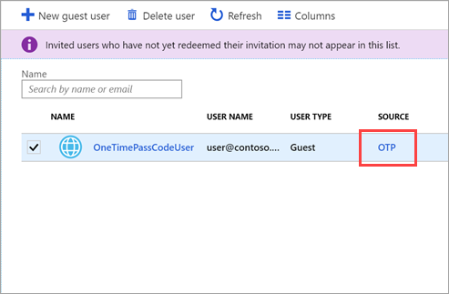
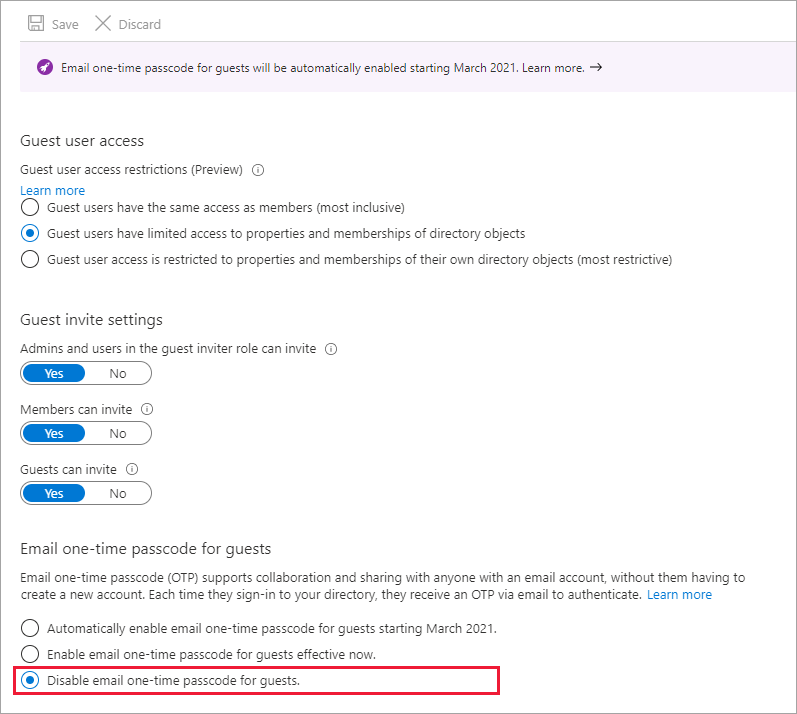

---

title: One-time passcode authentication for B2B guest users - Azure AD
description: How to use Email one-time passcode to authenticate B2B guest users without the need for a Microsoft account.

services: active-directory
ms.service: active-directory
ms.subservice: B2B
ms.topic: how-to
ms.date: 11/02/2020

ms.author: mimart
author: msmimart
manager: celestedg
ms.reviewer: mal
ms.custom: "it-pro, seo-update-azuread-jan, seoapril2019"
ms.collection: M365-identity-device-management
---

# Email one-time passcode authentication

This article describes how to enable email one-time passcode authentication for B2B guest users. The email one-time passcode feature authenticates B2B guest users when they can't be authenticated through other means like Azure AD, a Microsoft account (MSA), or Google federation. With one-time passcode authentication, there's no need to create a Microsoft account. When the guest user redeems an invitation or accesses a shared resource, they can request a temporary code, which is sent to their email address. Then they enter this code to continue signing in.

> [!IMPORTANT]
> **Starting March 2021**, the email one-time passcode feature will be turned on for all existing tenants and enabled by default for new tenants. If you don't want to allow this feature to turn on automatically, you can disable it. See [Disable email one-time passcode](#disable-email-one-time-passcode) below.

> [!NOTE]
> One-time passcode users must sign in using a link that includes the tenant context (for example, `https://myapps.microsoft.com/?tenantid=<tenant id>` or `https://portal.azure.com/<tenant id>`, or in the case of a verified domain, `https://myapps.microsoft.com/<verified domain>.onmicrosoft.com`). Direct links to applications and resources also work as long as they include the tenant context. Guest users are currently unable to sign in using endpoints that have no tenant context. For example, using `https://myapps.microsoft.com`, `https://portal.azure.com`, or the Teams common endpoint will result in an error.

## User experience for one-time passcode guest users

When the email one-time passcode feature is enabled, newly invited users [who meet certain conditions](#when-does-a-guest-user-get-a-one-time-passcode) will use one-time passcode authentication. Guest users who redeemed an invitation before email one-time passcode was enabled will continue to use their same authentication method.

With one-time passcode authentication, the guest user can redeem your invitation by clicking a direct link or by using the invitation email. In either case, a message in the browser indicates that a code will be sent to the guest user's email address. The guest user selects **Send code**:

   

A passcode is sent to the user’s email address. The user retrieves the passcode from the email and enters it in the browser window:

   

The guest user is now authenticated, and they can see the shared resource or continue signing in.

> [!NOTE]
> One-time passcodes are valid for 30 minutes. After 30 minutes, that specific one-time passcode is no longer valid, and the user must request a new one. User sessions expire after 24 hours. After that time, the guest user receives a new passcode when they access the resource. Session expiration provides added security, especially when a guest user leaves their company or no longer needs access.

## When does a guest user get a one-time passcode?

When a guest user redeems an invitation or uses a link to a resource that has been shared with them, they’ll receive a one-time passcode if:

- They do not have an Azure AD account
- They do not have a Microsoft account
- The inviting tenant did not set up Google federation for @gmail.com and @googlemail.com users

At the time of invitation, there's no indication that the user you're inviting will use one-time passcode authentication. But when the guest user signs in, one-time passcode authentication will be the fallback method if no other authentication methods can be used.

You can view guest users who authenticate with one-time passcodes in the Azure portal by going to **Azure Active Directory** > **Users**.

> [!NOTE]
> When a user redeems a one-time passcode and later obtains an MSA, Azure AD account, or other federated account, they'll continue to be authenticated using a one-time passcode. If you want to update their authentication method, you can delete their guest user account and reinvite them.

### Example

Guest user alexdoe@gmail.com is invited to Fabrikam, which does not have Google federation set up. Alex does not have a Microsoft account. They'll receive a one-time passcode for authentication.

## Disable email one-time passcode

Starting March 2021, the email one-time passcode feature will be turned on for all existing tenants and enabled by default for new tenants. We're enabling this feature because it provides a seamless fallback authentication method for your guest users. However, you have the option of disabling this feature if you choose not to use it. 

> [!NOTE]
>
> - If the email one-time passcode feature has been enabled in your tenant and you turn it off, any guest users who have redeemed a one-time passcode will not be able to sign in. You can delete the guest user and reinvite them so they can sign in again using another authentication method.
>
> - If you manually enable or disable the feature, the **Automatically enable email one-time passcode for guests in March 2021** option will no longer be available to you.

### To disable the email one-time passcode feature

1. Sign in to the [Azure portal](https://portal.azure.com/) as an Azure AD global administrator.

2. In the navigation pane, select **Azure Active Directory**.

3. Select **External Identities** > **External collaboration settings**.

4. Under **Email one-time passcode for guests**, select **Disable email one-time passcode for guests**.

    

   > [!NOTE]
   > The following settings are available under **Email one-time passcode for guests**:
   >
   > - **Automatically enable email one-time passcode for guests in March 2021**. (Default) If the email one-time passcode feature is not already enabled for your tenant, it will be automatically turned on in March 2021. No further action is necessary if you want the feature enabled at that time. If you've already enabled or disabled the feature, this option will be unavailable.
   >
   > - **Enable email one-time passcode for guests effective now**. Turns on the email one-time passcode feature for your tenant.
   >
   > - **Disable email one-time passcode for guests**. Turns off the email one-time passcode feature for your tenant, and prevents the feature from turning on in March 2021.

5. Select **Save**.

## Note for public preview customers

If you've already opted into the public preview of email one-time passcode authentication, you won't be affected by the March 2021 date we've set for automatically enabling the one-time passcode feature. Also, because you've already opted in to email one-time passcode authentication, you won't see the option to **Automatically enable email one-time passcode for guests in March 2021**.

However, if you'd prefer to opt out of the feature and allow it to be automatically enabled in March 2021, you can do so by using the API.

**(UI/API INSTRUCTIONS TBD)**
