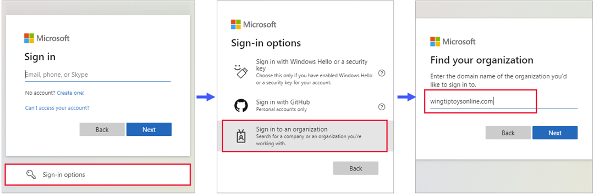

---

title: Invitation redemption in B2B collaboration
description: Describes the Microsoft Entra B2B collaboration invitation redemption experience for end users, including the agreement to privacy terms.

services: active-directory
ms.service: active-directory
ms.subservice: B2B
ms.topic: conceptual
ms.date: 05/05/2023
ms.author: cmulligan
author: csmulligan
manager: celestedg

ms.collection: engagement-fy23, M365-identity-device-management

# Customer intent: As a tenant administrator, I want to make sure that guest users can access resources and the consent process.
---

# Microsoft Entra B2B collaboration invitation redemption

This article describes the ways guest users can access your resources and the consent process they'll encounter. If you send an invitation email to the guest, the invitation includes a link the guest can redeem to get access to your app or portal. The invitation email is just one of the ways guests can get access to your resources. As an alternative, you can add guests to your directory and give them a direct link to the portal or app you want to share. Regardless of the method they use, guests are guided through a first-time consent process. This process ensures that your guests agree to privacy terms and accept any [terms of use](../conditional-access/terms-of-use.md) you've set up.

When you add a guest user to your directory, the guest user account has a consent status (viewable in PowerShell) that’s initially set to **PendingAcceptance**. This setting remains until the guest accepts your invitation and agrees to your privacy policy and terms of use. After that, the consent status changes to **Accepted**, and the consent pages are no longer presented to the guest.

> [!IMPORTANT]
> - **Starting July 12, 2021**,  if Microsoft Entra B2B customers set up new Google integrations for use with self-service sign-up for their custom or line-of-business applications, authentication with Google identities won’t work until authentications are moved to system web-views. [Learn more](google-federation.md#deprecation-of-web-view-sign-in-support).
> - **Starting September 30, 2021**, Google is [deprecating embedded web-view sign-in support](https://developers.googleblog.com/2016/08/modernizing-oauth-interactions-in-native-apps.html). If your apps authenticate users with an embedded web-view and you're using Google federation with [Azure AD B2C](/azure/active-directory-b2c/identity-provider-google) or Microsoft Entra B2B for [external user invitations](google-federation.md) or [self-service sign-up](identity-providers.md), Google Gmail users won't be able to authenticate. [Learn more](google-federation.md#deprecation-of-web-view-sign-in-support).
> - The [email one-time passcode feature](one-time-passcode.md) is now turned on by default for all new tenants and for any existing tenants where you haven't explicitly turned it off. When this feature is turned off, the fallback authentication method is to prompt invitees to create a Microsoft account.

## Redemption process and sign-in through a common endpoint

Guest users can now sign in to your multi-tenant or Microsoft first-party apps through a common endpoint (URL), for example `https://myapps.microsoft.com`. Previously, a common URL would redirect a guest user to their home tenant instead of your resource tenant for authentication, so a tenant-specific link was required (for example `https://myapps.microsoft.com/?tenantid=<tenant id>`). Now the guest user can go to the application's common URL, choose **Sign-in options**, and then select **Sign in to an organization**. The user then types the domain name of your organization.

The user is then redirected to your tenant-specific endpoint, where they can either sign in with their email address or select an identity provider you've configured.

## Redemption process through a direct link

As an alternative to the invitation email or an application's common URL, you can give a guest a direct link to your app or portal. You first need to add the guest user to your directory via the [Azure portal](./b2b-quickstart-add-guest-users-portal.md) or [PowerShell](./b2b-quickstart-invite-powershell.md). Then you can use any of the [customizable ways to deploy applications to users](../manage-apps/end-user-experiences.md), including direct sign-on links. When a guest uses a direct link instead of the invitation email, they’ll still be guided through the first-time consent experience.

> [!NOTE]
> A direct link is tenant-specific. In other words, it includes a tenant ID or verified domain so the guest can be authenticated in your tenant, where the shared app is located. Here are some examples of direct links with tenant context:
 > - Apps access panel: `https://myapps.microsoft.com/?tenantid=<tenant id>`
 > - Apps access panel for a verified domain: `https://myapps.microsoft.com/<;verified domain>`
 > - Azure portal: `https://portal.azure.com/<tenant id>`
 > - Individual app: see how to use a [direct sign-on link](../manage-apps/end-user-experiences.md#direct-sign-on-links)

There are some cases where the invitation email is recommended over a direct link. If these special cases are important to your organization, we recommend that you invite users by using methods that still send the invitation email:

- Sometimes the invited user object may not have an email address because of a conflict with a contact object (for example, an Outlook contact object). In this case, the user must select the redemption URL in the invitation email.
- The user may sign in with an alias of the email address that was invited. (An alias is another email address associated with an email account.) In this case, the user must select the redemption URL in the invitation email.

## Redemption process through the invitation email

When you add a guest user to your directory by [using the Azure portal](./b2b-quickstart-add-guest-users-portal.md), an invitation email is sent to the guest in the process. You can also choose to send invitation emails when you’re [using PowerShell](./b2b-quickstart-invite-powershell.md) to add guest users to your directory. Here’s a description of the guest’s experience when they redeem the link in the email.

1. The guest receives an [invitation email](./invitation-email-elements.md) that's sent from **Microsoft Invitations**.
2. The guest selects **Accept invitation** in the email.
3. The guest will use their own credentials to sign in to your directory. If the guest doesn't have an account that can be federated to your directory and the [email one-time passcode (OTP)](./one-time-passcode.md) feature isn't enabled; the guest is prompted to create a personal [MSA](https://support.microsoft.com/help/4026324/microsoft-account-how-to-create). Refer to the [invitation redemption flow](#invitation-redemption-flow) for details.
4. The guest is guided through the [consent experience](#consent-experience-for-the-guest) described below.

## Redemption process limitation with conflicting Contact object
Sometimes the invited external guest user's email may conflict with an existing [Contact object](/graph/api/resources/contact), resulting in the guest user being created without a proxyAddress. This is a known limitation that prevents guest users from redeeming an invitation through a direct link using [SAML/WS-Fed IdP](./direct-federation.md), [MSAs](./microsoft-account.md), [Google Federation](./google-federation.md), or [Email One-Time Passcode](./one-time-passcode.md) accounts.

However, the following scenarios should continue to work:
-	Redeeming an invitation through an invitation email redemption link using [SAML/WS-Fed IdP](./direct-federation.md), [Email One-Time Passcode](./one-time-passcode.md), and [Google Federation](./google-federation.md) accounts.
-	Signing back into an application after redemption process using [SAML/WS-Fed IdP](./direct-federation.md), [Email One-Time Passcode](./one-time-passcode.md), and [Google Federation](./google-federation.md) accounts.

To unblock users who can't redeem an invitation due to a conflicting [Contact object](/graph/api/resources/contact), follow these steps:
1. Delete the conflicting Contact object.
2. Delete the guest user in the Azure portal (the user's "Invitation accepted" property should be in a pending state).
3. Reinvite the guest user.
4. Wait for the user to redeem invitation.
5. Add the user's Contact email back into Exchange and any DLs they should be a part of.

## Invitation redemption flow

When a user selects the **Accept invitation** link in an [invitation email](invitation-email-elements.md), Microsoft Entra ID automatically redeems the invitation based on the redemption flow as shown below:

:::image type="content" source="media/redemption-experience/invitation-redemption.png" alt-text="Screenshot showing the redemption flow diagram.":::

1. Microsoft Entra ID performs user-based discovery to determine if the user already exists in a managed Microsoft Entra tenant. (Unmanaged Microsoft Entra accounts can no longer be used for the redemption flow.) If the user’s User Principal Name ([UPN](../hybrid/connect/plan-connect-userprincipalname.md#what-is-userprincipalname)) matches both an existing Microsoft Entra account and a personal MSA, the user is prompted to choose which account they want to redeem with.

2. If an admin has enabled [SAML/WS-Fed IdP federation](direct-federation.md), Microsoft Entra ID checks if the user’s domain suffix matches the domain of a configured SAML/WS-Fed identity provider and redirects the user to the pre-configured identity provider.

3. If an admin has enabled [Google federation](google-federation.md), Microsoft Entra ID checks if the user’s domain suffix is gmail.com, or googlemail.com and redirects the user to Google.

4. The redemption process checks if the user has an existing personal [MSA](microsoft-account.md). If the user already has an existing MSA, they'll sign in with their existing MSA.

5. Once the user’s **home directory** is identified, the user is sent to the corresponding identity provider to sign in.  

6. If no home directory is found and the email one-time passcode feature is *enabled* for guests, a [passcode is sent](./one-time-passcode.md#when-does-a-guest-user-get-a-one-time-passcode) to the user through the invited email. The user retrieves and enters this passcode in the Microsoft Entra sign-in page.

7. If no home directory is found and email one-time passcode for guests is *disabled*, the user is prompted to create a consumer MSA with the invited email. We support creating an MSA with work emails in domains that aren't verified in Microsoft Entra ID.

8. After authenticating to the right identity provider, the user is redirected to Microsoft Entra ID to complete the [consent experience](#consent-experience-for-the-guest).  

## Consent experience for the guest

When a guest signs in to a resource in a partner organization for the first time, they're presented with the following consent experience. These consent pages are shown to the guest only after sign-in, and they aren't displayed at all if the user has already accepted them.

1. The guest reviews the **Review permissions** page describing the inviting organization's privacy statement. A user must **Accept** the use of their information in accordance to the inviting organization's privacy policies to continue.

   :::image type="content" source="media/redemption-experience/new-review-permissions.png" alt-text="Screenshot showing the Review permissions page.":::

   > [!NOTE]
   > For information about how you as a tenant administrator can link to your organization's privacy statement, see [How-to: Add your organization's privacy info in Microsoft Entra ID](../fundamentals/properties-area.md).

2. If terms of use are configured, the guest opens and reviews the terms of use, and then selects **Accept**. 

   :::image type="content" source="media/redemption-experience/terms-of-use-accept.png" alt-text="Screenshot showing new terms of use."::: 

   You can configure [terms of use](../conditional-access/terms-of-use.md) in **External Identities** > **Terms of use**.

3. Unless otherwise specified, the guest is redirected to the Apps access panel, which lists the applications the guest can access.

   :::image type="content" source="media/redemption-experience/myapps.png" alt-text="Screenshot showing the Apps access panel." lightbox="media/redemption-experience/myapps.png":::

In your directory, the guest's **Invitation accepted** value changes to **Yes**. If an MSA was created, the guest’s **Source** shows **Microsoft Account**. For more information about guest user account properties, see [Properties of a Microsoft Entra B2B collaboration user](user-properties.md). 
If you see an error that requires admin consent while accessing an application, see [how to grant admin consent to apps](../develop/v2-admin-consent.md).

### Automatic redemption process setting

You might want to automatically redeem invitations so users don't have to accept the consent prompt when they're added to another tenant for B2B collaboration. When configured, a notification email is sent to the B2B collaboration user that requires no action from the user. Users are sent the notification email directly and they don't need to access the tenant first before they receive the email. The following shows an example notification email if you automatically redeem invitations in both tenants.

:::image type="content" source="media/redemption-experience/email-consent-prompt-suppressed.png" alt-text="Screenshot that shows B2B notification email when the consent prompt is suppressed.":::

For information about how to automatically redeem invitations, see [cross-tenant access overview](cross-tenant-access-overview.md#automatic-redemption-setting) and [Configure cross-tenant access settings for B2B collaboration](../external-identities/cross-tenant-access-settings-b2b-collaboration.md).

## Next steps

- [What is Microsoft Entra B2B collaboration?](what-is-b2b.md)
- [B2B collaboration user properties](user-properties.md)
- [Invitation email](invitation-email-elements.md)
