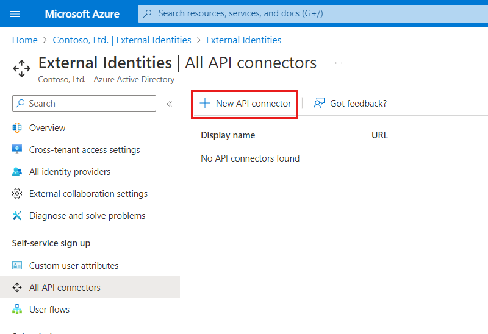
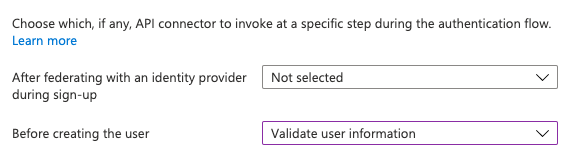
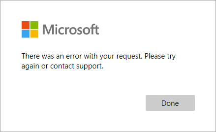

# Add an API connector to a user flow

To use an [API connector](api-connectors-overview.md), you first create the API connector and then enable it in a user flow.

> [!IMPORTANT]
>**Starting January 4, 2021**, Google is [deprecating WebView sign-in support](https://developers.googleblog.com/2020/08/guidance-for-our-effort-to-block-less-secure-browser-and-apps.html). If you’re using Google federation or self-service sign-up with Gmail, you should [test your line-of-business native applications for compatibility](google-federation.md#deprecation-of-webview-sign-in-support).

## Create an API connector

1. Sign in to the [Azure portal](https://portal.azure.com/).
2. Under **Azure services**, select **Azure Active Directory**.
3. In the left menu, select **External Identities**.
4. Select **All API connectors**, and then select **New API connector**.

   

5. Provide a display name for the call. For example, **Check approval status**.
6. Provide the **Endpoint URL** for the API call.
7. Choose the **Authentication type** and configure the authentication information for calling your API. See the section below for options on securing your API.

    

8. Select **Save**.

## Securing the API endpoint
You can protect your API endpoint by using either HTTP basic authentication or HTTPS client certificate authentication (preview). In either case, you provide the credentials that Azure Active Directory will use when calling your API endpoint. Your API endpoint then checks the credentials and performs authorization decisions.

### HTTP basic authentication
HTTP basic authentication is defined in [RFC 2617](https://tools.ietf.org/html/rfc2617). Azure Active Directory sends an HTTP request with the client credentials (`username` and `password`) in the `Authorization` header. The credentials are formatted as the base64-encoded string `username:password`. Your API then checks these values to determine whether to reject an API call or not.

### HTTPS client certificate authentication (preview)

> [!IMPORTANT]
> This functionality is in preview and is provided without a service-level agreement. For more information, see [Supplemental Terms of Use for Microsoft Azure Previews](https://azure.microsoft.com/support/legal/preview-supplemental-terms/).

Client certificate authentication is a mutual certificate-based authentication method where the client provides a client certificate to the server to prove its identity. In this case, Azure Active Directory will use the certificate that you upload as part of the API connector configuration. This happens as a part of the SSL handshake. Your API service can then limit access to only services that have proper certificates. The client certificate is an PKCS12 (PFX) X.509 digital certificate. In production environments, it should be signed by a certificate authority. 

To create a certificate, you can use [Azure Key Vault](../../key-vault/certificates/create-certificate.md), which has options for self-signed certificates and integrations with certificate issuer providers for signed certificates. Recommended settings include:
- **Subject**: `CN=<yourapiname>.<tenantname>.onmicrosoft.com`
- **Content Type**: `PKCS #12`
- **Lifetime Acton Type**: `Email all contacts at a given percentage lifetime` or `Email all contacts a given number of days before expiry`
- **Exportable Private Key**: `Yes` (in order to be able to export pfx file)

You can then [export the certificate](../../key-vault/certificates/how-to-export-certificate.md). You can alternatively use PowerShell's [New-SelfSignedCertificate cmdlet](../../active-directory-b2c/secure-rest-api.md#prepare-a-self-signed-certificate-optional) to generate a self-signed certificate.

After you have a certificate, you can then upload it as part of the API connector configuration. Note that password is only required for certificate files protected by a password.

Your API must implement the authorization based on sent client certificates in order to protect the API endpoints. For Azure App Service and Azure Functions, see [configure TLS mutual authentication](../../app-service/app-service-web-configure-tls-mutual-auth.md) to learn how to enable and *validate the certificate from your API code*.  You can also use [Azure API Management](
../../api-management/api-management-howto-mutual-certificates-for-clients.md) to protect your API and check certificate properties against desired values using policy expressions.
 
It's recommended you set reminder alerts for when your certificate will expire. You will need to generate a new certificate and repeat the steps above. Your API service can temporarily continue to accept old and new certificates while the new certificate is deployed. To upload a new certificate to an existing API connector, select the API connector under **All API connectors** and click on **Upload new certificate**. The most recently uploaded certificate which is not expired and is past the start date will automatically be used  by Azure Active Directory.

### API Key
Some services use an "API key" mechanism to obfuscate access to your HTTP endpoints during development. For [Azure Functions](../../azure-functions/functions-bindings-http-webhook-trigger.md#authorization-keys), you can accomplish this by including the `code` as a query parameter in the **Endpoint URL**. For example, `https://contoso.azurewebsites.net/api/endpoint`<b>`?code=0123456789`</b>). 

This is not a mechanism that should be used alone in production. Therefore, configuration for basic or certificate authentication is always required. If you do not wish to implement any authentication method (not recommended) for development purposes, you can choose basic authentication and use temporary values for `username` and `password` that your API can disregard while you implement the authorization in your API.

## The request sent to your API
An API connector materializes as an **HTTP POST** request, sending user attributes ('claims') as key-value pairs in a JSON body. Attributes are serialized similarly to [Microsoft Graph](/graph/api/resources/user#properties) user properties. 

**Example request**
```http
POST <API-endpoint>
Content-type: application/json

{
 "email": "johnsmith@fabrikam.onmicrosoft.com",
 "identities": [ // Sent for Google, Facebook, and Email One Time Passcode identity providers 
     {
     "signInType":"federated",
     "issuer":"facebook.com",
     "issuerAssignedId":"0123456789"
     }
 ],
 "displayName": "John Smith",
 "givenName":"John",
 "surname":"Smith",
 "jobTitle":"Supplier",
 "streetAddress":"1000 Microsoft Way",
 "city":"Seattle",
 "postalCode": "12345",
 "state":"Washington",
 "country":"United States",
 "extension_<extensions-app-id>_CustomAttribute1": "custom attribute value",
 "extension_<extensions-app-id>_CustomAttribute2": "custom attribute value",
 "ui_locales":"en-US"
}
```

Only user properties and custom attributes listed in the **Azure Active Directory** > **External Identities** > **Custom user attributes** experience are available to be sent in the request.

Custom attributes exist in the **extension_\<extensions-app-id>_AttributeName**  format in the directory. Your API should expect to receive claims in this same serialized format. For more information on custom attributes, see [define custom attributes for self-service sign-up flows](user-flow-add-custom-attributes.md).

Additionally, the **UI Locales ('ui_locales')** claim is sent by default in all requests. It provides a user's locale(s) as configured on their device that can be used by the API to return internationalized responses.

> [!IMPORTANT]
> If a claim does not have a value at the time the API endpoint is called, the claim will not be sent to the API. Your API should be designed to explicitly check and handle the case in which a claim is not in the request.

> [!TIP] 
> [**identities ('identities')**](/graph/api/resources/objectidentity) and the **Email Address ('email')** claims can be used by your API to identify a user before they have an account in your tenant. The 'identities' claim is sent when a user authenticates with an identity provider such as Google or Facebook. 'email' is always sent.

## Enable the API connector in a user flow

Follow these steps to add an API connector to a self-service sign-up user flow.

1. Sign in to the [Azure portal](https://portal.azure.com/) as an Azure AD administrator.
2. Under **Azure services**, select **Azure Active Directory**.
3. In the left menu, select **External Identities**.
4. Select **User flows**, and then select the user flow you want to add the API connector to.
5. Select **API connectors**, and then select the API endpoints you want to invoke at the following steps in the user flow:

   - **After signing in with an identity provider**
   - **Before creating the user**

   

6. Select **Save**.

## After signing in with an identity provider

An API connector at this step in the sign-up process is invoked immediately after the user authenticates with an identity provider (like Google, Facebook, & Azure AD). This step precedes the ***attribute collection page***, which is the form presented to the user to collect user attributes. This step is not invoked if a user is registering with a local account.

### Example request sent to the API at this step
```http
POST <API-endpoint>
Content-type: application/json

{
 "email": "johnsmith@fabrikam.onmicrosoft.com",
 "identities": [ // Sent for Google, Facebook, and Email One Time Passcode identity providers 
     {
     "signInType":"federated",
     "issuer":"facebook.com",
     "issuerAssignedId":"0123456789"
     }
 ],
 "displayName": "John Smith",
 "givenName":"John",
 "lastName":"Smith",
 "ui_locales":"en-US"
}
```

The exact claims sent to the API depends on which information is provided by the identity provider. 'email' is always sent.

### Expected response types from the web API at this step

When the web API receives an HTTP request from Azure AD during a user flow, it can return these responses:

- Continuation response
- Blocking response

#### Continuation response

A continuation response indicates that the user flow should continue to the next step: the attribute collection page.

In a continuation response, the API can return claims. If a claim is returned by the API, the claim does the following:

- Pre-fills the input field in the attribute collection page.

See an example of a [continuation response](#example-of-a-continuation-response).

#### Blocking Response

A blocking response exits the user flow. It can be purposely issued by the API to stop the continuation of the user flow by displaying a block page to the user. The block page displays the `userMessage` provided by the API.

See an example of a [blocking response](#example-of-a-blocking-response).

## Before creating the user

An API connector at this step in the sign-up process is invoked after the attribute collection page, if one is included. This step is always invoked before a user account is created in Azure AD. 

### Example request sent to the API at this step

```http
POST <API-endpoint>
Content-type: application/json

{
 "email": "johnsmith@fabrikam.onmicrosoft.com",
 "identities": [ // Sent for Google, Facebook, and Email One Time Passcode identity providers 
     {
     "signInType":"federated",
     "issuer":"facebook.com",
     "issuerAssignedId":"0123456789"
     }
 ],
 "displayName": "John Smith",
 "givenName":"John",
 "surname":"Smith",
 "jobTitle":"Supplier",
 "streetAddress":"1000 Microsoft Way",
 "city":"Seattle",
 "postalCode": "12345",
 "state":"Washington",
 "country":"United States",
 "extension_<extensions-app-id>_CustomAttribute1": "custom attribute value",
 "extension_<extensions-app-id>_CustomAttribute2": "custom attribute value",
 "ui_locales":"en-US"
}
```
The exact claims sent to the API depends on which information is collected from the user or is provided by the identity provider.

### Expected response types from the web API at this step

When the web API receives an HTTP request from Azure AD during a user flow, it can return these responses:

- Continuation response
- Blocking response
- Validation response

#### Continuation response
A continuation response indicates that the user flow should continue to the next step: create the user in the directory.

In a continuation response, the API can return claims. If a claim is returned by the API, the claim does the following:

- Overrides any value that has already been assigned to the claim from the attribute collection page.

See an example of a [continuation response](#example-of-a-continuation-response).

#### Blocking Response
A blocking response exits the user flow. It can be purposely issued by the API to stop the continuation of the user flow by displaying a block page to the user. The block page displays the `userMessage` provided by the API.

See an example of a [blocking response](#example-of-a-blocking-response).

### Validation-error response
 When the API responds with a validation-error response, the user flow stays on the attribute collection page and a `userMessage` is displayed to the user. The user can then edit and resubmit the form. This type of response can be used for input validation.

See an example of a [validation-error response](#example-of-a-validation-error-response).

## Example responses

### Example of a continuation response

```http
HTTP/1.1 200 OK
Content-type: application/json

{
    "version": "1.0.0",
    "action": "Continue",
    "postalCode": "12349", // return claim
    "extension_<extensions-app-id>_CustomAttribute": "value" // return claim
}
```

| Parameter                                          | Type              | Required | Description                                                                                                                                                                                                                                                                            |
| -------------------------------------------------- | ----------------- | -------- | -------------------------------------------------------------------------------------------------------------------------------------------------------------------------------------------------------------------------------------------------------------------------------------- |
| version                                            | String            | Yes      | The version of the API.                                                                                                                                                                                                                                                                |
| action                                             | String            | Yes      | Value must be `Continue`.                                                                                                                                                                                                                                                              |
| \<builtInUserAttribute>                            | \<attribute-type> | No       | Values can be stored in the directory if they selected as a **Claim to receive** in the API connector configuration and **User attributes** for a user flow. Values can be returned in the token if selected as an **Application claim**.                                              |
| \<extension\_{extensions-app-id}\_CustomAttribute> | \<attribute-type> | No       | The returned claim does not need to contain `_<extensions-app-id>_`. Returned values can overwrite values collected from a user. They can also be returned in the token if configured as part of the application.  |

### Example of a blocking response

```http
HTTP/1.1 200 OK
Content-type: application/json

{
    "version": "1.0.0",
    "action": "ShowBlockPage",
    "userMessage": "There was a problem with your request. You are not able to sign up at this time.",
}

```

| Parameter   | Type   | Required | Description                                                                |
| ----------- | ------ | -------- | -------------------------------------------------------------------------- |
| version     | String | Yes      | The version of the API.                                                    |
| action      | String | Yes      | Value must be `ShowBlockPage`                                              |
| userMessage | String | Yes      | Message to display to the user.                                            |

**End-user experience with a blocking response**



### Example of a validation-error response

```http
HTTP/1.1 400 Bad Request
Content-type: application/json

{
    "version": "1.0.0",
    "status": 400,
    "action": "ValidationError",
    "userMessage": "Please enter a valid Postal Code.",
}
```

| Parameter   | Type    | Required | Description                                                                |
| ----------- | ------- | -------- | -------------------------------------------------------------------------- |
| version     | String  | Yes      | The version of your API.                                                    |
| action      | String  | Yes      | Value must be `ValidationError`.                                           |
| status      | Integer | Yes      | Must be value `400` for a ValidationError response.                        |
| userMessage | String  | Yes      | Message to display to the user.                                            |

> [!NOTE]
> HTTP status code has to be "400" in addition to the "status" value in the body of the response.

**End-user experience with a validation-error response**


## Best practices and how to troubleshoot

### Using serverless cloud functions
Serverless functions, like HTTP triggers in Azure Functions, provide a simple way create API endpoints to use with the API connector. You can use the serverless cloud function to, [for example](code-samples-self-service-sign-up.md#api-connector-azure-function-quickstarts), perform validation logic and limit sign-ups to specific email domains. The serverless cloud function can also call and invoke other web APIs, user stores, and other cloud services for more complex scenarios.

### Best practices
Ensure that:
* Your API is following the API request and response contracts as outlined above. 
* The **Endpoint URL** of the API connector points to the correct API endpoint.
* Your API explicitly checks for null values of received claims.
* Your API responds as quickly as possible to ensure a fluid user experience.
    * If using a serverless function or scalable web service, use a hosting plan that keeps the API "awake" or "warm." in production. For Azure Functions, its recommended to use the [Premium plan](../../azure-functions/functions-scale.md)

### Use logging
In general, it's helpful to use the logging tools enabled by your web API service, like [Application insights](../../azure-functions/functions-monitoring.md), to monitor your API for unexpected error codes, exceptions, and poor performance.
* Monitor for HTTP status codes that aren't HTTP 200 or 400.
* A 401 or 403 HTTP status code typically indicates there's an issue with your authentication. Double-check your API's authentication layer and the corresponding configuration in the API connector.
* Use more aggressive levels of logging (e.g. "trace" or "debug") in development if needed.
* Monitor your API for long response times.

## Next steps
- Learn how to [add a custom approval workflow to self-service sign-up](self-service-sign-up-add-approvals.md)
- Get started with our [quickstart samples](code-samples-self-service-sign-up.md#api-connector-azure-function-quickstarts).