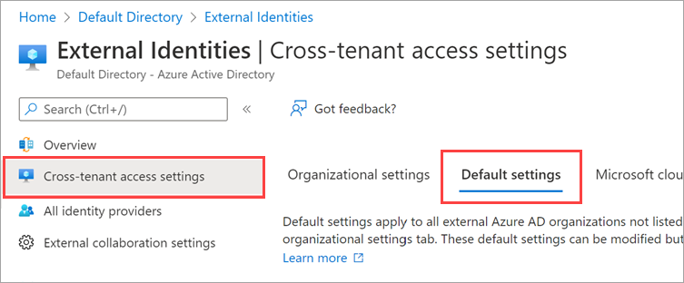
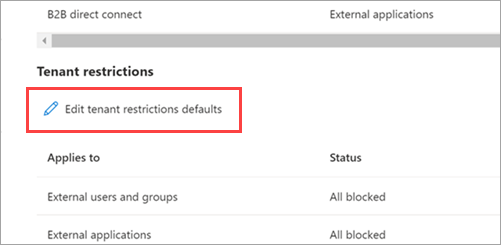
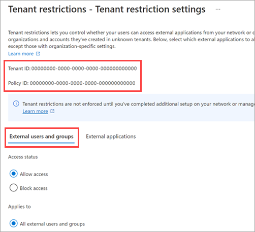
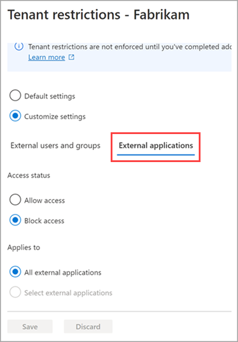
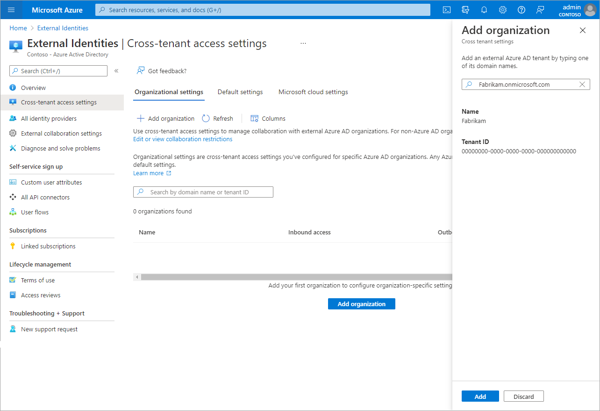
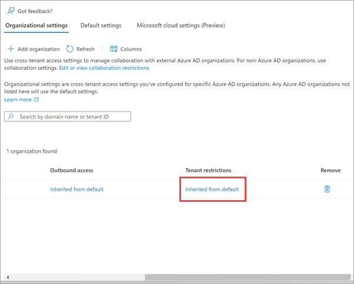
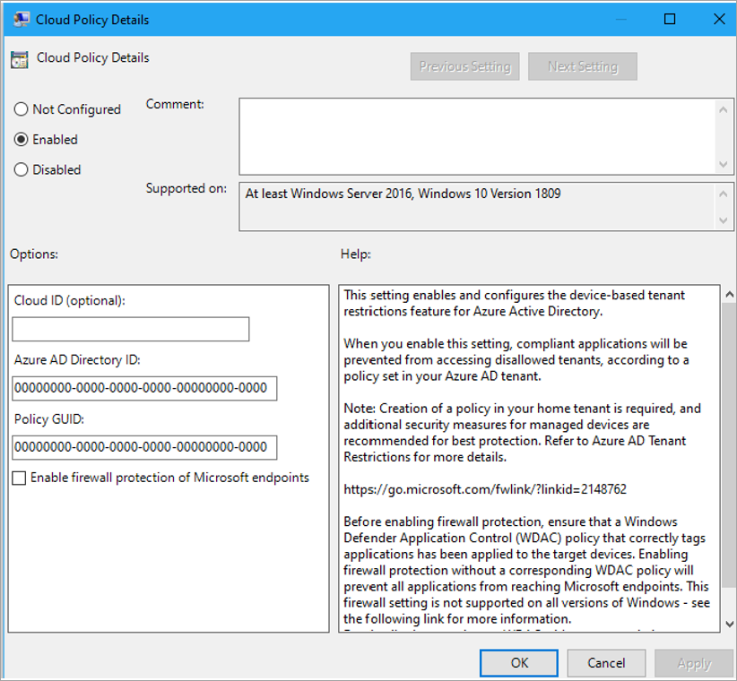

# Set up tenant restrictions V2 (Preview)

> [!NOTE]
> The **Tenant restrictions** settings, which are included with cross-tenant access settings, are preview features of Azure Active Directory. For more information about previews, see [Supplemental Terms of Use for Microsoft Azure Previews](https://azure.microsoft.com/support/legal/preview-supplemental-terms/).
For security reasons, you can limit what your users can access when they use an external account to sign in to your networks or devices. With the **Tenant restrictions** settings included with [cross-tenant access settings](cross-tenant-access-overview.md), you can control the external apps that your Windows device users can access when they're using external accounts. For example, let's say a user in your organization has created a separate account in an unknown tenant, or an external organization has given your user an account that lets them sign in to their organization. You can use tenant restrictions to prevent the user from using some or all external apps while they're signed in with the external account on your network or devices.

Tenant restrictions can be scoped to specific users, groups, organizations, or external apps. Apps built on the Windows operating system networking stack are protected, including the following:

- Office apps (all versions/release channels)
- Universal Windows Platform (UWP) .NET applications
- Edge and all websites in Edge
- Teams (with Federation Controls configured)

## Tenant restrictions V2 overview

Azure AD offers two versions of tenant restrictions policies:

- Tenant restrictions V1, described in [Set up tenant restrictions V1 for B2B collaboration](tenant-restrictions-v1.md), lets you restrict access to external tenants by configuring a tenant allow list on your corporate proxy.
- Tenant restrictions V2, described in this article, lets you apply policies directly to your users' Windows devices instead of through your corporate proxy, reducing overhead and providing more flexible, granular control.

The following table compares the two versions.
### Tenant restrictions V1 and V2 comparison

|  |V1  |V2  |
|----------------------|---------|---------|
|**Policy enforcement**    | The corporate proxy enforces the tenant restriction policy in the Azure AD control plane.         |     Windows devices are configured to point Microsoft traffic to the tenant restriction policy, and the policy is enforced in the cloud. Tenant restrictions are enforced on resource access, providing data path coverage and protection against token infiltration. For non-Windows devices, the corporate proxy enforces the policy.    |
|**Malicious tenant requests** | Azure AD blocks malicious tenant authentication requests to provide authentication plane protection.         |    Azure AD blocks malicious tenant authentication requests to provide authentication plane protection.     |
|**Granularity**           | Limited.        |   Tenant, user, group, and application granularity.      |
|**Anonymous access**      | Anonymous access to Teams meetings and file sharing is allowed.         |   Anonymous access to Teams meetings is blocked. Access to anonymously shared resources (“Anyone with the link”) is blocked.      |
|**MSA accounts**          |Uses a Restrict-MSA header to block access to consumer accounts.         |  Allows control of Microsoft account (MSA/Live ID) authentication on both the identity and data planes. Uses app-level control to allow apps such as Microsoft Learning and Azure Information Protection ([Azure Rights Management Service](/azure/information-protection/what-is-azure-rms) and [Office Message Encryption](/microsoft-365/compliance/ome)).       |
|**Proxy management**      | Manage corporate proxies by adding tenants to the Azure AD traffic allow list.         |   N/A      |
|**Platform support**      |Supported on all platforms         |     Supported only on Windows operating systems and Edge.     |
|**Portal support**        |No user interface in the Azure portal for configuring the policy.         |   User interface available in the Azure portal for setting up the cloud policy.      |
|**Unsupported apps**      |     N/A    |   block unsupported app use with Microsoft endpoints by using Windows Defender Application Control (WDAC) or Windows Firewall  (for example, for Chrome, Firefox, and so on).      |

Both versions of tenant restrictions can be used simultaneously. In fact, you can use tenant restrictions V2 to manage access for your Windows device users, and use tenant restrictions v1 to manage access for all other clients and apps that aren't supported by V2.

This article describes how to configure tenant restrictions V2 using the Azure portal. You can also use the [Microsoft Graph cross-tenant access API](/graph/api/resources/crosstenantaccesspolicy-overview?view=graph-rest-beta&preserve-view=true) to create these same tenant restrictions policies.

### Tenant restrictions vs. inbound and outbound settings

Although tenant restrictions are configured along with your cross-tenant access settings, they operate separately from inbound and outbound access settings. Cross-tenant access settings give you control when users sign in with an account from your organization, whereas tenant restrictions give you control when they're using an external account. Your inbound and outbound settings for B2B collaboration and B2B direct connect don't affect (and are unaffected by) your tenant restrictions settings.

Think of the different cross-tenant access settings this way:

- Inbound settings control *external* account access to your *internal* apps.
- Outbound settings control *internal* account access to *external* apps.
- Tenant restrictions control *external* account access to *external* apps.

### Tenant restrictions vs. B2B collaboration

When your users need access to external organizations and apps, we recommend enabling tenant restrictions to block external accounts and use B2B collaboration instead. B2B collaboration gives you the ability to:

- Use Conditional Access and force multi-factor authentication for B2B collaboration users.
- Manage inbound and outbound access.
- Terminate sessions and credentials when a B2B collaboration user's employment status changes or their credentials are breached.
- Use sign-in logs to view details about the B2B collaboration user.

### Tenant restrictions and Microsoft Teams

For greater control over access to Teams meetings, you can use Federation Controls in Teams to allow or block specific tenants, along with tenant restrictions V2 to block anonymous access to Teams meetings. Tenant restrictions prevent users from using an externally-issued identity to join Teams meetings.

For example, suppose Contoso uses Teams Federation Controls to block the Fabrikam tenant. If someone with a Contoso device uses a Fabrikam account to join a Contoso Teams meeting, they'll be allowed into the meeting as an anonymous user. Now, if Contoso also enables tenant restrictions V2, Teams will block anonymous access, and the user won't be able to join the meeting.

To enforce tenant restrictions for Teams, you'll need to configure tenant restrictions V2 in your Azure AD cross-tenant access settings, and also set up Federation Controls in the Teams Admin portal and restart Teams. Be aware that tenant restrictions won't block anonymous access to Teams meetings, SharePoint files, and other resources that don't require authentication.

## Configure tenant restrictions V2

### Prerequisites

To configure tenant restrictions, you'll need the following:

- Azure AD Premium P1 or P2
- Account with a role of Global administrator, Security administrator, or Conditional Access administrator
- Windows devices running Windows 10 or Windows 11 with the latest updates

### Step 1: Create tenant restrictions V2

Settings for tenant restrictions V2 are located in the Azure portal under **Cross-tenant access settings**. First, configure the default tenant restrictions you want to apply to all users, groups, apps, and organizations. Then, if you need partner-specific configurations, you can add a partner's organization and customize any settings that differ from your defaults.

#### To configure default tenant restrictions

1. Sign in to the [Azure portal](https://portal.azure.com) using a Global administrator, Security administrator, or Conditional Access administrator account. Then open the **Azure Active Directory** service.

1. Select **External Identities**

1. Select **Cross-tenant access settings**, and then select the **Default settings** tab.

   

1. Scroll to the **Tenant restrictions** section.

1. Select the **Edit tenant restrictions defaults** link.

      

1. Select the **External users and groups** tab.

   > [!IMPORTANT]
   > Copy the values for **Tenant ID** and **Policy ID**. You'll use them when you configure Windows clients to enable tenant restrictions.
    

1. Under **Access status**, choose whether to allow or block access to the apps listed on the **External applications** tab. Note that you can't scope default settings to individual external users and groups, so **Applies to** always equals **All external users and groups**.

   - **Allow access**: Allows all user and group external accounts to access  external apps when using your networks and devices.
   - **Block access**: Blocks all user and group external accounts from accessing  external apps when using your networks and devices.

   > [!NOTE]
   > If you block access for all external users and groups, you also need to block access to all external applications (on the **External applications** tab).
1. Select the **External applications** tab.

    

1. Under **Access status**, choose whether to allow or block access to external applications. Note that you can't scope default settings to individual external users and groups, so **Applies to** always equals **All external applications**.

   - **Allow access**: Allows all external applications to be accessed by your users when using external accounts.
   - **Block access**: Blocks the external applications specified under **Applies to** from being accessed by your users when using external accounts.

    

#### To configure partner-specific tenant restrictions

Follow these steps to configure customized tenant restrictions for an organization when you want the tenant restrictions to differ from the defaults. Any settings you configure for an organization will take precedence over the default settings for that.

1. Sign in to the [Azure portal](https://portal.azure.com) using a Global administrator, Security administrator, or Conditional Access administrator account. Then open the **Azure Active Directory** service.
1. Select **External Identities**, and then select **Cross-tenant access settings**.
1. Select **Organizational settings**. (If the organization is already listed, you can skip adding it and go directly to modifying the settings.)
1. Select **Add organization**.
1. On the **Add organization** pane, type the full domain name (or tenant ID) for the organization.

   

1. Select the organization in the search results, and then select **Add**.
1. The organization appears in the **Organizational settings** list. Scroll to the right to see the **Tenant restrictions** column. At this point, all tenant restrictions settings for this organization are inherited from your default settings. To change the settings for this organization, select the **Inherited from default** link under the **Tenant restrictions** column.

   

1. Select the **External users and groups** tab.

   > [!IMPORTANT]
   > Copy the values for **Tenant ID** and **Policy ID**. You'll use them when you configure Windows clients to enable tenant restrictions.
    

1. Under **Access status**, choose whether to allow or block access to the apps specified on the **External applications** tab.

   - **Allow access**: Allows user and group external accounts to access the specified external apps when using your networks and devices.
   - **Block access**: Blocks user and group external accounts from accessing the specified external apps when using your networks and devices.

   > [!NOTE]
   > If you block access for all external users and groups, you also need to block access to all external applications (on the **External applications** tab).
1. Under **Applies to**, choose either **All external users and groups** or **Select external users and groups**.

1. If you chose **Select external users and groups**, do the following for each user or group you want to add:

   - Select **Add external users and groups**.
   - In the **Select** pane, type the user name or group name in the search box.
   - Select the user or group in the search results.
   - When you're done selecting the users and groups you want to add, choose **Select**.

1. Select the **External applications** tab.

    

1. Under **Access status**, choose whether to allow or block access to external applications.

   - **Allow access**: Allows the external applications specified under **Applies to** to be accessed by your users when using external accounts.
   - **Block access**: Blocks the external applications specified under **Applies to** from being accessed by your users when using external accounts.

1. Under **Applies to**, select one of the following:

   - **All external applications**: Applies the action you chose under **Access status** to all external applications.
   - **Select external applications**: Applies the action you chose under **Access status** to all external applications.

   > [!NOTE]
   > If you block access to all external applications, you also need to block access for all of your users and groups (on the **Users and groups** tab).
1. If you chose **Select external applications**, do the following for each application you want to add:

   - Select **Add Microsoft applications** or **Add other applications**.
   - In the search box, type the application name or the application ID (either the *client app ID* or the *resource app ID*). Then select the application in the search results. Repeat for each application you want to add.
   - When you're done selecting applications, choose **Select**.

### Step 2: Enable tenant restrictions on Windows managed devices

After you create a tenant restrictions V2 policy, you can enforce the policy on each Windows 10 and Windows 11 device by adding your tenant ID and the policy ID to the device's **Tenant Restrictions** configuration. When tenant restrictions are enabled on a Windows device, corporate proxies aren't required for policy enforcement. Devices don't need to be Azure AD managed to enforce tenant restrictions V2; domain-joined devices that are managed with Group Policy are also supported.

You can use Group Policy to deploy the tenant restrictions configuration to Windows devices (see [Administrative Templates for Windows 10](https://www.microsoft.com/en-us/download/details.aspx?id=104042) and [Group Policy Settings Reference Spreadsheet for Windows 10](https://www.microsoft.com/en-us/download/details.aspx?id=104043)).

If you want to test the policy on a device, follow these steps.

> [!NOTE]
> - The device must be running Windows 10 or Windows 11 with the latest updates.
> - You'll need the policy ID for the tenant restrictions policy, which can only be viewed on the **Tenant restrictions** page in the portal as described in [Step 1: Create tenant restrictions V2](#step-1-create-tenant-restrictions-v2). The policy ID isn't retrievable via the Microsoft Graph API.
1. On the Windows computer, press the Windows key, type **gpedit**, and then select **Edit group policy (Control panel)**.
1. Go to **Computer Configuration** > **Administrative Templates** > **Windows Components** > **Tenant Restrictions**.
1. Right-click **Cloud Policy Details** in the right pane, and then select **Edit**.
1. Enter the following settings (leave all other fields blank). To find these settings, go to the tenant restrictions settings page.
   - **Azure AD Directory ID**: Enter the directory ID for your tenant. To find your tenant ID in the [Azure portal](https://portal.azure.com), open the **Azure Active Directory** service, select **Properties**, and copy the **Tenant ID**.
   - **Policy GUID**: Enter the object ID of your cross-tenant access policy. To find your policy GUID, Get this by calling /crosstenantaccesspolicy/default and using the “id” field returned:

   

1. Select **OK**.

### Step 3: Set up tenant restrictions on your corporate proxy

Tenant restrictions V2 policies can't be directly enforced on non-Windows 10 or Windows 11 devices, such as Mac computers, mobile devices, and unsupported Windows applications. To ensure sign-ins are restricted on all devices and apps in your corporate network, configure your corporate proxy to enforce tenant restrictions V2.

> [!IMPORTANT]
> If you've previously set up tenant restrictions, you'll need to stop sending `restrict-msa` to login.live.com. Otherwise, the new settings will conflict with your existing instructions to the MSA login service.
1. Configure the tenant restrictions V2 header as follows:

   |Header name  |Header Value  |
   |---------|---------|
   |`sec-Restrict-Tenant-Access-Policy`     |  `<DirectoryId>:<policyGuid>`       |

   - `DirectoryID` is your Azure AD tenant ID. Find this value by signing in to the Azure portal as an administrator, select **Azure Active Directory**, then select **Properties**.
   - `policyGUID` is the object ID for your cross-tenant access policy. Find this value by calling `/crosstenantaccesspolicy/default` and using the “id” field returned.

1. On your corporate proxy, send the tenant restrictions V2 header to the following Microsoft login domains:

   - login.live.com
   - login.microsoft.com
   - login.microsoftonline.com
   - login.windows.net

   This header will enforce your tenant restrictions V2 policy on all sign-ins on your network. Be aware that this header won't block anonymous access to Teams meetings, SharePoint files, or other resources that don't require authentication.

## Event Viewer for tenant restrictions

You can view events related to tenant restrictions in Event Viewer.

1. In Event Viewer, open **Applications and Services Logs**.
1. Navigate to **Microsoft** > **Windows** > **TenantRestrictions** > **Operational** and look for events.  

## Next steps

See [Configure external collaboration settings](external-collaboration-settings-configure.md) for B2B collaboration with non-Azure AD identities, social identities, and non-IT managed external accounts.