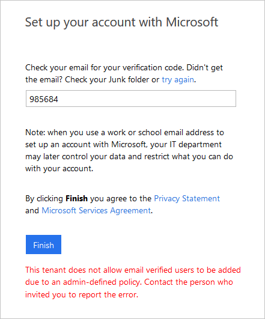

# Troubleshooting Microsoft Entra B2B collaboration

Here are some remedies for common problems with Microsoft Entra B2B collaboration.

   > [!IMPORTANT]
   >
   > - **Starting July 12, 2021**,  if Microsoft Entra B2B customers set up new Google integrations for use with self-service sign-up for their custom or line-of-business applications, authentication with Google identities won’t work until authentications are moved to system web-views. [Learn more](google-federation.md#deprecation-of-web-view-sign-in-support).
   > - **Starting September 30, 2021**, Google is [deprecating embedded web-view sign-in support](https://developers.googleblog.com/2016/08/modernizing-oauth-interactions-in-native-apps.html). If your apps authenticate users with an embedded web-view and you're using Google federation with [Azure AD B2C](/azure/active-directory-b2c/identity-provider-google) or Microsoft Entra B2B for [external user invitations](google-federation.md) or [self-service sign-up](identity-providers.md), Google Gmail users won't be able to authenticate. [Learn more](google-federation.md#deprecation-of-web-view-sign-in-support).
   > - The [email one-time passcode](one-time-passcode.md) feature is now turned on by default for all new tenants and for any existing tenants where you haven't explicitly turned it off. When this feature is turned off, the fallback authentication method is to prompt invitees to create a Microsoft account.

## Guest sign-in fails with error code AADSTS50020

When a guest user from an identity provider (IdP) can't sign in to a resource tenant in Microsoft Entra ID and receives an error code AADSTS50020, there are several possible causes. See the troubleshooting article for error [AADSTS50020](/troubleshoot/azure/active-directory/error-code-aadsts50020-user-account-identity-provider-does-not-exist).

## B2B direct connect user is unable to access a shared channel (error AADSTS90071)

When a B2B direct connect sees the following error message when trying to access another organization's Teams shared channel, multi-factor authentication trust settings haven't been configured by the external organization:

> The organization you're trying to reach needs to update their settings to let you sign in.
>
> AADSTS90071: An admin from *&lt;organization&gt;* must update their access settings to accept inbound multifactor authentication.

The organization hosting the Teams shared channel must enable the trust setting for multi-factor authentication to allow access to B2B direct connect users. Trust settings are configurable in an organization's [cross-tenant access settings](cross-tenant-access-settings-b2b-direct-connect.md).

## An error similar to "Failure to update policy due to object limit" appears while configuring cross-tenant access settings

As you configure [cross-tenant access settings](cross-tenant-access-settings-b2b-collaboration.md), if you receive an error that says “Failure to update policy due to object limit,” you've reached the policy object limit of 25 KB. We're working toward increasing this limit. If you need to be able to calculate how close the current policy is to this limit, do the following:

1. Open Microsoft Graph Explorer and run the following:  

   `GET https://graph.microsoft.com/beta/policies/crosstenantaccesspolicy`

1. Copy the entire JSON response and save it as a txt file, for example `policyobject.txt`.

1. Open PowerShell and run the following script, substituting the file location in the first line with your text file:

```powershell
$policy = Get-Content “C:\policyobject.txt”
$maxSize = 1024*25 
$size = [System.Text.Encoding]::UTF8.GetByteCount($policy) 
write-host "Remaining Bytes available in policy object" 
$maxSize - $size 
write-host "Is current policy within limits?" 
if ($size -le $maxSize) { return “valid” }; else { return “invalid” } 
```

## Users can no longer read email encrypted with Microsoft Rights Management Service (OME))

As you configure [cross-tenant access settings](cross-tenant-access-settings-b2b-collaboration.md), if you block access to all apps by default, users will be unable to read emails encrypted with Microsoft Rights Management Service (also known as OME). To avoid this issue, we recommend configuring your outbound settings to allow your users to access this app ID: 00000012-0000-0000-c000-000000000000. If this is the only application you allow, access to all other apps will be blocked by default.

## I’ve added an external user but don't see them in my Global Address Book or in the people picker

In cases where external users aren't populated in the list, the object might take a few minutes to replicate.

## A B2B guest user isn't showing up in SharePoint Online/OneDrive people picker

The ability to search for existing guest users in the SharePoint Online (SPO) people picker is OFF by default to match legacy behavior.

You can enable this feature by using the setting 'ShowPeoplePickerSuggestionsForGuestUsers' at the tenant and site collection level. You can set the feature using the Set-SPOTenant and Set-SPOSite cmdlets, which allow members to search all existing guest users in the directory. Changes in the tenant scope don't affect already provisioned SPO sites.

## My guest invite settings and domain restrictions aren't being respected by SharePoint Online/OneDrive

By default, SharePoint Online and OneDrive have their own set of external user options and don't use the settings from Microsoft Entra ID.  You need to enable [SharePoint and OneDrive integration with Microsoft Entra B2B](/sharepoint/sharepoint-azureb2b-integration) to ensure the options are consistent among those applications.
## Invitations have been disabled for directory

If you're notified that you don't have permissions to invite users, verify that your user account is authorized to invite external users under Identity > Users > User settings > External users > Manage external collaboration settings:

:::image type="content" source="media/troubleshoot/external-user-settings.png" alt-text="Screenshot showing the External User settings.":::

If you've recently modified these settings or assigned the Guest Inviter role to a user, there might be a 15-60 minute delay before the changes take effect.

## The user that I invited is receiving an error during the redemption process

Common errors include:

### Invitee’s Admin has disallowed EmailVerified Users from being created in their tenant

When inviting users whose organization is using Microsoft Entra ID, but where the specific user’s account doesn't exist (for example, the user doesn't exist in Microsoft Entra contoso.com). The administrator of contoso.com may have a policy in place preventing users from being created. The user must check with their admin to determine if external users are allowed. The external user’s admin may need to allow Email Verified users in their domain (see this [article](/powershell/module/msonline/set-msolcompanysettings) on allowing Email Verified Users).



### External user doesn't exist already in a federated domain

If you're using federation authentication and the user doesn't already exist in Microsoft Entra ID, the user can't be invited.

To resolve this issue, the external user’s admin must synchronize the user’s account to Microsoft Entra ID.

### External user has a proxyAddress that conflicts with a proxyAddress of an existing local user

When we check whether a user is able to be invited to your tenant, one of the things we check for is for a collision in the proxyAddress. This includes any proxyAddresses for the user in their home tenant and any proxyAddress for local users in your tenant. For external users, we'll add the email to the proxyAddress of the existing B2B user. For local users, you can ask them to sign in using the account they already have.

## I can't invite an email address because of a conflict in proxyAddresses

This happens when another object in the directory has the same invited email address as one of its proxyAddresses. To fix this conflict, remove the email from the [user](/graph/api/resources/user) object, and also delete the associated [contact](/graph/api/resources/contact) object before trying to invite this email again.

## The guest user object doesn't have a proxyAddress

Sometimes, the external guest user you're inviting conflicts with an existing [Contact object](/graph/api/resources/contact). When this occurs, the guest user is created without a proxyAddress. This means that the user won't be able to redeem this account using [just-in-time redemption](redemption-experience.md#redemption-process-through-a-direct-link) or [email one-time passcode authentication](one-time-passcode.md#user-experience-for-one-time-passcode-guest-users). Also, if the contact object you're synchronizing from on-premises AD conflicts with an existing guest user, the conflicting proxyAddress is removed from the existing guest user.

<a name='how-does--which-isnt-normally-a-valid-character-sync-with-azure-ad'></a>

## How does ‘\#’, which isn't normally a valid character, sync with Microsoft Entra ID?

“\#” is a reserved character in UPNs for Microsoft Entra B2B collaboration or external users, because the invited account user@contoso.com becomes user_contoso.com#EXT#@fabrikam.onmicrosoft.com. Therefore, \# in UPNs coming from on-premises aren't allowed to sign in to the Microsoft Entra admin center. 

## I receive an error when adding external users to a synchronized group

External users can be added only to “assigned” or “Security” groups and not to groups that are mastered on-premises.

## My external user didn't receive an email to redeem

The invitee should check with their ISP or spam filter to ensure that the following address is allowed: Invites@microsoft.com.

> [!NOTE]
>
> - For the Azure service operated by 21Vianet in China, the sender address is Invites@oe.21vianet.com.
> - For the Microsoft Entra Government cloud, the sender address is invites@azuread.us.

## I notice that the custom message doesn't get included with invitation messages at times

To comply with privacy laws, our APIs don't include custom messages in the email invitation when:

- The inviter doesn’t have an email address in the inviting tenant
- When an appservice principal sends the invitation

If this scenario is important to you, you can suppress our API invitation email, and send it through the email mechanism of your choice. Consult your organization’s legal counsel to make sure any email you send this way also complies with privacy laws.

## You receive an “AADSTS65005” error when you try to sign in to an Azure resource

A user who has a guest account can't sign in, and is receiving the following error message:

```plaintext
    AADSTS65005: Using application 'AppName' is currently not supported for your organization contoso.com because it is in an unmanaged state. An administrator needs to claim ownership of the company by DNS validation of contoso.com before the application AppName can be provisioned.
```

The user has an Azure user account and is a viral tenant who has been abandoned or unmanaged. Additionally, there are no Global Administrators in the tenant.

To resolve this problem, you must take over the abandoned tenant. Refer to  [Take over an unmanaged directory as administrator in Microsoft Entra ID](../enterprise-users/domains-admin-takeover.md). You must also access the internet-facing DNS for the domain suffix in question in order to provide direct evidence that you are in control of the namespace. After the tenant is returned to a managed state, discuss with the customer whether leaving the users and verified domain name is the best option for their organization.

## A guest user with a just-in-time or "viral" tenant is unable to reset their password

If the identity tenant is a just-in-time (JIT) or viral tenant (meaning it's a separate, unmanaged Azure tenant), only the guest user can reset their password. Sometimes an organization will [take over management of viral tenants](../enterprise-users/domains-admin-takeover.md) that are created when employees use their work email addresses to sign up for services. After the organization takes over a viral tenant, only an administrator in that organization can reset the user's password or enable SSPR. If necessary, as the inviting organization, you can remove the guest user account from your directory and resend an invitation.

## A guest user is unable to use the Azure AD PowerShell V1 module

As of November 18, 2019, guest users in your directory (defined as user accounts where the **userType** property equals **Guest**) are blocked from using the Azure AD PowerShell V1 module. Going forward, a user will need to either be a member user (where **userType** equals **Member**) or use the Azure AD PowerShell V2 module.

## In an Azure US Government tenant, I can't invite a B2B collaboration guest user

Within the Azure US Government cloud, B2B collaboration is enabled between tenants that are both within Azure US Government cloud and that both support B2B collaboration. If you invite a user in a tenant that doesn't yet support B2B collaboration, you'll get an error. For details and limitations, see [Microsoft Entra ID P1 and P2 Variations](/azure/azure-government/compare-azure-government-global-azure#azure-active-directory-premium-p1-and-p2).

If you need to collaborate with a Microsoft Entra organization that's outside of the Azure US Government cloud, you can use [Microsoft cloud settings](cross-cloud-settings.md) to enable B2B collaboration.

## Invitation is blocked due to cross-tenant access policies

When you try to invite a B2B collaboration user, you might see this error message: "This invitation is blocked by cross-tenant access settings. Admins in both your organization and the invited user's organization must configure cross-tenant access settings to allow the invitation." This error message will appear, if B2B collaboration is supported, but is blocked by cross-tenant access settings. Check your cross-tenant access settings, and make sure that your settings allow B2B collaboration with the user. 
When you try to collaborate with another Microsoft Entra organization in a separate Microsoft Azure cloud, you can use [Microsoft cloud settings](cross-cloud-settings.md) to enable Microsoft Entra B2B collaboration.

## Invitation is blocked due to disabled Microsoft B2B Cross Cloud Worker application

Rarely, you might see this message: “This action can't be completed because the Microsoft B2B Cross Cloud Worker application has been disabled in the invited user’s tenant. Ask the invited user’s admin to re-enable it, then try again.” This error means that the Microsoft B2B Cross Cloud Worker application has been disabled in the B2B collaboration user’s home tenant. This app is typically enabled, but it might have been disabled by an admin in the user’s home tenant, either through PowerShell or the portal (see [Disable how a user signs in](../manage-apps/disable-user-sign-in-portal.md)). An admin in the user’s home tenant can re-enable the app through PowerShell or the Microsoft Entra admin center. In the admin center, search for “Microsoft B2B Cross Cloud Worker” to find the app, select it, and then choose to re-enable it.

<a name='i-receive-the-error-that-azure-ad-cant-find-the-aad-extensions-app-in-my-tenant'></a>

## I receive the error that Microsoft Entra ID can't find the `aad-extensions-app` in my tenant

When you're using self-service sign-up features, like custom user attributes or user flows, an app called `aad-extensions-app. Do not modify. Used by AAD for storing user data.` is automatically created. It's used by Microsoft Entra External ID to store information about users who sign up and custom attributes collected.

If you accidentally deleted the `aad-extensions-app`, you have 30 days to recover it. You can restore the app using the Azure AD PowerShell module.

1. Launch the Azure AD PowerShell module and run `Connect-AzureAD`.
1. Sign in as a global administrator for the Microsoft Entra tenant that you want to recover the deleted app for.
1. Run the PowerShell command `Get-AzureADDeletedApplication`.
1. Find the application in the list where the display name begins with `aad-extensions-app` and copy its `ObjectId` property value.
1. Run the PowerShell command `Restore-AzureADDeletedApplication -ObjectId {id}`. Replace the `{id}` portion of the command with the `ObjectId` from the previous step.

You should now see the restored app in the Microsoft Entra admin center.

## A guest user was invited successfully but the email attribute isn't populating

Let's say you inadvertently invite a guest user with an email address that matches a user object already in your directory. The guest user object is created, but the email address is added to the `otherMail` property instead of to the `mail` or `proxyAddresses` properties. To avoid this issue, you can search for conflicting user objects in your Microsoft Entra directory by using these PowerShell steps:

1. Open the Azure AD PowerShell module and run `Connect-AzureAD`.
1. Sign in as a global administrator for the Microsoft Entra tenant that you want to check for duplicate contact objects in.
1. Run the PowerShell command `Get-AzureADContact -All $true | ? {$_.ProxyAddresses -match 'user@domain.com'}`.
1. Run the PowerShell command `Get-AzureADContact -All $true | ? {$_.Mail -match 'user@domain.com'}`.

## External access blocked by policy error on the login screen

When you try to login to your tenant, you might see this error message: "Your network administrator has restricted what organizations can be accessed. Contact your IT department to unblock access." This error is related to tenant restriction settings. To resolve this issue, ask your IT team to follow the instructions in [this article](../manage-apps/tenant-restrictions.md).

## Invitation is blocked due missing cross-tenant access settings 

You might see this message: "This invitation is blocked by cross-tenant access settings in your organization. Your administrator must configure cross-tenant access settings to allow this invitation." In this case, ask your administrator to check the cross-tenant access settings.  

## Next steps

- [Get support for B2B collaboration](../fundamentals/how-to-get-support.md)
- [Use audit logs and access reviews](auditing-and-reporting.md)
