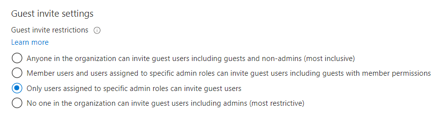

# Troubleshooting Azure Active Directory B2B collaboration

Here are some remedies for common problems with Azure Active Directory (Azure AD) B2B collaboration.

   > [!IMPORTANT]
   > **Starting March 31, 2021**, Microsoft will no longer support the redemption of invitations by creating unmanaged Azure AD accounts and tenants for B2B collaboration scenarios. In preparation, we encourage customers to opt into [email one-time passcode authentication](one-time-passcode.md). We welcome your feedback on this public preview feature and are excited to create even more ways to collaborate.

## I’ve added an external user but do not see them in my Global Address Book or in the people picker

In cases where external users are not populated in the list, the object might take a few minutes to replicate.

## A B2B guest user is not showing up in SharePoint Online/OneDrive people picker

The ability to search for existing guest users in the SharePoint Online (SPO) people picker is OFF by default to match legacy behavior.

You can enable this feature by using the setting 'ShowPeoplePickerSuggestionsForGuestUsers' at the tenant and site collection level. You can set the feature using the Set-SPOTenant and Set-SPOSite cmdlets, which allow members to search all existing guest users in the directory. Changes in the tenant scope do not affect already provisioned SPO sites.

## Invitations have been disabled for directory

If you are notified that you do not have permissions to invite users, verify that your user account is authorized to invite external users under Azure Active Directory > User settings > External users > Manage external collaboration settings:



If you have recently modified these settings or assigned the Guest Inviter role to a user, there might be a 15-60 minute delay before the changes take effect.

## The user that I invited is receiving an error during redemption

Common errors include:

### Invitee’s Admin has disallowed EmailVerified Users from being created in their tenant

When inviting users whose organization is using Azure Active Directory, but where the specific user’s account does not exist (for example, the user does not exist in Azure AD contoso.com). The administrator of contoso.com may have a policy in place preventing users from being created. The user must check with their admin to determine if external users are allowed. The external user’s admin may need to allow Email Verified users in their domain (see this [article](/powershell/module/msonline/set-msolcompanysettings?view=azureadps-1.0) on allowing Email Verified Users).


### External user does not exist already in a federated domain

If you are using federation authentication and the user does not already exist in Azure Active Directory, the user cannot be invited.

To resolve this issue, the external user’s admin must synchronize the user’s account to Azure Active Directory.

## How does ‘\#’, which is not normally a valid character, sync with Azure AD?

“\#” is a reserved character in UPNs for Azure AD B2B collaboration or external users, because the invited account user@contoso.com becomes user_contoso.com#EXT#@fabrikam.onmicrosoft.com. Therefore, \# in UPNs coming from on-premises aren't allowed to sign in to the Azure portal. 

## I receive an error when adding external users to a synchronized group

External users can be added only to “assigned” or “Security” groups and not to groups that are mastered on-premises.

## My external user did not receive an email to redeem

The invitee should check with their ISP or spam filter to ensure that the following address is allowed: Invites@microsoft.com

## I notice that the custom message does not get included with invitation messages at times

To comply with privacy laws, our APIs do not include custom messages in the email invitation when:

- The inviter doesn’t have an email address in the inviting tenant
- When an appservice principal sends the invitation

If this scenario is important to you, you can suppress our API invitation email, and send it through the email mechanism of your choice. Consult your organization’s legal counsel to make sure any email you send this way also complies with privacy laws.

## You receive an “AADSTS65005” error when you try to log in to an Azure resource

A user who has a guest account cannot log on, and is receiving the following error message:

```plaintext
    AADSTS65005: Using application 'AppName' is currently not supported for your organization contoso.com because it is in an unmanaged state. An administrator needs to claim ownership of the company by DNS validation of contoso.com before the application AppName can be provisioned.
```

The user has an Azure user account and is a viral tenant who has been abandoned or unmanaged. Additionally, there are no global or company administrators in the tenant.

To resolve this problem, you must take over the abandoned tenant. Refer to  [Take over an unmanaged directory as administrator in Azure Active Directory](../users-groups-roles/domains-admin-takeover.md). You must also access the internet-facing DNS for the domain suffix in question in order to provide direct evidence that you are in control of the namespace. After the tenant is returned to a managed state, please discuss with the customer whether leaving the users and verified domain name is the best option for their organization.

## A guest user with a just-in-time or "viral" tenant is unable to reset their password

If the identity tenant is a just-in-time (JIT) or viral tenant (meaning it's a separate, unmanaged Azure tenant), only the guest user can reset their password. Sometimes an organization will [take over management of viral tenants](../users-groups-roles/domains-admin-takeover.md) that are created when employees use their work email addresses to sign up for services. After the organization takes over a viral tenant, only an administrator in that organization can reset the user's password or enable SSPR. If necessary, as the inviting organization, you can remove the guest user account from your directory and resend an invitation.

## A guest user is unable to use the AzureAD PowerShell V1 module

As of November 18, 2019, guest users in your directory (defined as user accounts where the **userType** property equals **Guest**) are blocked from using the AzureAD PowerShell V1 module. Going forward, a user will need to either be a member user (where **userType** equals **Member**) or use the AzureAD PowerShell V2 module.

## In an Azure US Government tenant, I can't invite a B2B collaboration guest user

Within the Azure US Government cloud, B2B collaboration is currently only supported between tenants that are both within Azure US Government cloud and that both support B2B collaboration. If you invite a user in a tenant that isn't part of the Azure US Government cloud or that doesn't yet support B2B collaboration, you'll get an error. For details and limitations, see [Azure Active Directory Premium P1 and P2 Variations](../../azure-government/compare-azure-government-global-azure.md#azure-active-directory-premium-p1-and-p2).

## I receive the error that Azure AD cannot find the aad-extensions-app in my tenant

When using self-service sign-up features, like custom user attributes or user flows, an app called `aad-extensions-app. Do not modify. Used by AAD for storing user data.` is automatically created. It's used by Azure AD External Identities to store information about users who sign up and custom attributes collected.

If you accidentally deleted the `aad-extensions-app`, you have 30 days to recover it. You can restore the app using the Azure AD PowerShell module.

1. Launch the Azure AD PowerShell module and run `Connect-AzureAD`.
1. Sign in as a global administrator for the Azure AD tenant that you want to recover the deleted app for.
1. Run the PowerShell command `Get-AzureADDeletedApplication`.
1. Find the application in the list where the display name begins with `aad-extensions-app` and copy its `ObjectId` property value.
1. Run the PowerShell command `Restore-AzureADDeletedApplication -ObjectId {id}`. Replace the `{id}` portion of the command with the `ObjectId` from the previous step.

You should now see the restored app in the Azure portal.

## Next steps

[Get support for B2B collaboration](../fundamentals/active-directory-troubleshooting-support-howto.md)