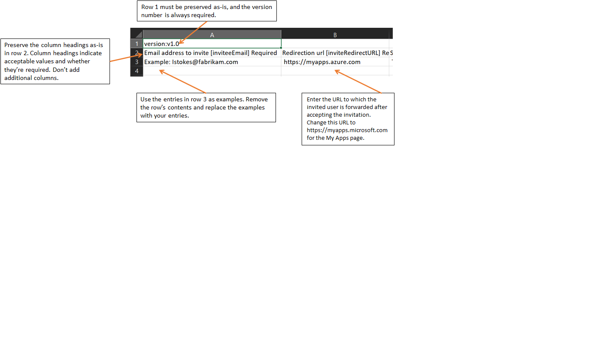

---

title: Bulk invite guest users for B2B collaboration tutorial
description: In this tutorial, you learn how to send bulk invitations using a CSV file to external Microsoft Entra B2B collaboration users. 

services: active-directory
ms.service: active-directory
ms.subservice: B2B
ms.topic: tutorial
ms.date: 07/31/2023

ms.author: cmulligan
author: csmulligan
manager: CelesteDG

# Customer intent: As a tenant administrator, I want to send B2B invitations to multiple external users at the same time so that I can avoid having to send individual invitations to each user.

ms.collection: engagement-fy23, M365-identity-device-management
ms.custom: engagement-fy23
---

# Tutorial: Bulk invite Microsoft Entra B2B collaboration users

If you use Microsoft Entra B2B collaboration to work with external partners, you can invite multiple guest users to your organization at the same time. In this tutorial, you learn how to use the Microsoft Entra admin center to send bulk invitations to external users. Specifically, you'll follow these steps:

> [!div class="checklist"]
>
> * Use **Bulk invite users** to prepare a comma-separated value (.csv) file with the user information and invitation preferences
> * Upload the .csv file to Microsoft Entra ID
> * Verify the users were added to the directory

## Prerequisites
- If you don’t have Microsoft Entra ID, create a [free account](https://azure.microsoft.com/free/?WT.mc_id=A261C142F) before you begin.
- You need two or more test email accounts that you can send the invitations to. The accounts must be from outside your organization. You can use any type of account, including social accounts such as gmail.com or outlook.com addresses.

## Invite guest users in bulk

[!INCLUDE [portal updates](~/articles/active-directory/includes/portal-update.md)]

1. Sign in to the [Microsoft Entra admin center](https://entra.microsoft.com) as at least a [User Administrator](../roles/permissions-reference.md#user-administrator).
1. Browse to **Identity** > **Users** > **All Users**.
4. Select **Bulk operations** > **Bulk invite**.

    :::image type="content" source="media/tutorial-bulk-invite/bulk-invite-button.png" alt-text="Screenshot of the bulk invite button.":::


4. On the **Bulk invite users** page, select **Download** to get a [valid .csv template](tutorial-bulk-invite.md#understand-the-csv-template) with invitation properties.

    :::image type="content" source="media/tutorial-bulk-invite/download-button.png" alt-text="Screenshot of the download the csv file button.":::

1. Open the .csv template and add a line for each guest user. Required values are:

   * **Email address to invite** - the user who will receive an invitation

   * **Redirection url** - the URL to which the invited user is forwarded after accepting the invitation. If you want to forward the user to the My Apps page, you must change this value to https://myapps.microsoft.com or https://myapplications.microsoft.com.

    :::image type="content" source="media/tutorial-bulk-invite/bulk-invite-csv.png" alt-text="Screenshot of the example csv file with guest users entered.":::

   > [!NOTE]
   > Don't use commas in the **Customized invitation message** because they'll prevent the message from being parsed successfully.

6. Save the file.
7. On the **Bulk invite users** page, under **Upload your csv file**, browse to the file. When you select the file, validation of the .csv file starts. 
8. When the file contents are validated, you’ll see **File uploaded successfully**. If there are errors, you must fix them before you can submit the job.
9. When your file passes validation, select **Submit** to start the Azure bulk operation that adds the invitations. 
10. To view the job status, select **Click here to view the status of each operation**. Or, you can select **Bulk operation results** in the **Activity** section. For details about each line item within the bulk operation, select the values under the **# Success**, **# Failure**, or **Total Requests** columns. If failures occurred, the reasons for failure will be listed.

    :::image type="content" source="media/tutorial-bulk-invite/bulk-operation-results.png" alt-text="Screenshot of the bulk operation results." lightbox="media/tutorial-bulk-invite/bulk-operation-results.png":::


11. When the job completes, you'll see a notification that the bulk operation succeeded.


## Understand the CSV template

Download and fill in the bulk upload CSV template to help you successfully invite Microsoft Entra guest users in bulk. The CSV template you download might look like this example:



### CSV template structure

The rows in a downloaded CSV template are as follows:

- **Version number**: The first row containing the version number must be included in the upload CSV.
- **Column headings**: The format of the column headings is &lt;*Item name*&gt; [PropertyName] &lt;*Required or blank*&gt;. For example, `Email address to invite [inviteeEmail] Required`. Some older versions of the template might have slight variations.
- **Examples row**: We've included in the template a row of examples of values for each column. You must remove the examples row and replace it with your own entries.

### Additional guidance

- The first two rows of the upload template must not be removed or modified, or the upload can't be processed.
- The required columns are listed first.
- We don't recommend adding new columns to the template. Any columns you add are ignored and not processed.
- We recommend that you download the latest version of the CSV template as often as possible.


## Verify guest users in the directory

Check to see that the guest users you added exist in the directory either in the Microsoft Entra admin center or by using PowerShell.

### View guest users in the Microsoft Entra admin center

1. Sign in to the [Microsoft Entra admin center](https://entra.microsoft.com) as at least a [User Administrator](../roles/permissions-reference.md#user-administrator).
1. Browse to **Identity** > **Users** > **All users**.
4. Under **Show**, select **Guest users only** and verify the users you added are listed.

### View guest users with PowerShell

To view guest users with PowerShell, you'll need the [`Microsoft.Graph.Users` PowerShell module](/powershell/module/microsoft.graph.users/?view=graph-powershell-beta&preserve-view=true). Then sign in using the `Connect-MgGraph` command with an admin account to consent to the required scopes:
```powershell
Connect-MgGraph -Scopes "User.Read.All"
```

Run the following command:

```powershell
 Get-MgUser -Filter "UserType eq 'Guest'"
```

You should see the users that you invited listed, with a user principal name (UPN) in the format *emailaddress*#EXT#\@*domain*. For example, *lstokes_fabrikam.com#EXT#\@contoso.onmicrosoft.com*, where contoso.onmicrosoft.com is the organization from which you sent the invitations.

## Clean up resources

When no longer needed, you can delete the test user accounts in the directory in the Azure portal on the Users page by selecting the checkbox next to the guest user and then selecting **Delete**.

Or you can run the following PowerShell command to delete a user account:

```powershell
 Remove-MgUser -UserId "<UPN>"
```

For example: `Remove-MgUser -UserId "lstokes_fabrikam.com#EXT#@contoso.onmicrosoft.com"`

## Next steps

- [Bulk invite guest users via PowerShell](bulk-invite-powershell.md)
- [Learn about the Microsoft Entra B2B collaboration invitation redemption process](redemption-experience.md)
- [Enforce multi-factor authentication for B2B guest users](b2b-tutorial-require-mfa.md)
