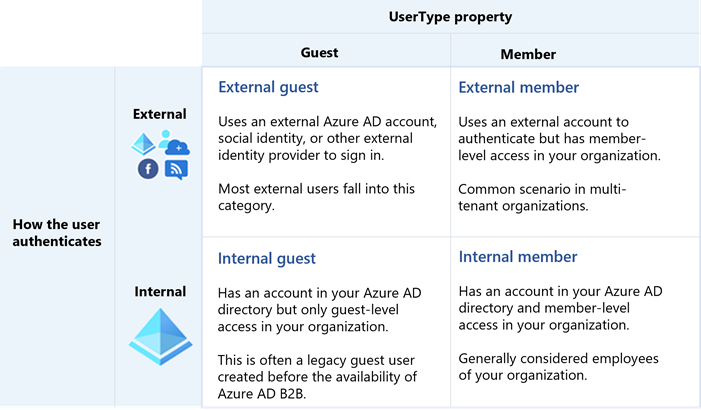
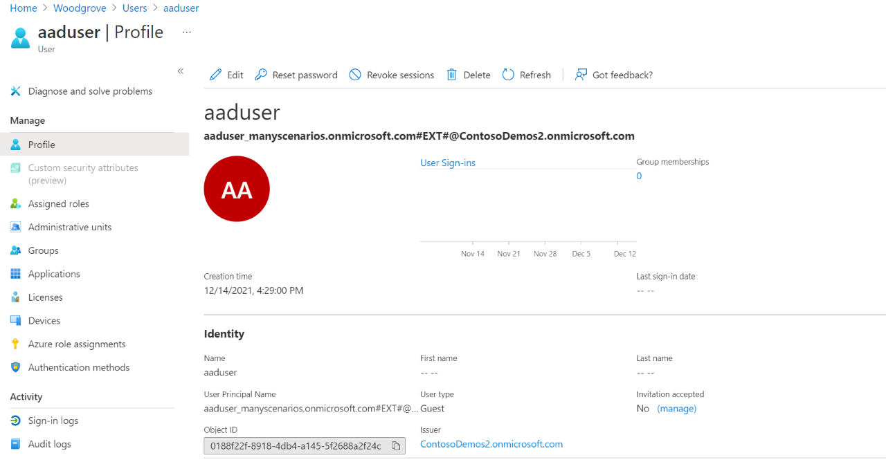
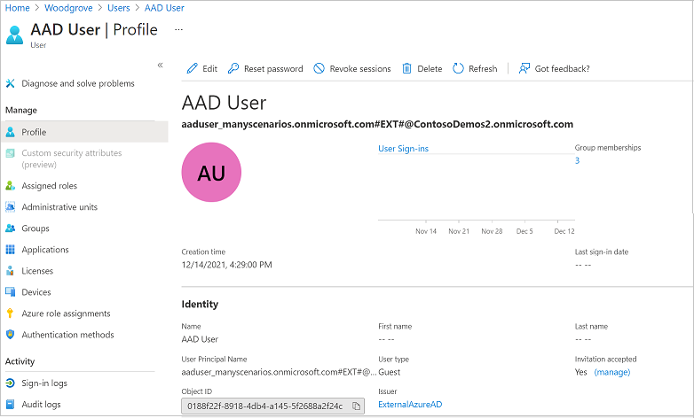
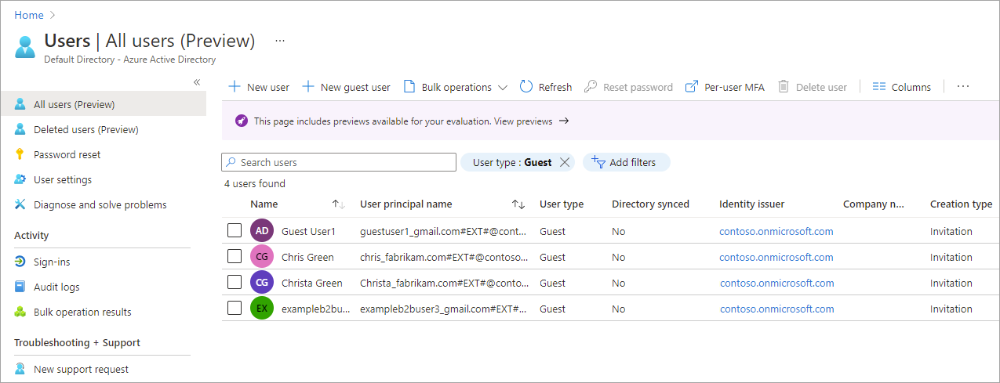
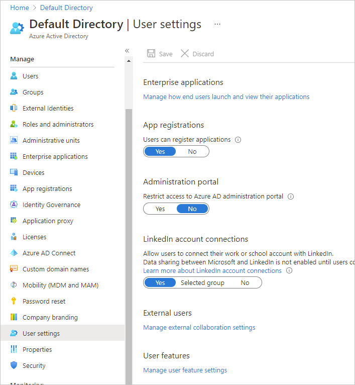

# Properties of a Microsoft Entra B2B collaboration user

B2B collaboration is a capability of Microsoft Entra External ID that lets you collaborate with users and partners outside of your organization. With B2B collaboration, an external user is invited to sign in to your Microsoft Entra organization using their own credentials. This B2B collaboration user can then access the apps and resources you want to share with them. A user object is created for the B2B collaboration user in the same directory as your employees. B2B collaboration user objects have limited privileges in your directory by default, and they can be managed like employees, added to groups, and so on. This article discusses the properties of this user object and ways to manage it.

The following table describes B2B collaboration users based on how they authenticate (internally or externally) and their relationship to your organization (guest or member).

- **External guest**: Most users who are commonly considered external users or guests fall into this category. This B2B collaboration user has an account in an external Microsoft Entra organization or an external identity provider (such as a social identity), and they have guest-level permissions in the resource organization. The user object created in the resource Microsoft Entra directory has a UserType of Guest.
- **External member**: This B2B collaboration user has an account in an external Microsoft Entra organization or an external identity provider (such as a social identity) and member-level access to resources in your organization. This scenario is common in organizations consisting of multiple tenants, where users are considered part of the larger organization and need member-level access to resources in the organization’s other tenants. The user object created in the resource Microsoft Entra directory has a UserType of Member.
- **Internal guest**: Before Microsoft Entra B2B collaboration was available, it was common to collaborate with distributors, suppliers, vendors, and others by setting up internal credentials for them and designating them as guests by setting the user object UserType to Guest. If you have internal guest users like these, you can invite them to use B2B collaboration instead so they can use their own credentials, allowing their external identity provider to manage authentication and their account lifecycle.
- **Internal member**: These users are generally considered employees of your organization. The user authenticates internally via Microsoft Entra ID, and the user object created in the resource Microsoft Entra directory has a UserType of Member.

The user type you choose has the following limitations for apps or services (but aren't limited to):
    
[!INCLUDE [user-type-workload-limitations-include](../includes/user-type-workload-limitations-include.md)]

> [!IMPORTANT]
> The [email one-time passcode](one-time-passcode.md) feature is now turned on by default for all new tenants and for any existing tenants where you haven't explicitly turned it off. When this feature is turned off, the fallback authentication method is to prompt invitees to create a Microsoft account.

## Invitation redemption

Now, let's see what a Microsoft Entra B2B collaboration user looks like in Microsoft Entra External ID.

### Before invitation redemption

B2B collaboration user accounts are the result of inviting guest users to collaborate by using the guest users' own credentials. When the invitation is initially sent to the guest user, an account is created in your tenant. This account doesn’t have any credentials associated with it because authentication is performed by the guest user's identity provider. The **Identities** property for the guest user account in your directory is set to the host's organization domain until the guest redeems their invitation. The user sending the invitation is added as a default value for the **Sponsor** (preview) attribute on the guest user account. In the portal, the invited user’s profile will show an **External user state** of **PendingAcceptance**. Querying for `externalUserState` using the Microsoft Graph API will return `Pending Acceptance`.

### After invitation redemption

After the B2B collaboration user accepts the invitation, the **Identities** property is updated based on the user’s identity provider.

- If the B2B collaboration user is using a Microsoft account or credentials from another external identity provider, **Identities** reflects the identity provider, for example **Microsoft Account**, **google.com**, or **facebook.com**.

   

- If the B2B collaboration user is using credentials from another Microsoft Entra organization, **Identities** is **ExternalAzureAD**.

- For external users who are using internal credentials, the **Identities** property is set to the host’s organization domain. The **Directory synced** property is **Yes** if the account is homed in the organization’s on-premises Active Directory and synced with Microsoft Entra ID, or **No** if the account is a cloud-only Microsoft Entra account. The directory sync information is also available via the `onPremisesSyncEnabled` property in Microsoft Graph.

## Key properties of the Microsoft Entra B2B collaboration user

### User Principal Name

The user principal name for a B2B collaboration user object contains an #EXT# identifier.

### User type

This property indicates the relationship of the user to the host tenancy. This property can have two values:

- **Member**: This value indicates an employee of the host organization and a user in the organization's payroll. For example, this user expects to have access to internal-only sites. This user isn't considered an external collaborator.

- **Guest**: This value indicates a user who isn't considered internal to the company, such as an external collaborator, partner, or customer. Such a user isn't expected to receive a CEO's internal memo or receive company benefits, for example.

> [!NOTE]
> The UserType has no relation to how the user signs in, the directory role of the user, and so on. This property simply indicates the user's relationship to the host organization and allows the organization to enforce policies that depend on this property.

### Identities

This property indicates the user’s primary identity provider. A user can have several identity providers, which can be viewed by selecting the link next to **Identities** in the user’s profile or by querying the `identities` property via the Microsoft Graph API.

> [!NOTE]
> Identities and UserType are independent properties. A value of Identities does not imply a particular value for UserType.

Identities property value | Sign-in state
--------------------- | -------------------------
ExternalAzureAD | This user is homed in an external organization and authenticates by using a Microsoft Entra account that belongs to the other organization.
Microsoft account |  This user is homed in a Microsoft account and authenticates by using a Microsoft account.
{host’s domain} | This user authenticates by using a Microsoft Entra account that belongs to this organization.
google.com | This user has a Gmail account and has signed up by using self-service to the other organization.
facebook.com | This user has a Facebook account and has signed up by using self-service to the other organization.
mail | This user has signed up by using Microsoft Entra External ID email one-time passcode (OTP).
{issuer URI} | This user is homed in an external organization that doesn't use Microsoft Entra ID as their identity provider, but instead uses a SAML/WS-Fed-based identity provider. The issuer URI is shown when the Identities field is clicked.

Phone sign-in is not supported for external users. B2B accounts cannot use `phone`value as an identity provider. 

### Directory synced

The **Directory synced** property indicates whether the user is being synced with on-premises Active Directory and is authenticated on-premises. This property is **Yes** if the account is homed in the organization’s on-premises Active Directory and synced with Microsoft Entra ID, or **No** if the account is a cloud-only Microsoft Entra account. In Microsoft Graph, the Directory synced property corresponds to `onPremisesSyncEnabled`.

## Can Microsoft Entra B2B users be added as members instead of guests?

Typically, a Microsoft Entra B2B user and guest user are synonymous. Therefore, a Microsoft Entra B2B collaboration user is added as a user with **UserType** set to **Guest** by default. However, in some cases, the partner organization is a member of a larger organization to which the host organization also belongs. If so, the host organization might want to treat users in the partner organization as members instead of guests. Use the Microsoft Entra B2B Invitation Manager APIs to add or invite a user from the partner organization to the host organization as a member.

## Filter for guest users in the directory

In the **Users** list, you can use **Add filter** to display only the guest users in your directory.

## Convert UserType

It's possible to convert UserType from Member to Guest and vice-versa by editing the user's profile in the Azure portal or by using PowerShell. However, the UserType property represents the user's relationship to the organization. Therefore, you should change this property only if the relationship of the user to the organization changes. If the relationship of the user changes, should the user principal name (UPN) change? Should the user continue to have access to the same resources? Should a mailbox be assigned?

## Guest user permissions

Guest users have [default restricted directory permissions](../fundamentals/users-default-permissions.md). They can manage their own profile, change their own password, and retrieve some information about other users, groups, and apps. However, they can't read all directory information. 

B2B guest users are not supported in Microsoft Teams shared channels. For access to shared channels see [B2B direct connect.](b2b-direct-connect-overview.md)

There may be cases where you want to give your guest users higher privileges. You can add a guest user to any role and even remove the default guest user restrictions in the directory to give a user the same privileges as members. It's possible to turn off the default limitations so that a guest user in the company directory has the same permissions as a member user. For more information, check out the [Restrict guest access permissions in Microsoft Entra External ID](../enterprise-users/users-restrict-guest-permissions.md) article.

## Can I make guest users visible in the Exchange Global Address List?

Yes. By default, guest objects aren't visible in your organization's global address list, but you can use Azure Active Directory PowerShell to make them visible. For details, see "Add guests to the global address list" in the [Microsoft 365 per-group guest access article](/microsoft-365/solutions/per-group-guest-access).

## Can I update a guest user's email address?

If a guest user accepts your invitation and they subsequently change their email address, the new email doesn't automatically sync to the guest user object in your directory. The mail property is created via [Microsoft Graph API](/graph/api/resources/user). You can update the mail property via the Microsoft Graph API, the Exchange admin center, or [Exchange Online PowerShell](/powershell/module/exchange/users-and-groups/set-mailuser). The change will be reflected in the Microsoft Entra guest user object.

## Next steps

* [B2B user claims mapping](claims-mapping.md)
* [B2B collaboration user tokens](user-token.md)
* [B2B collaboration for hybrid organizations](hybrid-organizations.md)
