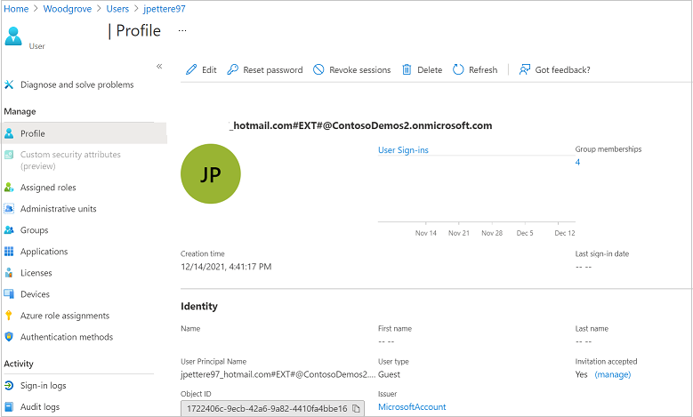

# Properties of an Azure Active Directory B2B collaboration user

This article describes the properties and states of an invited Azure Active Directory B2B (Azure AD B2B) collaboration user object both before and after invitation redemption. An Azure AD B2B collaboration user is an external user, typically from a partner organization, that you invite to sign into your Azure AD organization using their own credentials. This B2B collaboration user (also generally referred to as a *guest user*) can then access the apps and resources you want to share with them. A user object is created for the B2B collaboration user in the same directory as your employees. B2B collaboration user objects have limited privileges in your directory by default, and they can be managed like employees, added to groups, and so on.

Depending on the inviting organization's needs, an Azure AD B2B collaboration user can be in one of the following account states:

- State 1: Homed in an external instance of Azure AD and represented as a guest user in the inviting organization. In this case, the B2B user signs in by using an Azure AD account that belongs to the invited tenant. If the partner organization doesn't use Azure AD, the guest user in Azure AD is still created. The requirements are that they redeem their invitation and Azure AD verifies their email address. This arrangement is also called a just-in-time (JIT) tenancy, a "viral" tenancy, or an unmanaged Azure AD tenancy.

   > [!IMPORTANT]
   > **Starting November 1, 2021**, we'll begin rolling out a change to turn on the email one-time passcode feature for all existing tenants and enable it by default for new tenants. As part of this change, Microsoft will stop creating new, unmanaged ("viral") Azure AD accounts and tenants during B2B collaboration invitation redemption. To minimize disruptions during the holidays and deployment lockdowns, the majority of tenants will see changes rolled out in January 2022. We're enabling the email one-time passcode feature because it provides a seamless fallback authentication method for your guest users. However, if you don't want to allow this feature to turn on automatically, you can [disable it](one-time-passcode.md#disable-email-one-time-passcode).

- State 2: Homed in a Microsoft or other account and represented as a guest user in the host organization. In this case, the guest user signs in with a Microsoft account or a social account (google.com or similar). The invited user's identity is created as a Microsoft account in the inviting organization’s directory during offer redemption.

- State 3: Homed in the host organization's on-premises Active Directory and synced with the host organization's Azure AD. You can use Azure AD Connect to sync the partner accounts to the cloud as Azure AD B2B users with UserType = Guest. See [Grant locally-managed partner accounts access to cloud resources](hybrid-on-premises-to-cloud.md).

- State 4: Homed in the host organization's Azure AD with UserType = Guest and credentials that the host organization manages.

  

Now, let's see what an Azure AD B2B collaboration user looks like in Azure AD.

### Before invitation redemption

State 1 and State 2 accounts are the result of inviting guest users to collaborate by using the guest users' own credentials. When the invitation is initially sent to the guest user, an account is created in your tenant. This account doesn’t have any credentials associated with it because authentication is performed by the guest user's identity provider.

The **Issuer** property for the guest user account in your directory is set to the host's organization domain until the guest redeems their invitation. In the portal, the **Invitation accepted** property in the invited user’s Azure AD portal profile will be set to `No` and querying for **externalUserState** using the Microsoft Graph API will return `Pending Acceptance`.

### After invitation redemption

After the guest user accepts the invitation, the **Issuer** property is updated based on the guest user’s identity provider.

For guest users in State 1, the **issuer** is **External Azure AD**.

For guest users in State 2, the **issuer** is **Microsoft Account**.

For guest users in State 3 and State 4, the **issuer** property is set to the host’s organization domain. The **Directory synced** property in the Azure portal or **onPremisesSyncEnabled** in Microsoft Graph can be used to distinguish between state 3 and 4, yes indicating that the user is homed in the host’s on premises Active Directory.

## Key properties of the Azure AD B2B collaboration user
### UserType
This property indicates the relationship of the user to the host tenancy. This property can have two values:
- Member: This value indicates an employee of the host organization and a user in the organization's payroll. For example, this user expects to have access to internal-only sites. This user is not considered an external collaborator.

- Guest: This value indicates a user who isn't considered internal to the company, such as an external collaborator, partner, or customer. Such a user isn't expected to receive a CEO's internal memo or receive company benefits, for example.

  > [!NOTE]
  > The UserType has no relation to how the user signs in, the directory role of the user, and so on. This property simply indicates the user's relationship to the host organization and allows the organization to enforce policies that depend on this property.

For pricing related details please reference [Azure Active Directory pricing](https://azure.microsoft.com/pricing/details/active-directory).

### Issuer
This property indicates the user’s primary identity provider. A user can have several identity providers which can be viewed by selecting issuer in the user’s profile or by querying the property via Microsoft Graph API.  

Issuer property value | Sign-in state
--------------------- | -------------------------
External Azure AD organization | This user is homed in an external organization and authenticates by using an Azure AD account that belongs to the other organization. This type of sign-in corresponds to State 1.
Microsoft account |  This user is homed in a Microsoft account and authenticates by using a Microsoft account. This type of sign-in corresponds to State 2.
{Host’s domain} | This user authenticates by using an Azure AD account that belongs to this organization. This type of sign-in corresponds to State 4.
google.com | This user has a Gmail account and has signed up by using self-service to the other organization. This type of sign-in corresponds to State 2.
facebook.com | This user has a Facebook account and has signed up by using self-service to the other organization. This type of sign-in corresponds to State 2.
mail | This user has an email address that does not match with verified Azure AD or SAML/WS-Fed domains, and is not a Gmail address or a Microsoft account. This type of sign-in corresponds to State 4.
phone | This user has an email address that does not match a verified Azure AD domain or a SAML/WS-Fed domain, and is not a Gmail address or Microsoft account. This type of sign-in corresponds to State 4.
{issuer URI} | This user is homed in an external organization that does not use Azure Active Directory as their identity provider, but instead uses a SAML/WS-Fed based identity providers. The issuer URI is shown when the issuer field is clicked. This type of sign-in corresponds to State 2.

### Directory synced (or ‘onPremisesSyncEnabled in MS Graph)

This property indicates if the user is being synced with on-premises Active Directory and is authenticated on-premises. If the value of this property is ‘yes’, this corresponds to state 3.

  > [!NOTE]
  > Issuer and UserType are independent properties. A value of issuer does not imply a particular value for UserType.

## Can Azure AD B2B users be added as members instead of guests?

Typically, an Azure AD B2B user and guest user are synonymous. Therefore, an Azure AD B2B collaboration user is added as a user with UserType = Guest by default. However, in some cases, the partner organization is a member of a larger organization to which the host organization also belongs. If so, the host organization might want to treat users in the partner organization as members instead of guests. Use the Azure AD B2B Invitation Manager APIs to add or invite a user from the partner organization to the host organization as a member.

## Filter for guest users in the directory

## Convert UserType
It's possible to convert UserType from Member to Guest and vice-versa by using PowerShell. However, the UserType property represents the user's relationship to the organization. Therefore, you should change this property only if the relationship of the user to the organization changes. If the relationship of the user changes, should the user principal name (UPN) change? Should the user continue to have access to the same resources? Should a mailbox be assigned?

## Remove guest user limitations
There may be cases where you want to give your guest users higher privileges. You can add a guest user to any role and even remove the default guest user restrictions in the directory to give a user the same privileges as members.

It's possible to turn off the default limitations so that a guest user in the company directory has the same permissions as a member user.

## Can I make guest users visible in the Exchange Global Address List?
Yes. By default, guest objects aren't visible in your organization's global address list, but you can use Azure Active Directory PowerShell to make them visible. For details, see "Add guests to the global address list" in the [Microsoft 365 per-group guest access article](/microsoft-365/solutions/per-group-guest-access).

## Can I update a guest user's email address?

If a guest user accepts your invitation and they subsequently change their email address, the new email doesn't automatically sync to the guest user object in your directory. The mail property is created via [Microsoft Graph API](/graph/api/resources/user). You can update the mail property via the Microsoft Graph API, the Exchange admin center, or [Exchange Online PowerShell](/powershell/module/exchange/users-and-groups/set-mailuser). The change will be reflected in the Azure AD guest user object.

## Next steps

* [What is Azure AD B2B collaboration?](what-is-b2b.md)
* [B2B collaboration user tokens](user-token.md)
* [B2B collaboration user claims mapping](claims-mapping.md)
