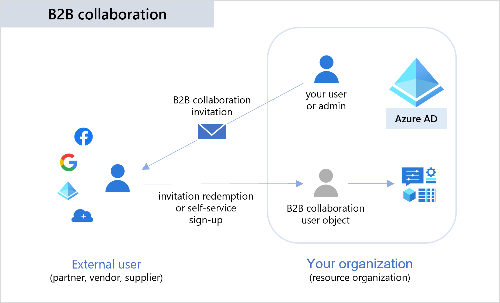
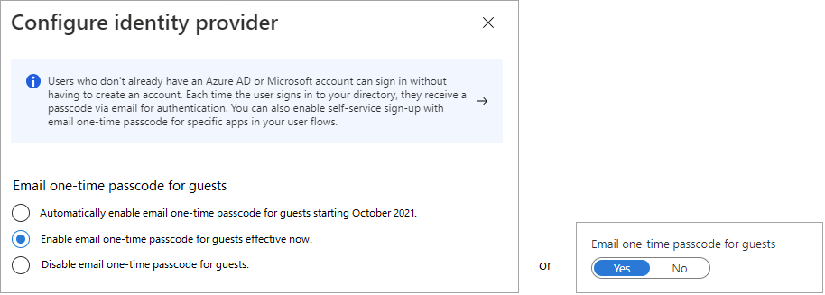

# B2B collaboration overview

Azure Active Directory (Azure AD) B2B collaboration is a feature within External Identities that lets you invite guest users to collaborate with your organization. With B2B collaboration, you can securely share your company's applications and services with external users, while maintaining control over your own corporate data. Work safely and securely with external partners, large or small, even if they don't have Azure AD or an IT department.

A simple invitation and redemption process lets partners use their own credentials to access your company's resources. You can also enable self-service sign-up user flows to let external users sign up for apps or resources themselves. Once the external user has redeemed their invitation or completed sign-up, they're represented in your directory as a [user object](user-properties.md). The user type for these B2B collaboration users is typically set to "guest" and their user principal name contains the #EXT# identifier.

Developers can use Azure AD business-to-business APIs to customize the invitation process or write applications like self-service sign-up portals. For licensing and pricing information related to guest users, refer to [Azure Active Directory External Identities pricing](https://azure.microsoft.com/pricing/details/active-directory/external-identities/).

> [!IMPORTANT]
> The [email one-time passcode](one-time-passcode.md) feature is now turned on by default for all new tenants and for any existing tenants where you haven't explicitly turned it off. When this feature is turned off, the fallback authentication method is to prompt invitees to create a Microsoft account.

## Collaborate with any partner using their identities

With Azure AD B2B, the partner uses their own identity management solution, so there's no external administrative overhead for your organization. Guest users sign in to your apps and services with their own work, school, or social identities.

- The partner uses their own identities and credentials, whether or not they have an Azure AD account.
- You don't need to manage external accounts or passwords.
- You don't need to sync accounts or manage account lifecycles.

## Manage collaboration with other organizations and clouds

B2B collaboration is enabled by default, but comprehensive admin settings let you control your inbound and outbound B2B collaboration with external partners and organizations:

- For B2B collaboration with other Azure AD organizations, use [cross-tenant access settings](cross-tenant-access-overview.md). Manage inbound and outbound B2B collaboration, and scope access to specific users, groups, and applications. Set a default configuration that applies to all external organizations, and then create individual, organization-specific settings as needed. Using cross-tenant access settings, you can also trust multi-factor (MFA) and device claims (compliant claims and hybrid Azure AD joined claims) from other Azure AD organizations.

- Use [external collaboration settings](external-collaboration-settings-configure.md) to define who can invite external users, allow or block B2B specific domains, and set restrictions on guest user access to your directory.

- Use [Microsoft cloud settings](cross-cloud-settings.md) to establish mutual B2B collaboration between the Microsoft Azure global cloud and [Microsoft Azure Government](../../azure-government/index.yml) or [Microsoft Azure operated by 21Vianet](/azure/china).

## Easily invite guest users from the Azure portal

As an administrator, you can easily add guest users to your organization in the Azure portal.

- [Create a new guest user](b2b-quickstart-add-guest-users-portal.md) in Azure AD, similar to how you'd add a new user.
- Assign guest users to apps or groups.
- [Send an invitation email](invitation-email-elements.md) that contains a redemption link, or send a direct link to an app you want to share.

:::image type="content" source="media/what-is-b2b/add-a-b2b-user-to-azure-portal.png" alt-text="Screenshot showing the Invite a new guest user invitation entry page." lightbox="media/what-is-b2b/add-a-b2b-user-to-azure-portal-large.png":::

- Guest users follow a few simple [redemption steps](redemption-experience.md) to sign in.

:::image type="content" source="media/what-is-b2b/consent-screen.png" alt-text="Screenshot showing the Review permissions page.":::

## Allow self-service sign-up

With a self-service sign-up user flow, you can create a sign-up experience for external users who want to access your apps. As part of the sign-up flow, you can provide options for different social or enterprise identity providers, and collect information about the user. Learn about [self-service sign-up and how to set it up](self-service-sign-up-overview.md).

You can also use [API connectors](api-connectors-overview.md) to integrate your self-service sign-up user flows with external cloud systems. You can connect with custom approval workflows, perform identity verification, validate user-provided information, and more.

:::image type="content" source="media/what-is-b2b/self-service-sign-up-user-flow-overview.png" alt-text="Screenshot showing the user flows page.":::

## Use policies to securely share your apps and services

You can use authentication and authorization policies to protect your corporate content. Conditional Access policies, such as multi-factor authentication, can be enforced:

- At the tenant level.
- At the application level.
- For specific guest users to protect corporate apps and data.

:::image type="content" source="media/what-is-b2b/tutorial-mfa-policy-2.png" alt-text="Screenshot showing the Conditional Access option.":::

## Let application and group owners manage their own guest users

You can delegate guest user management to application owners so that they can add guest users directly to any application they want to share, whether it's a Microsoft application or not.

- Administrators set up self-service app and group management.
- Non-administrators use their [Access Panel](https://myapps.microsoft.com) to add guest users to applications or groups.

:::image type="content" source="media/what-is-b2b/access-panel-manage-app.png" alt-text="Screenshot showing the Access panel for a guest user."  lightbox="media/what-is-b2b/access-panel-manage-app.png":::

## Customize the onboarding experience for B2B guest users

Bring your external partners on board in ways customized to your organization's needs.

- Use [Azure AD entitlement management](../governance/entitlement-management-overview.md) to configure policies that [manage access for external users](../governance/entitlement-management-external-users.md#how-access-works-for-external-users).
- Use the [B2B collaboration invitation APIs](/graph/api/resources/invitation) to customize your onboarding experiences.

## Integrate with Identity providers

Azure AD supports external identity providers like Facebook, Microsoft accounts, Google, or enterprise identity providers. You can set up federation with identity providers. This way your external users can sign in with their existing social or enterprise accounts instead of creating a new account just for your application. Learn more about [identity providers for External Identities](identity-providers.md).

:::image type="content" source="media/what-is-b2b/identity-providers.png" alt-text="Screenshot showing the Identity providers page.":::

## Integrate with SharePoint and OneDrive

You can [enable integration with SharePoint and OneDrive](/sharepoint/sharepoint-azureb2b-integration) to share files, folders, list items, document libraries, and sites with people outside your organization, while using Azure B2B for authentication and management. The users you share resources with are typically guest users in your directory, and permissions and groups work the same for these guests as they do for internal users. When enabling integration with SharePoint and OneDrive, you also enable the [email one-time passcode](one-time-passcode.md) feature in Azure AD B2B to serve as a fallback authentication method.

## Next steps

- [Invitation email](invitation-email-elements.md)
- [Add B2B collaboration guest users in the portal](add-users-administrator.md)
- [B2B direct connect](b2b-direct-connect-overview.md)