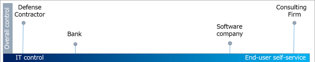

# Determine your security posture for external access 

As you consider governing external access, you’ll need to assess the security and collaboration needs for your organization overall, and within each scenario. At the organizational level, consider the amount of control you need your IT team to have over day-to-day collaboration. Organizations in regulated industries may require more IT control. For example, a defense contractor may be required to positively identify and document each external user, their access, and the removal of access. This requirement may be on all access, or on specific scenarios or workloads. On the other end of the spectrum, a consulting firm may generally allow end users to determine the external users they need to collaborate with, within certain IT guard rails. 

> [!NOTE]
> Overly tight control on collaboration can lead to higher IT budgets, reduced productivity, and delayed business outcomes. When official collaboration channels are perceived as too onerous, end users tend to go around IT provided systems to get their jobs done, by for example emailing unsecured documents.

## Think in terms of scenarios

In many cases IT can delegate partner access, at least in some scenarios, while providing guard rails for security. The IT guard rails can be help ensure that intellectual property stays secure, while empowering employees to collaborate with partners to get work done.

As you consider the scenarios within your organization, assess the need for employee versus business partner access to resources. A bank may have compliance needs that restrict access to certain resources, like user account information, to a small group of internal employees. Conversely, the same bank may enable delegated access for partners working on a marketing campaign.

In each scenario, consider 

* the sensitivity of the information at risk

* whether you need to restrict what partners can see about other users

* the cost of a breach vs the weight of centralized control and end-user friction

 You may also start with centrally managed controls to meet compliance targets and delegate control to end users over time. All access management models may simultaneously coexist within an organization. 

The use of [partner managed credentials](../external-identities/what-is-b2b.md) provides your organization with an essential signal that terminates access to your resources once the external user has lost access to the resources of their own company.

## Goals of securing external access

The goals of IT-governed and delegated access differ.

**The primary goals of IT-governed access are to:**

* Meet governance, regulatory, and compliance (GRC) targets. 

* Tightly control partner access and what partners can see about member users, groups, and other partners.

**The primary goals of delegating access are to:**

* Enable business owners to govern who they collaborate with, within IT constraints.

* Enable business partners to request access based on rules defined by business owners.

Whichever you enact for your organization and scenarios you'll need to: 

* **Control access to applications, data, and content**. This can be accomplished through a variety of methods, depending on your versions of [Azure AD](https://www.microsoft.com/security/business/identity-access-management/azure-ad-pricing) and [Microsoft 365](https://www.microsoft.com/microsoft-365/compare-microsoft-365-enterprise-plans). 

* **Reduce the attack surface**. [Privileged identity management](../privileged-identity-management/pim-configure.md), [data loss prevention (DLP),](/exchange/security-and-compliance/data-loss-prevention/data-loss-prevention) and [encryption capabilities](/exchange/security-and-compliance/data-loss-prevention/data-loss-prevention) reduce the attack surface.

* **Regularly review activity and audit log to confirm compliance**. IT can delegate access decisions to business owners through entitlement management while access reviews provide a way to periodically confirm continued access. Automated data classification with sensitivity labels helps to automate encryption of sensitive content making it easy for employee end users to comply.

## Next steps 

See the following articles on securing external access to resources. We recommend you take the actions in the listed order.

1. [Determine your security posture for external access](1-secure-access-posture.md) (You are here.)

2. [Discover your current state](2-secure-access-current-state.md)

3. [Create a governance plan](3-secure-access-plan.md)

4. [Use groups for security](4-secure-access-groups.md)

5. [Transition to Azure AD B2B](5-secure-access-b2b.md)

6. [Secure access with Entitlement Management](6-secure-access-entitlement-managment.md)

7. [Secure access with Conditional Access policies](7-secure-access-conditional-access.md)

8. [Secure access with Sensitivity labels](8-secure-access-sensitivity-labels.md)

9. [Secure access to Microsoft Teams, OneDrive, and SharePoint](9-secure-access-teams-sharepoint.md)
 

​
