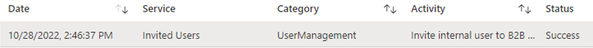

# Convert local guests into Azure Active Directory B2B guest accounts

Azure Active Directory (Azure AD B2B) allows external users to collaborate using their own identities. However, it isn't uncommon for organizations to issue local usernames and passwords to external users. This approach isn't recommended as the bring-your-own-identity (BYOI) capabilities provided
by Azure AD B2B to provide better security, lower cost, and reduce
complexity when compared to local account creation. Learn more
[here.](https://learn.microsoft.com/azure/active-directory/fundamentals/secure-external-access-resources)

If your organization currently issues local credentials that external users have to manage and would like to migrate to using Azure AD B2B instead, this document provides a guide to make the transition as seamlessly as possible.

## Identify external-facing applications

Before migrating local accounts to Azure AD B2B, admins should understand what applications and workloads these external users need to access. For example, if external users need access to an application that is hosted on-premises, admins will need to validate that the application is integrated with Azure AD and that a provisioning process is implemented to provision the user from Azure AD to the application.
The existence and use of on-premises applications could be a reason why local accounts are created in the first place. Learn more about
[provisioning B2B guests to on-premises
applications.](https://learn.microsoft.com/azure/active-directory/external-identities/hybrid-cloud-to-on-premises)

All external-facing applications should have single-sign on (SSO) and provisioning integrated with Azure AD for the best end user experience.

## Identify local guest accounts

Admins will need to identify which accounts should be migrated to Azure AD B2B. External identities in Active Directory should be easily identifiable, which can be done with an attribute-value pair. For example, making ExtensionAttribute15 = `External` for all external users. If these users are being provisioned via Azure AD Connect or Cloud Sync, admins can optionally configure these synced external users
to have the `UserType` attributes set to `Guest`. If these users are being
provisioned as cloud-only accounts, admins can directly modify the
users' attributes. What is most important is being able to identify the
users who you want to convert to B2B.

## Map local guest accounts to external identities

Once you've identified which external user accounts you want to
convert to Azure AD B2B, you need to identify the BYOI identities or external emails for each user. For example, admins will need to identify that the local account (v-Jeff@Contoso.com) is a user whose home identity/email address is Jeff@Fabrikam.com. How to identify the home identities is up to the organization, but some examples include:

- Asking the external user's sponsor to provide the information.

- Asking the external user to provide the information.

- Referring to an internal database if this information is already known and stored by the organization.

Once the mapping of each external local account to the BYOI identity is done, admins will need to add the external identity/email to the user.mail attribute on each local account.

## End user communications

External users should be notified that the migration will be taking place and when it will happen. Ensure you communicate the expectation that external users will stop using their existing password and post-migration will authenticate with their own home/corporate credentials going forward. Communications can include email campaigns, posters, and announcements.

## Migrate local guest accounts to Azure AD B2B

Once the local accounts have their user.mail attributes populated with the external identity/email that they're mapped to, admins can [convert the local accounts to Azure AD B2B by inviting the local account.](https://learn.microsoft.com/azure/active-directory/external-identities/invite-internal-users)
This can be done in the UX or programmatically via PowerShell or the Microsoft Graph API. Once complete, the users will no longer
authenticate with their local password, but will instead authenticate with their home identity/email that was populated in the user.mail attribute. You've successfully migrated to Azure AD B2B.

## Post-migration considerations

If local accounts for external users were being synced from on-premises, admins should take steps to reduce their on-premises footprint and use cloud-native B2B guest accounts moving forward. Some possible actions can include:

- Transition existing local accounts for external users to Azure AD B2B and stop creating local accounts. Post-migration, admins should invite external users natively in Azure AD.

- Randomize the passwords of existing local accounts for external users to ensure they can't authenticate locally to on-premises resources. This will increase security by ensuring that authentication and user lifecycle is tied to the external user's home identity.

## Support reference

Audit log created will be as follows:

## Next steps

See the following articles on securing external access to resources. We recommend you take the actions in the listed order.

1. [Determine your desired security posture for external access](1-secure-access-posture.md)
1. [Discover your current state](2-secure-access-current-state.md)
1. [Create a governance plan](3-secure-access-plan.md)
1. [Use groups for security](4-secure-access-groups.md)
1. [Transition to Azure AD B2B](5-secure-access-b2b.md)
1. [Secure access with Entitlement Management](6-secure-access-entitlement-managment.md)
1. [Secure access with Conditional Access policies](7-secure-access-conditional-access.md) 
1. [Secure access with Sensitivity labels](8-secure-access-sensitivity-labels.md)
1. [Secure access to Microsoft Teams, OneDrive, and SharePoint](9-secure-access-teams-sharepoint.md)
1. [Secure local guest accounts](10-secure-local-guest.md) (You’re here)
