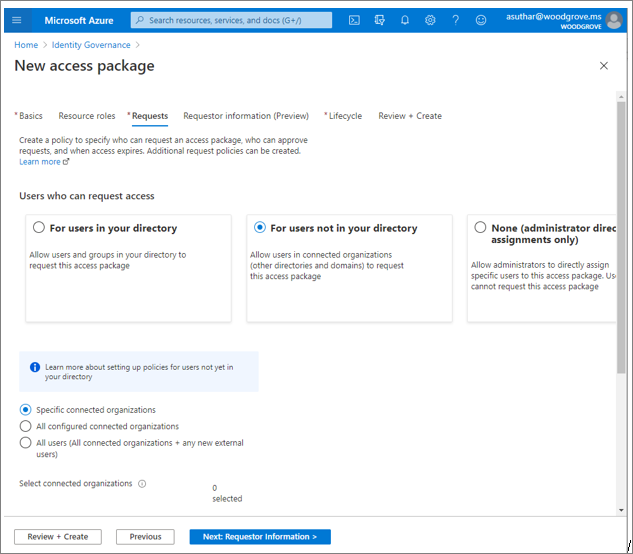

# Discover the current state of external collaboration in your organization

Before discovering the current state of your external collaboration, you should [determine your desired security posture](1-secure-access-posture.md). You'll consider your organization’s needs for centralized vs. delegated control, and any relevant governance, regulatory, and compliance targets.

Individuals in your organization are probably already collaborating with users from other organizations. Collaboration can be through features in productivity applications like Microsoft 365, by emailing, or by otherwise sharing resources with external users. The pillars of your governance plan will form as you discover:

* The users who are initiating external collaboration.
* The external users and organizations you're collaborating with.
* The access being granted to external users.

## Users initiating external collaboration

The users initiating external collaboration best understand the applications most relevant for external collaboration, and when that access should end. Understanding these users can help you determine who should be delegated permission to inviting external users, create access packages, and complete access reviews.

To find users who are currently collaborating, review the [Microsoft 365 audit log for sharing and access request activities](/microsoft-365/compliance/search-the-audit-log-in-security-and-compliance#sharing-and-access-request-activities). You can also review the [Azure AD audit log for details on who invited B2B](../external-identities/auditing-and-reporting.md) users to your directory.

## Find current collaboration partners

External users may be [Azure AD B2B users](../external-identities/what-is-b2b.md) (preferable) with partner-managed credentials, or external users with locally provisioned credentials. These users are typically (but not always) marked with a UserType of Guest. You can enumerate guest users through the [Microsoft Graph API](/graph/api/user-list?tabs=http), [PowerShell](/graph/api/user-list?tabs=http), or the [Azure portal](../enterprise-users/users-bulk-download.md).

There are also tools specifically designed to identify existing Azure AD B2B collaboration such as identifying external Azure AD tenants, and which external users are accessing what applications. These tools include a [PowerShell module](https://github.com/AzureAD/MSIdentityTools/wiki/Get-MSIDCrossTenantAccessActivity) and an [Azure Monitor workbook](../reports-monitoring/workbook-cross-tenant-access-activity.md).  

### Use email domains and companyName property

External organizations can be determined by the domain names of external user email addresses. If consumer identity providers such as Google are supported, this may not be possible. In this case we recommend that you write the companyName attribute to clearly identify the user’s external organization.

### Use allow or blocklists

Consider whether your organization wants to allow collaboration with only specific organizations. Alternatively, consider if your organization wants to block collaboration with specific organizations. At the tenant level, there is an [allow or blocklist](../external-identities/allow-deny-list.md), which can be used to control overall B2B invitations and redemptions regardless of source (such as Microsoft Teams, Microsoft SharePoint, or the Azure portal).

If you’re using entitlement management, you can also scope access packages to a subset of your partners by using the Specific connected organizations setting as shown below.

## Find access being granted to external users

Once you have an inventory of external users and organizations, you can determine the access granted to these users using the Microsoft Graph API to determine Azure AD [group membership](/graph/api/resources/groups-overview) or [direct application assignment](/graph/api/resources/approleassignment) in Azure AD.

### Enumerate application-specific permissions

You may also be able to perform application-specific permission enumeration. For example, you can programmatically generate a permission report for SharePoint Online by using [this script](https://gallery.technet.microsoft.com/office/SharePoint-Online-c9ec4f64).

Specifically investigate access to all of your business-sensitive and business-critical apps so that you are fully aware of any external access.

### Detect ad hoc sharing

If your email and network plans enable it, you can investigate content being shared through email or through unauthorized software as a service (SaaS) apps. [Microsoft 365 Data Loss Protection](/microsoft-365/compliance/data-loss-prevention-policies) helps you identify, prevent, and monitor the accidental sharing of sensitive information across your Microsoft 365 infrastructure. [Microsoft Defender for Cloud Apps](https://www.microsoft.com/microsoft-365/enterprise-mobility-security/cloud-app-security) can help you identify the use of unauthorized SaaS apps in your environment.

## Next steps

See the following articles on securing external access to resources. We recommend you take the actions in the listed order.

1. [Determine your security posture for external access](1-secure-access-posture.md)

2. [Discover your current state](2-secure-access-current-state.md) (You are here.)

3. [Create a governance plan](3-secure-access-plan.md)

4. [Use groups for security](4-secure-access-groups.md)

5. [Transition to Azure AD B2B](5-secure-access-b2b.md)

6. [Secure access with Entitlement Management](6-secure-access-entitlement-managment.md)

7. [Secure access with Conditional Access policies](7-secure-access-conditional-access.md)

8. [Secure access with Sensitivity labels](8-secure-access-sensitivity-labels.md)

9. [Secure access to Microsoft Teams, OneDrive, and SharePoint](9-secure-access-teams-sharepoint.md)
