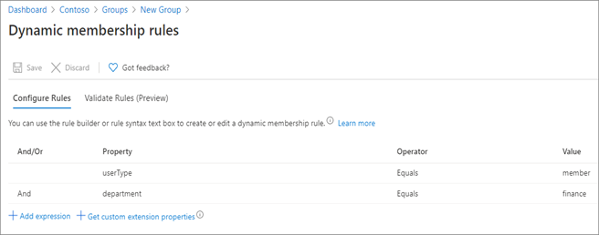
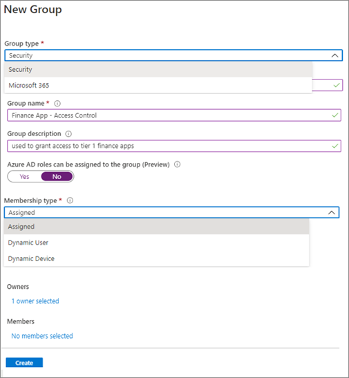
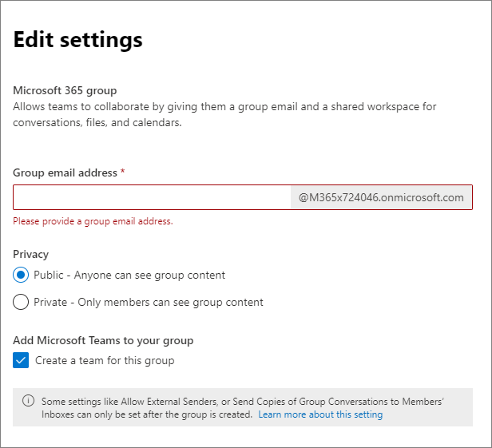

# Securing external access with groups 

Groups are an essential part of any access control strategy. Azure Active Directory (Azure AD) security groups and Microsoft 365 (M365) Groups can be used as the basis for securing access to resources.

Groups are the best option to use as the basis for the following access control mechanisms:

* Conditional Access policies

* Entitlement Management Access Packages 

* Access to M365 resources, Microsoft Teams, and SharePoint sites

Groups have the following roles:

* Owners – Group owners manage the group settings and its membership.

* Members – Members who inherit the permissions and access assigned to the group.

* Guests – Guests are members from outside of your organization. 

## Determine your group strategy

As you develop your group strategy to secure external access to your resources, consider [your desired security posture](1-secure-access-posture.md) to determine the following choices.

* **Who should be able to create groups?** Do you want only administrators to create groups, or do you want employees and or external users to also create these groups.

   * *By default any tenant member can create Azure AD security groups*. 

      * You can [restrict access to the portal for non-administrators](../develop/howto-restrict-your-app-to-a-set-of-users.md) and disable group creation ability in [PowerShell.](../enterprise-users/groups-troubleshooting.md) 

      * You can also [set up self-service group management in Azure Active Directory](../enterprise-users/groups-self-service-management.md). 

   * *By default all users can create M365 Groups and groups are open for all (internal and external) users in your tenant to join*. 

      * [You can restrict Microsoft 365 Group creation](/microsoft-365/solutions/manage-creation-of-groups) to the members of a particular security group. Use Windows PowerShell to configure this setting. 

* **Who should be able to invite people to groups?** Can all group members be able to add other members, or can only group owners add members?

* **Who can be invited to groups?** By default, external users can be added to groups. 

### Assign users to groups

Users can be assigned to groups both manually based on the user attributes in their user object, or on other criteria. Users can only be assigned to groups dynamically based on their attributes.

For example, you can assign users to groups based on their:

* specific job title or department

* partner organization to which they belong (manually, or through Connected organizations)

* user type (Member or Guest)

* participation in a specific project (manually)

* location

Dynamic groups can contain either users or devices, but not both. You add queries based on user attributes to assign users into the dynamic group. The below example shows queries that add users to the group if they are members (not guests) and in the finance department.

For more information on dynamic groups, see [Create or update a dynamic group in Azure Active Directory.](../enterprise-users/groups-create-rule.md)

### Do not use groups for multiple purposes

When using groups for security or resource access purposes, it's important that they have a single function. If a group is used to grant access to resources, it shouldn't be used for any other purpose. If a group is used for generic purposes such as to define location or team membership, it shouldn't also be used to secure access. 

We recommend a naming convention for security groups that makes the purpose clear. For example:

* *Secure_access_finance_apps*

* *Team_membership_finance_team*

* *Location_finance_building*

### Types of groups

Both Azure AD security groups and Microsoft 365 groups can be created from the Azure AD portal or the M365 admin portal. Both types can be used as the basis for securing external access:

|Considerations | Azure AD security groups (manual and dynamic)| Microsoft 365 Groups |
| - | - | - |
| What can the group contain?| Users Groups Service principles Devices| Users only |
| Where is the group created?| Azure AD portal M365 portal (if to be mail enabled) PowerShell Microsoft Graph End user portal| M365 portal Azure AD portal PowerShell Microsoft Graph In Microsoft 365 applications |
| Who creates by default?| Administrators  End-users| Administrators End-users |
| Who can be added by default?| Internal users (members)| Tenant members and guests from any organization |
| What does it grant access to?| Only resources to which it's assigned.| All group-related resources: (Group mailbox, site, team, chats, and other included M365 resources) Any other resources to which group is added |
| Can be used with| Conditional Access Entitlement Management Group licensing| Conditional Access Entitlement Management Sensitivity labels |

Use Microsoft 365 groups to create and manage a set of Microsoft 365 resources, such as a Team and its associated sites and content. They’re a great choice for a project-based effort. 

 

## Azure AD security groups 

[Azure AD security groups](./active-directory-manage-groups.md) can contain users or devices and can be used to manage access to 

* Azure resources such as Microsoft 365 apps, custom apps, and Software as a Service (SaaS) apps such as ServiceNow of Dropbox.

* Azure data and subscriptions.

* Azure services.

Azure AD security groups can also be used to:

* assign licenses for services such as M365, Dynamics 365, and Enterprise Mobility and Security. For more information, see [group-based licensing](./active-directory-licensing-whatis-azure-portal.md).

* assign elevated permissions. For more information, see [Use cloud groups to manage role assignments (preview](../roles/groups-concept.md)). 

To create a group [in the Azure portal](./active-directory-groups-create-azure-portal.md) navigate to Azure Active Directory, then to Groups. You can also create Azure AD security groups by using [PowerShell cmdlets](../enterprise-users/groups-settings-v2-cmdlets.md). 

> [!NOTE]
> A security group can be used for assignment of up to 1500 applications, but not more. 

> [!IMPORTANT]
> **To create a mail-enabled security group, go to the [Microsoft 365 Admin center](https://admin.microsoft.com/)**. You cannot create it in the Azure AD portal. 
 You must enable a security group for mail at the time of creation. You can’t enable it later.

### Hybrid organizations and Azure AD security groups

Hybrid organizations have both an on-premises infrastructure and an Azure AD cloud infrastructure. Many hybrid organizations that use Active Directory create their security groups on-premises and sync them to the cloud. By using this method, only users in the on-premises environment can be added to the security groups.

**Protect your on-premises infrastructure from compromise, as a breach on-premises can be used to gain access to your Microsoft 365 tenant**. See [Protecting Microsoft 365 from on-premises attacks](./protect-m365-from-on-premises-attacks.md) for guidance.

## Microsoft 365 Groups

[Microsoft 365 Groups](/microsoft-365/admin/create-groups/office-365-groups) are the foundational membership service that drives all access across M365. They can be created from the [Azure portal](https://portal.azure.com/), or the [M365 portal](https://admin.microsoft.com/). When an M365 group is created, you grant access to a group of resources used to collaborate. See [Overview of Microsoft 365 Groups for administrators](/microsoft-365/admin/create-groups/office-365-groups) for a complete listing of these resources.

M365 Groups have the following nuances for their roles

* **Owners** - Group owners can add or remove members and have unique permissions like the ability to delete conversations from the shared inbox or change group settings. Group owners can rename the group, update the description or picture and more.

* **Members** - Members can access everything in the group but can't change group settings. By default group members can invite guests to join your group, though you can [control that setting](/microsoft-365/admin/create-groups/manage-guest-access-in-groups).

* **Guests** - Group guests are members who are from outside your organization. Guests by default have some limits to functionality in Teams.

 

### M365 Group settings

You select email alias, privacy, and whether to enable the group for teams at the time of set-up. 

After setup, you add members, and configure settings for email usage, etc.

### Next steps

See the following articles on securing external access to resources. We recommend you take the actions in the listed order.

1. [Determine your desired security posture for external access](1-secure-access-posture.md)

2. [Discover your current state](2-secure-access-current-state.md)

3. [Create a governance plan](3-secure-access-plan.md)

4. [Use groups for security](4-secure-access-groups.md) (You are here.)

5. [Transition to Azure AD B2B](5-secure-access-b2b.md)

6. [Secure access with Entitlement Management](6-secure-access-entitlement-managment.md)

7. [Secure access with Conditional Access policies](7-secure-access-conditional-access.md)

8. [Secure access with Sensitivity labels](8-secure-access-sensitivity-labels.md)

9. [Secure access to Microsoft Teams, OneDrive, and SharePoint](9-secure-access-teams-sharepoint.md)