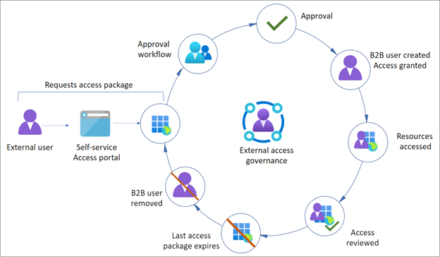
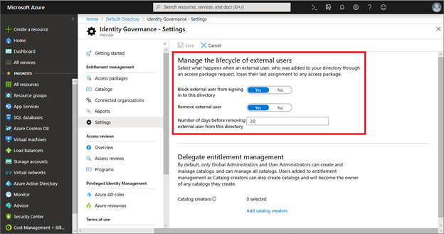
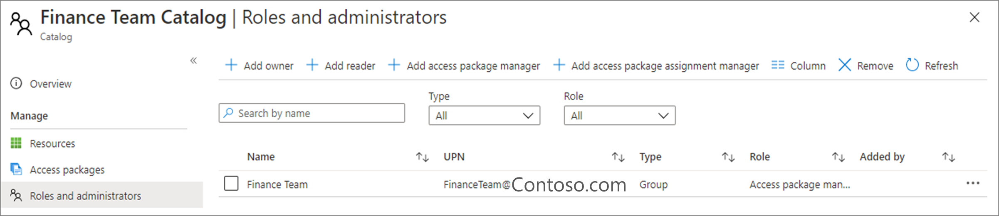
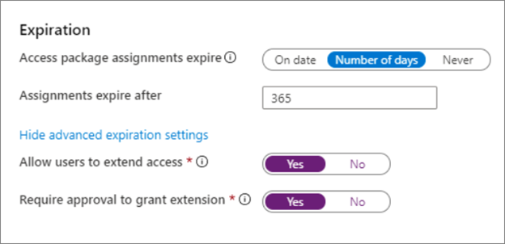
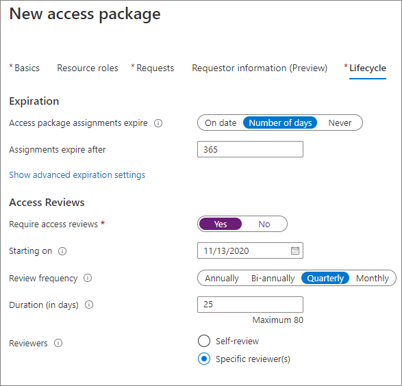

# Manage external access with Azure Active Directory entitlement management 

Use the entitlement management feature to manage the identity and access lifecycle. You can automate access request workflows, access assignments, reviews, and expiration. Delegated non-admins use entitlement management to create access packages that external users, from other organizations, can request access to. One and multi-stage approval workflows are configurable to evaluate requests, and provision users for time-limited access with recurring reviews. Use entitlement management for policy-based provisioning and deprovisioning of external accounts.

Learn more:

* [What is entitlement management?](../governance/entitlement-management-overview.md)
* [What are access packages and what resources can I manage with them?](../governance/entitlement-management-overview.md#what-are-access-packages-and-what-resources-can-i-manage-with-them)
* [What is provisioning?](../governance/what-is-provisioning.md)

## Before you begin

This article is number 6 in a series of 10 articles. We recommend you review the articles in order. Go to the **Next steps** section to see the entire series. 

## Enable entitlement management

The following key concepts are important to understand for entitlement management.

### Access packages

An access package is the foundation of entitlement management: groupings of policy-governed resources for users to collaborate on a project or do other tasks. For example, an access package might include:

* Access to SharePoint sites
* Enterprise applications, including your custom in-house and SaaS apps, like Salesforce
* Microsoft Teams
* Microsoft 365 Groups 

### Catalogs

Access packages reside in catalogs. When you want to group related resources and access packages and delegate their management, you create a catalog. First, you add resources to a catalog, and then you can add resources to access packages. For example, you can create a finance catalog, and delegate its management to a member of the finance team. That person can add resources, create access packages, and manage access approval.

Learn more:

* [Create and manage a catalog of resources in entitlement management](../governance/entitlement-management-catalog-create.md)
* [Delegation and roles in entitlement management](../governance/entitlement-management-delegate.md)
* [Add resources to a catalog](../governance/entitlement-management-catalog-create.md#add-resources-to-a-catalog)

The following diagram shows a typical governance lifecycle of an external user gaining access to an access package, with an expiration.

   

### Self-service external access

You can make access packages available, through the Azure AD My Access portal, to enable external users to request access. Policies determine who can request an access package. See, [Request access to an access package in entitlement management](../governance/entitlement-management-request-access.md).

You specify who is allowed to request the access package:

* Connected organizations
  * See, [Add a connected organization in entitlement management](../governance/entitlement-management-organization.md)
* Configured connected organizations
* Users from organizations
* Member or guest users in your tenant

### Approvals   

Access packages can include mandatory approval for access. Approvals can be single or multi-stage and are determined by policies. If internal and external users need to access the same package, you can set up access policies for categories of connected organizations, and for internal users.

> [!IMPORTANT]
> Implement approval processes for external users.

### Expiration  

Access packages can include an expiration date or a number of days you set for access. When the access package expires, and access ends, the B2B guest user object representing the user can be deleted or blocked from signing in. We recommend you enforce expiration on access packages for external users. Not all access packages have expirations.

> [!IMPORTANT]
> For packages without expiration, perform regular access reviews.

### Access reviews

Access packages can require periodic access reviews, which require the package owner or a designee to attest to the continued need for users’ access. See, [Manage guest access with access reviews](../governance/manage-guest-access-with-access-reviews.md).

Before you set up your review, determine the following criteria:

* Who
   * Criteria for continued access
   * Reviewers
* How often
   * Built-in options are monthly, quarterly, bi-annually, or annually 
   * We recommend quarterly, or more frequent, reviews for packages that support external access

> [!IMPORTANT]
> Access package reviews examine access granted through entitlement management. Set up other processes to review access to external users, outside entitlement management.

Learn more: [Plan a Microsoft Entra access reviews deployment](../governance/deploy-access-reviews.md).

## Using entitlement management automation

* [Working with the Azure AD entitlement management API](/graph/api/resources/entitlementmanagement-overview?view=graph-rest-1.0&preserve-view=true )
* [accessPackage resource type](/graph/api/resources/accesspackage?view=graph-rest-1.0&preserve-view=true )
* [Azure AD access reviews](/graph/api/resources/accessreviewsv2-overview?view=graph-rest-1.0&preserve-view=true )
* [connectedOrganization resource type](/graph/api/resources/connectedorganization?view=graph-rest-1.0&preserve-view=true )
* [entitlementManagementSettings resource type](/graph/api/resources/entitlementmanagementsettings?view=graph-rest-1.0&preserve-view=true )

## External access governance recommendations 

### Best practices

We recommend the following practices to govern external access with entitlement management.

* For projects with one or more business partners, create and use access packages to onboard and provide access to resources. 
  * [Create a new access package in entitlement management](../governance/entitlement-management-access-package-create.md)
* If you have B2B users in your directory, you can assign them to access packages.
* You can assign access in the Azure portal or with Microsoft Graph
  * [View, add, and remove assignments for an access package in entitlement management](../governance/entitlement-management-access-package-assignments.md)
  * [Create a new access package in entitlement management](../governance/entitlement-management-access-package-create.md)

### Identity Governance - Settings 

Use **Identity Governance - Settings** to remove users from your directory when their access packages expire. The following settings apply to users onboarded with entitlement management.

   

### Delegate catalog and package management

You can delegate catalog and package management to business owners, who have more information on who should access. See, [Delegation and roles in entitlement managements](../governance/entitlement-management-delegate.md)

   

### Enforce access package expiration

You can enforce access expiration for external users. See, [Change lifecycle settings for an access package in entitlement management](../governance/entitlement-management-access-package-lifecycle-policy.md).

   

* For the end date of a project-based access package, use **On date** to set the date. 
  * Otherwise we recommend expiration to be no longer 365 days, unless it's a multi-year project
* Allow users to extend access
  * Require approval to grant the extension

### Enforce guest-access package reviews

You can enforce reviews of guest-access packages to avoid inappropriate access for guests. See, [Manage guest access with access reviews](../governance/manage-guest-access-with-access-reviews.md).

   

* Enforce quarterly reviews
* For compliance-related projects, set the reviewers to be reviewers, rather than self-review for external users. 
  * You can use access package managers as reviewers
* For less sensitive projects, users self-reviewing reduces the burden to remove access from users no longer with the organization.

Learn more: [Govern access for external users in entitlement management](../governance/entitlement-management-external-users.md) 

## Next steps

Use the following series of articles to learn about securing external access to resources. We recommend you follow the listed order.

1. [Determine your security posture for external access with Azure AD](1-secure-access-posture.md)

2. [Discover the current state of external collaboration in your organization](2-secure-access-current-state.md)

3. [Create a security plan for external access to resources](3-secure-access-plan.md)

4. [Secure external access with groups in Azure AD and Microsoft 365](4-secure-access-groups.md) 

5. [Transition to governed collaboration with Azure AD B2B collaboration](5-secure-access-b2b.md) 

6. [Manage external access with Azure AD entitlement management](6-secure-access-entitlement-managment.md) (You're here)

7. [Manage external access to resources with Conditional Access policies](7-secure-access-conditional-access.md)

8. [Control external access to resources in Azure AD with sensitivity labels](8-secure-access-sensitivity-labels.md) 

9. [Secure external access to Microsoft Teams, SharePoint, and OneDrive for Business with Azure AD](9-secure-access-teams-sharepoint.md) 

10. [Convert local guest accounts to Azure Active Directory B2B guest accounts](10-secure-local-guest.md)

 

