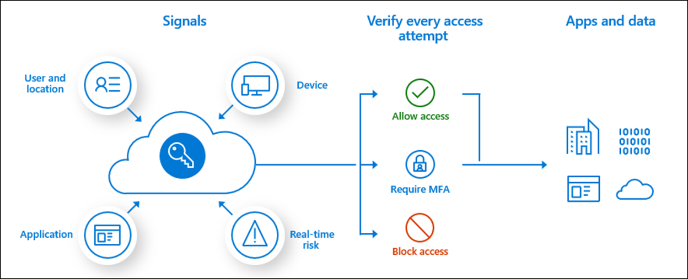

# Manage external access with Conditional Access policies 

[Conditional Access](../conditional-access/overview.md) is the tool Azure AD uses to bring together signals, enforce policies, and determine whether a user should be allowed access to resources. For detailed information on how to create and use Conditional Access policies (Conditional Access policies), see [Plan a Conditional Access deployment](../conditional-access/plan-conditional-access.md). 

This article discusses applying Conditional Access policies to external users and assumes you don’t have access to [Entitlement Management](../governance/entitlement-management-overview.md) functionality. Conditional Access policies can be and are used alongside Entitlement Management.

Earlier in this document set, you [created a security plan](3-secure-access-plan.md) that outlined:

* Applications and resources have the same security requirements and can be grouped for access.
* Sign-in requirements for external users.

You’ll use that plan to create your Conditional Access policies for external access. 

> [!IMPORTANT]
> Create several internal and external user test accounts so that you can test the policies you create before applying them.

## Conditional Access policies for external access

The following are best practices related to governing external access with Conditional Access policies.

* If you can’t use connected organizations in Entitlement Management, create an Azure AD security group or Microsoft 365 group for each partner organization you work with. Assign all users from that partner to the group. You may then use those groups in Conditional Access policies.

* Create as few Conditional Access policies as possible. For applications that have the same access needs, add them all to the same policy.  

   > [!NOTE]
   > Conditional Access policies can apply to a maximum of 250 applications. If more than 250 Apps have the same access needs, create duplicate policies. Policy A will apply to apps 1-250, policy B will apply to apps 251-500, etc.

* Clearly name policies specific to external access with a naming convention. One naming convention is *ExternalAccess_actiontaken_AppGroup*. For example a policy for external access that blocks access to finance apps, called ExternalAccess_Block_FinanceApps.

## Block all external users from resources

You can block external users from accessing specific sets of resources with Conditional Access policies. Once you’ve determined the set of resources to which you want to block access, create a policy.

To create a policy that blocks access for external users to a set of applications:

1. Sign in to the **Azure portal** as a Conditional Access Administrator, Security Administrator, or Global Administrator.
1. Browse to **Azure Active Directory** > **Security** > **Conditional Access**.
1. Select **New policy**.
1. Give your policy a name. We recommend that organizations create a meaningful standard for the names of their policies, for example ExternalAccess_Block_FinanceApps.
1. Under **Assignments**, select **Users or workload identities**.
   1. Under **Include**, select **All guests and external users**. 
   1. Under **Exclude**, select **Users and groups** and choose your organization's [emergency access or break-glass accounts](../roles/security-emergency-access.md). 
   1. Select **Done**.
1. Under **Cloud apps or actions** > **Include**, select **All cloud apps**.
   1. Under **Exclude**, select any applications that shouldn’t be blocked.
1. Under **Access controls** > **Grant**, select **Block access**, and choose **Select**.
1. Confirm your settings and set **Enable policy** to **Report-only**.
1. Select **Create** to create to enable your policy.

After confirming your settings using [report-only mode](../conditional-access/howto-conditional-access-insights-reporting.md), an administrator can move the **Enable policy** toggle from **Report-only** to **On**.

### Block external access to all except specific external users

There may be times you want to block external users except a specific group. For example, you may want to block all external users except those working for the finance team from the finance applications. To do this [Create a security group](active-directory-groups-create-azure-portal.md) to contain the external users who should access the finance applications:

1. Sign in to the **Azure portal** as a Conditional Access Administrator, Security Administrator, or Global Administrator.
1. Browse to **Azure Active Directory** > **Security** > **Conditional Access**.
1. Select **New policy**.
1. Give your policy a name. We recommend that organizations create a meaningful standard for the names of their policies, for example ExternalAccess_Block_AllButFinance.
1. Under **Assignments**, select **Users or workload identities**.
   1. Under **Include**, select **All guests and external users**. 
   1. Under **Exclude**, select **Users and groups**, 
      1. Choose your organization's [emergency access or break-glass accounts](../roles/security-emergency-access.md). 
      1. Choose the security group of external users you want to exclude from being blocked from specific applications.
   1. Select **Done**.
1. Under **Cloud apps or actions** > **Include**, select **All cloud apps**.
   1. Under **Exclude**, select the finance applications that shouldn’t be blocked.
1. Under **Access controls** > **Grant**, select **Block access**, and choose **Select**.
1. Confirm your settings and set **Enable policy** to **Report-only**.
1. Select **Create** to create to enable your policy.

After confirming your settings using [report-only mode](../conditional-access/howto-conditional-access-insights-reporting.md), an administrator can move the **Enable policy** toggle from **Report-only** to **On**.

### External partner access

Conditional Access policies that target external users may interfere with service provider access, for example granular delegated admin privileges [Introduction to granular delegated admin privileges (GDAP)](/partner-center/gdap-introduction).

## Implement Conditional Access

Many common Conditional Access policies are documented. See the article [Common Conditional Access policies](../conditional-access/concept-conditional-access-policy-common.md) for other common policies you may want to adapt for external users.

## Next steps

See the following articles on securing external access to resources. We recommend you take the actions in the listed order.

1. [Determine your desired security posture for external access](1-secure-access-posture.md)
1. [Discover your current state](2-secure-access-current-state.md)
1. [Create a governance plan](3-secure-access-plan.md)
1. [Use groups for security](4-secure-access-groups.md)
1. [Transition to Azure AD B2B](5-secure-access-b2b.md)
1. [Secure access with Entitlement Management](6-secure-access-entitlement-managment.md)
1. [Secure access with Conditional Access policies](7-secure-access-conditional-access.md) (You’re here)
1. [Secure access with Sensitivity labels](8-secure-access-sensitivity-labels.md)
1. [Secure access to Microsoft Teams, OneDrive, and SharePoint](9-secure-access-teams-sharepoint.md)
