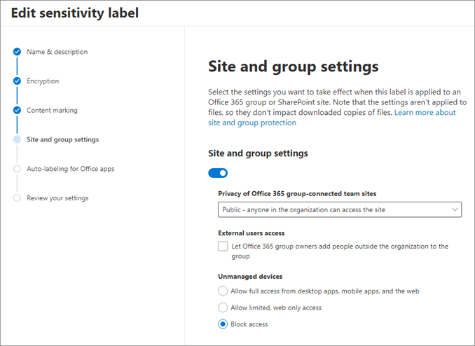

# Control access with sensitivity labels 

[Sensitivity labels](/microsoft-365/compliance/sensitivity-labels) help you control access to your content in Office 365 applications, and in containers like Microsoft Teams, Microsoft 365 Groups, and SharePoint sites. They can protect your content without hindering your users’ collaboration and production abilities. Sensitivity labels allow you to send your organization’s content across devices, apps, and services, while protecting your data and meeting your compliance and security policies. 

With sensitivity labels you can:

* **Classify content without adding any protection settings**. You can assign a classification to content (like a sticker) that persists and roams with your content as it’s used and shared. You can use this classification to generate usage reports and see activity data for your sensitive content.

* **Enforce protection settings such as encryption, watermarks, and access restrictions**. For example, users can apply a Confidential label to a document or email, and that label can [encrypt the content](/microsoft-365/compliance/encryption-sensitivity-labels) and add a “Confidential” watermark. In addition, you can [apply a sensitivity label to a container](/microsoft-365/compliance/sensitivity-labels-teams-groups-sites) like a SharePoint site, and enforce whether external users can access the content it contains.

Sensitivity labels on email and other content travel with the content. Sensitivity labels on containers can restrict access to the container, but content in the container doesn't inherit the label. For example, a user could take content from a protected site, download it, and then share it without restrictions unless the content also had a sensitivity label.

 >[!NOTE]
>To apply sensitivity labels users must be signed into their Microsoft work or school account. 

 
## Permissions necessary to create and manage sensitivity levels

Members of your compliance team who will create sensitivity labels need permissions to the Microsoft 365 Compliance Center, Microsoft 365 Security Center, or the Security & Compliance Center.

By default, global administrators for your tenant have access to these admin centers and can give compliance officers and other people access, without giving them all the permissions of a tenant admin. For this delegated limited admin access, add users to the Compliance Data Administrator, Compliance Administrator, or Security Administrator role group.

 

## Determine your sensitivity label strategy

As you think about governing external access to your content, determine the following:

**For all content and containers**

* How will you define what is High, Medium, or Low Business Impact (HBI, MBI, LBI)? Consider the impact to your organization if specific types of content are shared inappropriately.

   * Content with specific types of inherently [sensitive content](/microsoft-365/compliance/apply-sensitivity-label-automatically), such as credit cards or passport numbers

   * Content created by specific groups or people (for example, compliance officers, financial officers, or executives)

   * Content in specific libraries or sites. For example, containers hosting organizational strategy or private financial data

   * Other criteria

* What categories of content (for example HBI content) should be restricted from access by external users?

   * Restrictions can include actions like restricting access to containers, and encrypting content.

* What defaults should be in place for HBI data, sites, or Microsoft 365 Groups?

* Where will you use sensitivity labels to [label and monitor](/microsoft-365/compliance/sensitivity-labels), versus to [enforce encryption](/microsoft-365/compliance/encryption-sensitivity-labels) or to [enforce container access restrictions](/microsoft-365/compliance/sensitivity-labels-teams-groups-sites)?

**For email and content**

* Do you want to [automatically apply sensitivity labels](/microsoft-365/compliance/apply-sensitivity-label-automatically) to content, or do so manually?

   * If you choose to do so manually, do you want to [recommend that users apply a label](/microsoft-365/compliance/apply-sensitivity-label-automatically)?

**For containers**

* What criteria will determine if M365 Groups, Teams, or SharePoint sites require access to be restricted by using sensitivity labels?

* Do you want to only label content in these containers moving forward, or do you want to [automatically label](/microsoft-365/compliance/apply-sensitivity-label-automatically) existing files in SharePoint and OneDrive?

See these [common scenarios for sensitivity labels](/microsoft-365/compliance/get-started-with-sensitivity-labels) for other ideas on how you can use sensitivity labels.

### Sensitivity labels on email and content

When you assign a sensitivity label to a document or email, it's like a stamp that's applied to content that is customizable, clear text, and persistent. 

* **Customizable** means you can create labels appropriate for your organization and determine what happens when they're applied.

* **Clear text** means it’s a part of the item’s metadata and is readable by applications and services so that they can apply their own protective actions.

* **Persistent** means the label and any associated protections roam with the content, and become the basis for applying and enforcing policies.

 

> [!NOTE]
> Each item of content can have a single sensitivity label applied to it.

### Sensitivity labels on containers

You can apply sensitivity labels on containers such as [Microsoft 365 Groups](../enterprise-users/groups-assign-sensitivity-labels.md), [Microsoft Teams](/microsoft-365/compliance/sensitivity-labels-teams-groups-sites), and [SharePoint sites](/microsoft-365/compliance/sensitivity-labels-teams-groups-sites). When you apply this sensitivity label to a supported container, the label automatically applies the classification and protection settings to the connected site or group. Sensitivity labels on these containers can control the following aspects of containers:

* **Privacy**. You can choose who can see the site: specific users, all internal users, or anyone.

* **External user access**. Controls whether the group owner can add guests to the group.

* **Access from unmanaged devices**. Determines if and how unmanaged devices can access content.

 

 

When you apply a sensitivity label to a container such as a SharePoint site, it is not applied to content there: sensitivity labels on containers control access to the content within the container. 

* If you want to automatically apply labels to the content within the container, see [Apply a sensitivity to content automatically](/microsoft-365/compliance/apply-sensitivity-label-automatically).

* If you want users to be able to manually apply labels to this content, be sure that you‘ve [enabled sensitivity labels for Office files in SharePoint and OneDrive](/microsoft-365/compliance/sensitivity-labels-sharepoint-onedrive-files).

### Plan to implement sensitivity labels

Once you have determined how you want to use sensitivity labels, and to what content and sites you want to apply them, see the following documentation to help you perform your implementation.

1. [Get started with sensitivity labels](/microsoft-365/compliance/get-started-with-sensitivity-labels)

2. [Create a deployment strategy](/microsoft-365/compliance/get-started-with-sensitivity-labels)

3. [Create and publish sensitivity labels](/microsoft-365/compliance/create-sensitivity-labels)

4. [Restrict access to content using sensitivity labels to apply encryption](/microsoft-365/compliance/encryption-sensitivity-labels)

5. [Use sensitivity labels with teams, groups, and sites](/microsoft-365/compliance/sensitivity-labels-teams-groups-sites)

6. [Enable sensitivity labels for Office files in SharePoint and OneDrive](/microsoft-365/compliance/sensitivity-labels-sharepoint-onedrive-files)

### Next steps

See the following articles on securing external access to resources. We recommend you take the actions in the listed order.

1. [Determine your desired security posture for external access](1-secure-access-posture.md)

2. [Discover your current state](2-secure-access-current-state.md)

3. [Create a governance plan](3-secure-access-plan.md)

4. [Use groups for security](4-secure-access-groups.md)

5. [Transition to Azure AD B2B](5-secure-access-b2b.md)

6. [Secure access with Entitlement Management](6-secure-access-entitlement-managment.md)

7. [Secure access with Conditional Access policies](7-secure-access-conditional-access.md)

8. [Secure access with Sensitivity labels](8-secure-access-sensitivity-labels.md) (You are here.)

9. [Secure access to Microsoft Teams, OneDrive, and SharePoint](9-secure-access-teams-sharepoint.md)