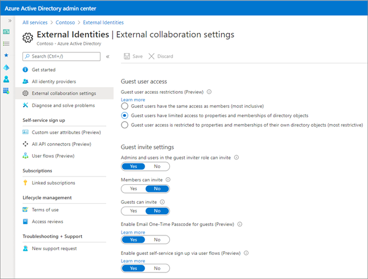
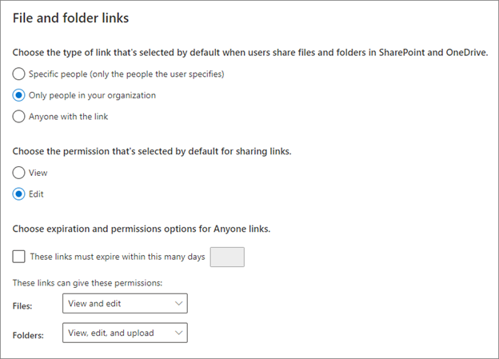

# Secure external access to Microsoft Teams, SharePoint, and OneDrive for Business 

Microsoft Teams, SharePoint, and OneDrive for Business are three of the most used ways to collaborate and share content with external users. If the “approved” methods are too restrictive, users will go outside of approved methods by emailing content or setting up insecure external processes and applications, such as a personal DropBox or OneDrive. Your goal is to balance your security needs with ease of collaboration.

This article guides you to determine and configure external collaboration to meet your business goals using Microsoft Teams and SharePoint.

## Governance begins in Azure Active Directory

Sharing in Microsoft 365 is in part governed by the [External Identities | External collaboration settings](https://aad.portal.azure.com/) in Azure Active Directory (Azure AD). If external sharing is disabled or restricted in Azure AD, it overrides any sharing settings configured in Microsoft 365. An exception to this is that if Azure AD B2B integration isn't enabled, SharePoint and OneDrive can be configured to support ad-hoc sharing via one-time passcodes (OTP).

### Guest user access

There are three choices for guest user access, which controls what guest users can see after being invited. 

To prevent guest users from seeing details of other guest users, and being able to enumerate group membership, choose Guest users have limited access to properties and memberships of directory objects.

### Guest invite settings

These settings determine who can invite guests and how those guests can be invited. These settings are only enabled if the integration with B2B is enabled.

We recommend enabling administrators and users in the guest inviter role can invite. This setting allows controlled collaboration processes to be set up, as in the following example.

* Team owner submits a ticket to be assigned the Guest inviter role, and

   * Becomes responsible for all guest invitations.

   * Agrees not to directly add users to the underlying SharePoint

   * Is accountable to perform regular access reviews, and revoke access as appropriate.

* Central IT does the following

   * Enables external sharing by granting the requested role upon training completion.

   * Assigns Azure AD P2 license to the Microsoft 365 group owner to enable access reviews.
   * Creates a Microsoft 365 group access review.

   * Confirms that access reviews are occurring.

   * Removes users directly added to the underlying SharePoint.

 Set **Enable Email One-time Passcodes for guests (Preview) and Enable up guest self-service sign via user flows** to **yes**. This setting takes advantage of the integration with Azure AD External collaboration settings.

### Collaboration restrictions

There are three choices under collaboration restrictions. Your business requirements dictate which you will choose.

* **Allow invitations to be sent to any domain** means any user can be invited to collaborate.

* **Deny invitations to the specified domains** means any user outside of those can be invited to collaborate.

* **Allow invitations only to the specified domains** means that any user outside of those specified domains cannot be invited. 

## Govern access in Teams

[Teams differentiates between external users (anyone outside your organization) and guest users (those with guest accounts)](/microsoftteams/communicate-with-users-from-other-organizations?WT.mc_id=TeamsAdminCenterCSH%e2%80%8b)). You manage collaboration setting in the [Teams Admin portal](https://admin.teams.microsoft.com/company-wide-settings/external-communications) under Org-wide settings. 

> [!NOTE]
> External identities collaboration settings in Azure Active Directory control the effective permissions. You can increase restrictions in Teams, but not decrease them from what is set in Azure AD.

* **External Access settings**. By default, Teams allows external access, which means that organization can communicate with all external domains. If you want to restrict or allow specific domains just for Teams, you can do so here.

* **Guest Access**. Guest access controls what guest users can do in teams.

To learn more about managing external access in Teams, see the following resources.

* [Manage external access in Microsoft Teams](/microsoftteams/manage-external-access)

* [Microsoft 365 identity models and Azure Active Directory](/microsoft-365/enterprise/about-microsoft-365-identity)

* [Identity models and authentication for Microsoft Teams](/MicrosoftTeams/identify-models-authentication)

* [Sensitivity labels for Microsoft Teams](/MicrosoftTeams/sensitivity-labels)

## Govern access in SharePoint and OneDrive

SharePoint administrators have many settings available for collaboration. Organization-wide settings are managed from the SharePoint admin center. Settings can be adjusted for each SharePoint site. We recommend that your organization-wide settings be at your minimum necessary security levels, and that you increase security on specific sites as needed. For example, for a high-risk project, you may want to restrict users to certain domains, and disable the ability of members to invite guests.

### Integrating SharePoint and One-drive with Azure AD B2B

As a part of your overall strategy for governing external collaboration, we recommend that you [enable the Preview of SharePoint and OneDrive integration with Azure AD B2B](/sharepoint/sharepoint-azureb2b-integration-preview) .

Azure AD B2B provides authentication and management of guest users. With SharePoint and OneDrive integration, [Azure AD B2B one-time passcodes](../external-identities/one-time-passcode.md) are used for external sharing of files, folders, list items, document libraries, and sites. This feature provides an upgraded experience from the existing [secure external sharing recipient experience](/sharepoint/what-s-new-in-sharing-in-targeted-release).

> [!NOTE]
> If you enable the preview for Azure AD B2B integration, then SharePoint and OneDrive sharing is subject to the Azure AD organizational relationships settings, such as **Members can invite** and **Guests can invite**.

### Sharing policies

*External Sharing* can be set for both SharePoint and OneDrive. OneDrive restrictions can't be more permissive than the SharePoint settings.

 

SharePoint integration with Azure AD B2B changes how controls interact with accounts.

* **Anyone**. Not recommended

   * Regardless of integration status, enabling Anyone links means no Azure policies will be applied when this type of link is used. 

   * In a scenario of governed collaboration, don't enable this functionality. 
   > [!NOTE]
   > You may find a scenario where you need to enable this setting for a specific site, in which case you would enable it here, and set the greater restriction on individual sites.

* **New and existing guests**. Recommended if you have integration enabled.

   * **With Azure AD B2B integration** enabled, new and existing guests will have an Azure AD B2B guest account that can be managed with Azure AD policies.

   * **Without Azure AD B2B integration** enabled, new guests will not have an Azure AD B2B account created, and they cannot be managed from Azure AD. Whether existing guests have an Azure AD B2B account depends on how the guest was created.

* **Existing guests**. Recommended if you do not have integration enabled.

   * With this enabled, users can only share with other users already in your directory.

* **Only people in your organization**. Not recommended when you need to collaborate with external users.

   * Regardless of integration status, users will only be able to share with users in your organization. 

* **Limit external sharing by domain**. By default SharePoint allows external access, which means that sharing is allowed with all external domains. If you want to restrict or allow specific domains just for SharePoint, you can do so here.

* **Allow only users in specific security groups to share externally**.  This setting restricts who can share content in SharePoint and OneDrive, while the setting in Azure AD applies to all applications. Restricting who can share can be useful if you want to require your users to take a training about sharing securely, then at completion add them to an approved sharing security group. If this setting is selected, and users do not have a way to gain access to being an “approved sharer,” they may instead find unapproved ways to share. 

* **Allow guests to share items they don’t own**. We recommend leaving this disabled.

* **People who use a verification code must reauthenticate after this many days (default is 30)**. We recommend enabling this setting.

### Access controls

Access controls setting will affect all users in your organization. Given that you may not be able to control whether external users have compliant devices, we will not address those controls here. 

* **Idle session sign-out**. We recommend that you enable this control, which allows you to warn and sign-out users on unmanaged devices after a period of inactivity. You can configure the period of inactivity and the warning. 

* **Network location**. Setting this control means you can allow access only form IP addresses that your organization owns. In external collaboration scenarios, set this only if all of your external partners will access resources only form within your network, or via your VPN.

### File and folder links

In the SharePoint admin center, you can also set how file and folder links are shared. You can also configure these setting for each site. 

 

If you have enabled the integration with Azure AD B2B, sharing of files and folders with those outside of the organization will result in a B2B user being created when files and folder are shared.

We recommend setting the default link type to **Only people in your organization**, and default permissions to **Edit**. Doing so ensures that items are shared thoughtfully. You can then customize this setting for per-site default that meet specific collaboration needs.

### Anyone links

We do not recommend enabling anyone links. If you do, we recommend setting an expiration, and consider restricting them to view permissions. If you choose View only permissions for files or folders, users will not be able to change Anyone links to include edit privileges.

To learn more about governing external access to SharePoint see the following:

* [SharePoint external sharing overview](/sharepoint/external-sharing-overview)

* [SharePoint and OneDrive integration with Azure AD B2B](/sharepoint/sharepoint-azureb2b-integration-preview)

#### Next steps

See the following articles on securing external access to resources. We recommend you take the actions in the listed order.

1. [Determine your security posture for external access](1-secure-access-posture.md)

2. [Discover your current state](2-secure-access-current-state.md)

3. [Create a governance plan](3-secure-access-plan.md)

4. [Use groups for security](4-secure-access-groups.md)

5. [Transition to Azure AD B2B](5-secure-access-b2b.md)

6. [Secure access with Entitlement Management](6-secure-access-entitlement-managment.md)

7. [Secure access with Conditional Access policies](7-secure-access-conditional-access.md)

8. [Secure access with Sensitivity labels](8-secure-access-sensitivity-labels.md)

9. [Secure access to Microsoft Teams, OneDrive, and SharePoint](9-secure-access-teams-sharepoint.md) (You are here.)