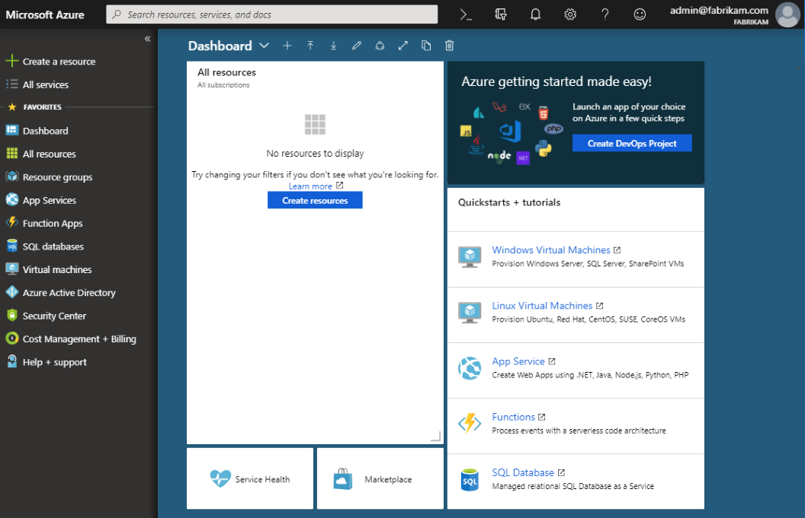
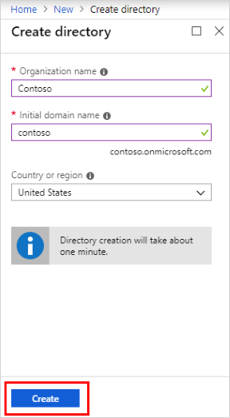
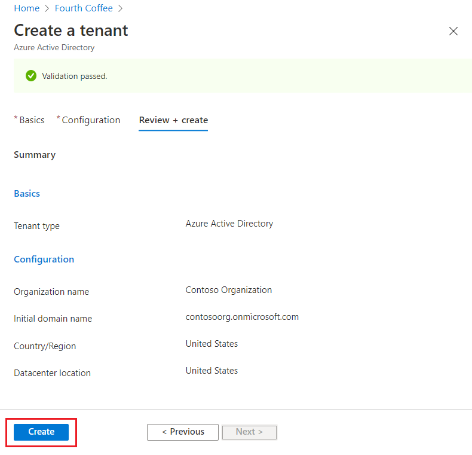

# Quickstart: Create a new tenant in Azure Active Directory
You can do all of your administrative tasks using the Azure Active Directory (Azure AD) portal, including creating a new tenant for your organization. 

In this quickstart, you'll learn how to get to the Azure portal and Azure Active Directory, and you'll learn how to create a basic tenant for your organization.

If you don't have an Azure subscription, create a [free account](https://azure.microsoft.com/free/) before you begin.

## Create a new tenant for your organization
After you sign in to the Azure portal, you can create a new tenant for your organization. Your new tenant represents your organization and helps you to manage a specific instance of Microsoft cloud services for your internal and external users.

### To create a new tenant

1. Sign in to your organization's [Azure portal](https://portal.azure.com/).

1. From the Azure portal menu, select **Azure Active Directory**.  

    <kbd></kbd>  

1. Select **Create a tenant**.

1. On the Basics tab, select the type of tenant you want to create, either **Azure Active Directory** or **Azure Active Directory (B2C)**.

1. Select **Next: Configuration** to move on to the Configuration tab.

    <kbd></kbd>

1.  On the Configuration tab, enter the following information:
    
    - Type _Contoso Organization_ into the **Organization name** box.

    - Type _Contosoorg_ into the **Initial domain name** box.

    - Leave the _United States_ option in the **Country or region** box.

1. Select **Next: Review + Create**. Review the information you entered and if the information is correct, select **create**.

    <kbd></kbd>

Your new tenant is created with the domain contoso.onmicrosoft.com.

## Your user account in the new tenant

When you create a new AAD tenant, you become the first user of that tenant. As the first user, you're automatically assigned the [Global Admin](https://docs.microsoft.com/azure/active-directory/roles/permissions-reference#global-administrator) role. Check out your user account by navigating to the [**Users**](https://portal.azure.com/#blade/Microsoft_AAD_IAM/UsersManagementMenuBlade/MsGraphUsers) page.

By default, you're also listed as the [technical contact](https://docs.microsoft.com/microsoft-365/admin/manage/change-address-contact-and-more?view=o365-worldwide#what-do-these-fields-mean) for the tenant. Technical contact information is something you can change in [**Properties**](https://portal.azure.com/#blade/Microsoft_AAD_IAM/ActiveDirectoryMenuBlade/Properties).

## Clean up resources
If you're not going to continue to use this application, you can delete the tenant using the following steps:

- Ensure that you're signed in to the directory that you want to delete through the **Directory + subscription** filter in the Azure portal. Switch to the target directory if needed.
- Select **Azure Active Directory**, and then on the **Contoso - Overview** page, select **Delete directory**.

    The tenant and its associated information is deleted.

    <kbd></kbd>

## Next steps
- Change or add additional domain names, see [How to add a custom domain name to Azure Active Directory](add-custom-domain.md)

- Add users, see [Add or delete a new user](add-users-azure-active-directory.md)

- Add groups and members, see [Create a basic group and add members](active-directory-groups-create-azure-portal.md)

- Learn about [role-based access using Privileged Identity Management](../../role-based-access-control/best-practices.md) and [Conditional Access](../../role-based-access-control/conditional-access-azure-management.md) to help manage your organization's application and resource access.

- Learn about Azure AD, including [basic licensing information, terminology, and associated features](active-directory-whatis.md).
