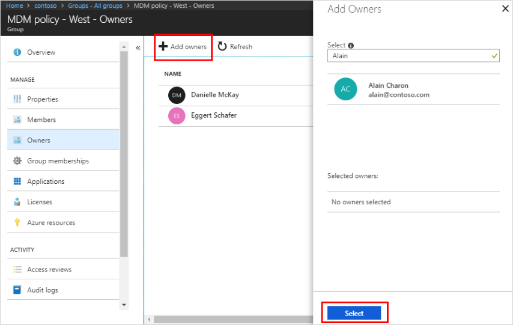
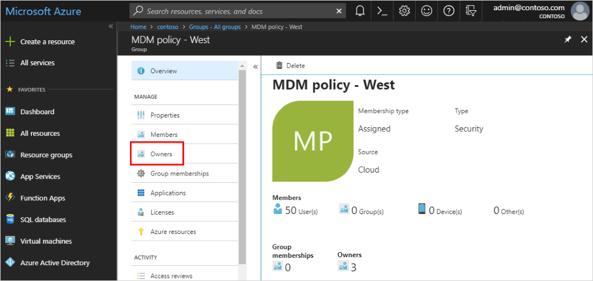
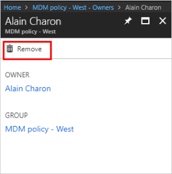

# How to: Add or remove group owners in Azure Active Directory
Azure Active Directory (Azure AD) groups are owned and managed by group owners. Group owners are assigned to manage a group and its members by a resource owner (administrator). Group owners aren't required to be members of the group. After a group owner has been assigned, only a resource owner can add or remove owners.

In some cases, you as the administrator might decide not to assign a group owner. In this case, you become the group owner. Additionally, owners can assign other owners to their group, unless you've restricted this in the group settings.

## Add an owner to a group
Add additional group owners to a group using Azure AD.

### To add a group owner
1. Sign in to the [Azure portal](https://portal.azure.com) using a Global administrator account for the directory.

2. Select **Azure Active Directory**, select **Groups**, and then select the group for which you want to add an owner (for this example, _MDM policy - West_).

3. On the **MDM policy - West Overview** page, select **Owners**.

    

4. On the **MDM policy - West - Owners** page, select **Add owners**, and then search for and select the user that will be the new group owner, and then choose **Select**.

    

    After you select the new owner, you can refresh the **Owners** page and see the name added to the list of owners.

## Remove an owner from a group
Remove an owner from a group using Azure AD.

### To remove an owner
1. Sign in to the [Azure portal](https://portal.azure.com) using a Global administrator account for the directory.

2. Select **Azure Active Directory**, select **Groups**, and then select the group for which you want to add an owner (for this example, _MDM policy - West_).

3. On the **MDM policy - West Overview** page, select **Owners**.

    

4. On the **MDM policy - West - Owners** page, select the user you want to remove as a group owner, choose **Remove** from the user's information page, and select **Yes** to confirm your decision.

    

    After you remove the owner, you can return to the **Owners** page and see the name has been removed from the list of owners.

## Next steps
- [Managing access to resources with Azure Active Directory groups](active-directory-manage-groups.md)

- [Azure Active Directory cmdlets for configuring group settings](../users-groups-roles/groups-settings-cmdlets.md)

- [Use groups to assign access to an integrated SaaS app](../users-groups-roles/groups-saasapps.md)

- [Integrating your on-premises identities with Azure Active Directory](../hybrid/whatis-hybrid-identity.md)

- [Azure Active Directory cmdlets for configuring group settings](../users-groups-roles/groups-settings-v2-cmdlets.md)
