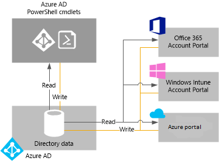

# Manage your Azure Active Directory tenant

## What is an Azure AD tenant?
In Azure Active Directory (Azure AD), a tenant is a dedicated instance of an Azure AD directory that your organization receives when it signs up for a Microsoft cloud service such as Azure or Office 365. Each Azure AD directory is distinct and separate from other Azure AD directories. Just like a corporate office building is a secure asset specific to only your organization, an Azure AD directory was also designed to be a secure asset for use by only your organization. The Azure AD architecture isolates customer data and identity information so that users and administrators of one Azure AD directory cannot accidentally or maliciously access data in another directory.

## How can I get an Azure AD directory?
Azure AD provides the core directory and identity management capabilities behind most of Microsoft’s cloud services, including:

* Azure
* Microsoft Office 365
* Microsoft Dynamics CRM Online
* Microsoft Intune

You get an Azure AD directory when you sign up for any of these Microsoft cloud services. You can create additional directories as needed. For example, you might maintain your first directory as a production directory and then create another directory for testing or staging.

### Using the Azure AD directory that comes with a new Azure subscription

We recommend that you use the administrator account you used for your first service when you sign up for other Microsoft services. The information that you provide the first time you sign up for a Microsoft service is used to create a new Azure AD directory instance for your organization. If you use that directory to authenticate sign-in attempts when you subscribe to other Microsoft services, they can use the existing user accounts, policies, settings, or on-premises directory integration you configure in your default directory.

For example, if you sign up for a Microsoft Intune subscription and then further synchronize your on-premises Active Directory with your Azure AD directory, you can sign up for another Microsoft service such as Office 365 and easily achieve the same directory integration benefits that you have with Microsoft Intune.

For more information about integrating your on-premises directory with Azure AD, see [Directory integration with Azure AD Connect](../hybrid/whatis-hybrid-identity.md).

### Associate an existing Azure AD directory with a new Azure subscription
You can associate a new Azure subscription with the same directory that authenticates sign-in for an existing Office 365 or Microsoft Intune subscription. For more information on that scenario, see [Transfer ownership of an Azure subscription to another account](../../billing/billing-subscription-transfer.md)

### Create an Azure AD directory by signing up for a Microsoft cloud service as an organization
If you don’t yet have a subscription to a Microsoft cloud service, you can use one of the following links to sign up. Signing up for your first service creates an Azure AD directory automatically.

* [Microsoft Azure](https://account.azure.com/organization)
* [Office 365](http://products.office.com/business/compare-office-365-for-business-plans/)
* [Microsoft Intune](https://portal.office.com/Signup/Signup.aspx?OfferId=40BE278A-DFD1-470a-9EF7-9F2596EA7FF9&dl=INTUNE_A&ali=1#0%20)

### How to change the default directory for a subscription

1. Sign in to the [Azure Account Center](https://account.azure.com/Subscriptions) with an account that is the Account Administrator of the subscription to transfer subscription ownership.
2. Ensure that the user who you want to be the subscription owner is in the targeted directory.
3. Click **Transfer subscription**.
4. Specify the recipient. The recipient automatically gets an email with an acceptance link.
5. The recipient clicks the link and follows the instructions, including entering their payment information. When the recipient succeeds, the subscription is transferred. 
6. The default directory of the subscription is changed to the directory that the user is in if the subscription ownership transfer is successful.

To learn more, see [Transfer Azure subscription ownership to another account](../../billing/billing-subscription-transfer.md)

### Manage the default directory in Azure
When you sign up for Azure, a default Azure AD directory is associated with your subscription. There are no costs for using Azure AD and your directories are a free resource. There are paid Azure AD services that are licensed separately and provide additional functionality such as company branding at sign-in, and self-service password reset. You can also create a custom domain using a DNS name that you own instead of the default *.onmicrosoft.com domain.

## How can I manage directory data?
To administer one or more Microsoft cloud service subscriptions, you can use the [Azure AD admin center](https://aad.portal.azure.com), the Microsoft Intune account portal, or the [Office 365 Admin Center](https://portal.office.com/) to manage your organization's directory data. You can also use [Azure Active Directory PowerShell cmdlets](https://docs.microsoft.com/powershell/azure/active-directory) to help you manage data stored in Azure AD.

From any one of these portals (or cmdlets), you can:

* Create and manage user and group accounts
* Manage related cloud services for your organization's subscriptions
* Set up on-premises integration with Azure AD identity and authentication services

The Azure AD admin center, Office 365 Admin Center, Microsoft Intune account portal, and the Azure AD cmdlets all read from and write to a single shared instance of Azure AD that is associated with your organization’s directory. Each of those tools acts as a front-end interface that pulls in or changes your directory data.
When you change your organization's data using any of the portals or cmdlets while signed in under the context of one of these services, the changes are also shown in the other portals the next time you sign in. This data is shared across the Microsoft cloud services to which you subscribe.

For example, if you use the Office 365 Admin Center to block a user from signing in, that action blocks the user from signing in to any other service to which your organization is currently subscribed to. If you view the same user account in the Microsoft Intune account portal, you also see that the user is blocked.

## How can I add and manage multiple directories?
You can [add an Azure AD directory in the Azure portal](https://portal.azure.com/#create/Microsoft.AzureActiveDirectory). Fill out the information and select **Create**.

You can manage each directory as a fully independent resource: each directory is a peer, fully featured and logically independent of other directories that you manage; there is no parent-child relationship between directories. This independence between directories includes resource independence, administrative independence, and synchronization independence.

* **Resource independence**. If you create or delete a resource in one directory, it has no impact on any resource in another directory, with the partial exception of external users. If you use a custom domain 'contoso.com' with one directory, it cannot be used with any other directory.
* **Administrative independence**.  If a user who is not an administrator of directory 'Contoso' creates a test directory 'Test,' then:
  
  * The administrators of directory 'Contoso' have no direct administrative privileges to directory 'Test' unless an administrator of 'Test' specifically grants them these privileges. Administrators of 'Contoso' can control access to directory 'Test' by virtue of their control of the user account that created 'Test.'
    
  * If you assign or remove an administrator role for a user in one directory, the change does not affect any administrator role that user may have in another directory.
* **Synchronization independence**. You can configure each Azure AD tenant independently to get data synchronized from a single instance the Azure AD Connect directory synchronization tool.

Unlike other Azure resources, your directories are not child resources of an Azure subscription. So if you cancel or allow your Azure subscription to expire, you can still access your directory data using Azure AD PowerShell, the Azure Graph API, or other interfaces such as the Office 365 Admin Center. You can also associate another subscription with the directory.

## How to prepare to delete an Azure AD directory
A global administrator can delete an Azure AD directory from the portal. When a directory is deleted, all resources that are contained in the directory are also deleted. Verify that you don’t need the directory before you delete it.

> [!NOTE]
> If the user is signed in with a work or school account, the user must not be attempting to delete their home directory. For example, if the user is signed in as joe@contoso.onmicrosoft.com, that user cannot delete the directory that has contoso.onmicrosoft.com as its default domain.

Azure AD requires that certain conditions are met to delete a directory. This reduces risk that deleting a directory negatively impacts users or applications, such as the ability of users to sign in to Office 365 or access resources in Azure. For example, if a directory for a subscription is unintentionally deleted, then users can't access the Azure resources for that subscription.

The following conditions are checked:

* The only user in the directory should be the global administrator who is to delete the directory. Any other users must be deleted before the directory can be deleted. If users are synchronized from on-premises, then sync must be turned off, and the users must be deleted in the cloud directory by using the Azure portal or Azure PowerShell cmdlets. There is no requirement to delete groups or contacts, such as contacts added from the Office 365 Admin Center.
* There can be no applications in the directory. Any applications must be deleted before the directory can be deleted.
* No multi-factor authentication providers can be linked to the directory.
* There can be no subscriptions for any Microsoft Online Services such as Microsoft Azure, Office 365, or Azure AD Premium associated with the directory. For example, if a default directory was created for you in Azure, you cannot delete this directory if your Azure subscription still relies on this directory for authentication. Similarly, you can't delete a directory if another user has associated a subscription with it. 

## Next steps
* [Azure AD Forum](https://social.msdn.microsoft.com/forums/azure/en-US/home?forum=windowsazuread)
* [Azure Multi-Factor Authentication Forum](https://social.msdn.microsoft.com/Forums/azure/en-US/home?forum=windowsazureactiveauthentication)
* [StackOverflow for Azure questions](https://stackoverflow.com/questions/tagged/azure-active-directory)
* [Azure Active Directory PowerShell](https://docs.microsoft.com/powershell/azure/active-directory)
* [Assigning administrator roles in Azure AD](../users-groups-roles/directory-assign-admin-roles.md)
