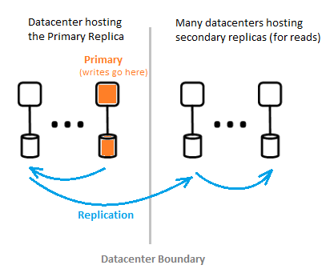

# What is the Azure Active Directory architecture?
Azure Active Directory (Azure AD) enables you to securely manage access to Azure services and resources for your users. Included with Azure AD is a full suite of identity management capabilities. For information about Azure AD features, see [What is Azure Active Directory?](https://docs.microsoft.com/azure/active-directory/active-directory-whatis)

With Azure AD, you can create and manage users and groups, and enable permissions to allow and deny access to enterprise resources. For information about identity management, see [The fundamentals of Azure identity management](https://docs.microsoft.com/azure/active-directory/fundamentals-identity).

## Azure AD architecture
Azure AD's geographically distributed architecture combines extensive monitoring, automated rerouting, failover, and recovery capabilities, which deliver company-wide availability and performance to customers.

The following architecture elements are covered in this article:
 *	Service architecture design
 *	Usability 
 *	Continuous availability
 *	Data centers

### Service architecture design
The most common way to build an accessible and usable, data-rich system is through independent building blocks or scale units for the Azure AD data tier, scale units are called *partitions*. 

The data tier has several front-end services that provide read-write capability. The diagram below shows how the components of a single-directory partition are delivered throughout geographically distributed data centers. 

  

The components of Azure AD architecture include a primary replica and secondary replicas.

**Primary replica**

The *primary replica* receives all *writes* for the partition it belongs to. Any write operation is immediately replicated to a secondary replica in a different datacenter before returning success to the caller, thus ensuring geo-redundant durability of writes.

**Secondary replicas**

All directory *reads* are serviced from *secondary replicas*, which are at data centers that are physically located across different geographies. There are many secondary replicas, as data is replicated asynchronously. Directory reads, such as authentication requests, are serviced from data centers that are close to customers. The secondary replicas are responsible for read scalability.

### Scalability

Scalability is the ability of a service to expand to meet increasing performance demands. Write scalability is achieved by partitioning the data. Read scalability is achieved by replicating data from one partition to multiple secondary replicas distributed throughout the world.

Requests from directory applications are routed to the datacenter that they are physically closest to. Writes are transparently redirected to the primary replica to provide read-write consistency. Secondary replicas significantly extend the scale of partitions because the directories are typically serving reads most of the time.

Directory applications connect to the nearest datacenters. This connection improves performance, and therefore scaling out is possible. Since a directory partition can have many secondary replicas, secondary replicas can be placed closer to the directory clients. Only internal directory service components that are write-intensive target the active primary replica directly.

### Continuous availability

Availability (or uptime) defines the ability of a system to perform uninterrupted. The key to Azure AD’s high-availability is that the services can quickly shift traffic across multiple geographically distributed data centers. Each data center is independent, which enables de-correlated failure modes.

Azure AD’s partition design is simplified compared to the enterprise AD design, using a single-master design that includes a carefully orchestrated and deterministic primary replica failover process.

**Fault tolerance**

A system is more available if it is tolerant to hardware, network, and software failures. For each partition on the directory, a highly available master replica exists: The primary replica. Only writes to the partition are performed at this replica. This replica is being continuously and closely monitored, and writes can be immediately shifted to another replica (which becomes the new primary) if a failure is detected. During failover, there could be a loss of write availability typically of 1-2 minutes. Read availability is not affected during this time.

Read operations (which outnumber writes by many orders of magnitude) only go to secondary replicas. Since secondary replicas are idempotent, loss of any one replica in a given partition is easily compensated by directing the reads to another replica, usually in the same datacenter.

**Data durability**

A write is durably committed to at least two data centers prior to it being acknowledged. This happens by first committing the write on the primary, and then immediately replicating the write to at least one other data center. This write action ensures that a potential catastrophic loss of the data center hosting the primary does not result in data loss.

Azure AD maintains a zero [Recovery Time Objective (RTO)](https://en.wikipedia.org/wiki/Recovery_time_objective) to not lose data on failovers. This includes:
-  Token issuance and directory reads
-  Allowing only about 5 minutes RTO for directory writes

### Data centers

Azure AD’s replicas are stored in datacenters located throughout the world. For more information, see [Azure datacenters](https://azure.microsoft.com/overview/datacenters).

Azure AD operates across data centers with the following characteristics:

 * Authentication, Graph, and other AD services reside behind the Gateway service. The Gateway manages load balancing of these services. It will fail over automatically if any unhealthy servers are detected using transactional health probes. Based on these health probes, the Gateway dynamically routes traffic to healthy data centers.
 * For *reads*, the directory has secondary replicas and corresponding front-end services in an active-active configuration operating in multiple data centers. In case of a failure of an entire data center, traffic will be automatically routed to a different datacenter.
 *	For *writes*, the directory will fail over primary (master) replica across data centers via planned (new primary is synchronized to old primary) or emergency failover procedures. Data durability is achieved by replicating any commit to at least two data centers.

**Data consistency**

The directory model is one of eventual consistencies. One typical problem with distributed asynchronously replicating systems is that the data returned from a “particular” replica may not be up-to-date. 

Azure AD provides read-write consistency for applications targeting a secondary replica by routing its writes to the primary replica, and synchronously pulling the writes back to the secondary replica.

Application writes using the Graph API of Azure AD are abstracted from maintaining affinity to a directory replica for read-write consistency. The Azure AD Graph service maintains a logical session, which has affinity to a secondary replica used for reads; affinity is captured in a “replica token” that the graph service caches using a distributed cache. This token is then used for subsequent operations in the same logical session. 

 >[!NOTE]
 >Writes are immediately replicated to the secondary replica to which the logical session's reads were issued.
 >

**Backup protection**

The directory implements soft deletes, instead of hard deletes, for users and tenants for easy recovery in case of accidental deletes by a customer. If your tenant administrator accidental deletes users, they can easily undo and restore the deleted users. 

Azure AD implements daily backups of all data, and therefore can authoritatively restore data in case of any logical deletions or corruptions. The data tier employs error correcting codes, so that it can check for errors and automatically correct particular types of disk errors.

**Metrics and monitors**

Running a high availability service requires world-class metrics and monitoring capabilities. Azure AD continually analyzes and reports key service health metrics and success criteria for each of its services. There is also continuous development and tuning of metrics and monitoring and alerting for each scenario, within each Azure AD service and across all services.

If any Azure AD service is not working as expected, action is immediately taken to restore functionality as quickly as possible. The most important metric Azure AD tracks is how quickly live site issues can be detected and mitigated for customers. We invest heavily in monitoring and alerts to minimize time to detect (TTD Target: <5 minutes) and operational readiness to minimize time to mitigate (TTM Target: <30 minutes).

**Secure operations**

Using operational controls such as multi-factor authentication (MFA) for any operation, as well as auditing of all operations. In addition, using a just-in-time elevation system to grant necessary temporary access for any operational task-on-demand on an ongoing basis. For more information, see [The Trusted Cloud](https://azure.microsoft.com/support/trust-center).

## Next steps
[Azure Active Directory developer's guide](https://docs.microsoft.com/azure/active-directory/develop/active-directory-developers-guide)

