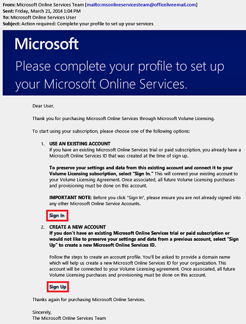
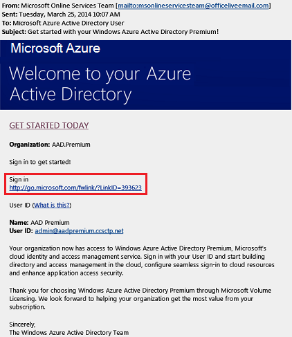
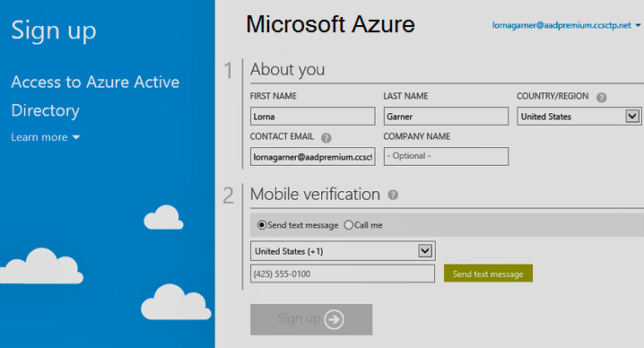

# Quickstart: Sign up for Azure Active Directory Premium
To get started with Azure Active Directory (Azure AD) Premium, you can purchase licenses and associate them with your Azure subscription. If you create a new Azure subscription, you also need to activate your licensing plan and Azure AD service access as described in the following sections. 

## Sign up for Active Directory Premium
To sign up for Active Directory Premium, you have several options: 
* Use your Azure or Office 365 subscription
* Use an Enterprise Mobility + Security licensing plan
* Use a Microsoft Volume Licensing plan

### Azure or Office 365 
As an Azure or Office 365 subscriber, you can buy Azure Active Directory Premium online. 

For detailed steps, see [How to Purchase Azure Active Directory Premium - Existing Customers](https://channel9.msdn.com/Series/Azure-Active-Directory-Videos-Demos/How-to-Purchase-Azure-Active-Directory-Premium-Existing-Customer) or [How to Purchase Azure Active Directory Premium - New Customers](https://channel9.msdn.com/Series/Azure-Active-Directory-Videos-Demos/How-to-Purchase-Azure-Active-Directory-Premium-New-Customers).  

### Enterprise Mobility + Security
Enterprise Mobility + Security (EMS) is a cost effective way for organizations to use the following services together under one licensing plan: Azure Active Directory Premium, Azure Information Protection, and Microsoft Intune. You can learn more about EMS at the [Enterprise Mobility + Security web site](https://www.microsoft.com/cloud-platform/enterprise-mobility-security) and more about the EMS license types available for purchase on the [Enterprise Mobility + Security Pricing Options](https://www.microsoft.com/cloud-platform/enterprise-mobility-security-pricing) page.  

You can get started with Azure AD via EMS licenses using one of the following licensing options:

- Try out EMS with a free [Enterprise Mobility + Security E5 trial subscription](https://signup.microsoft.com/Signup?OfferId=87dd2714-d452-48a0-a809-d2f58c4f68b7&ali=1)
- Purchase [Enterprise Mobility + Security E5 licenses](https://signup.microsoft.com/Signup?OfferId=e6de2192-536a-4dc3-afdc-9e2602b6c790&ali=1)
- Purchase [Enterprise Mobility + Security E3 licenses](https://signup.microsoft.com/Signup?OfferId=4BBA281F-95E8-4136-8B0F-037D6062F54C&ali=1)

### Microsoft volume licensing
Azure Active Directory Premium is available through a [Microsoft Enterprise Agreement](https://www.microsoft.com/en-us/licensing/licensing-programs/enterprise.aspx) (250 or more licenses) or the [Open Volume License](https://www.microsoft.com/en-us/licensing/licensing-programs/open-license.aspx) (5–250 licenses) program.

You can learn more about volume licensing purchase options on the [How to purchase through Volume Licensing](https://www.microsoft.com/en-us/licensing/how-to-buy/how-to-buy.aspx) page.

> [!NOTE]
> Azure Active Directory Premium and Basic editions are available for customers in China using the worldwide instance of Azure Active Directory. Azure Active Directory Premium and Basic editions are not currently supported in the Microsoft Azure service operated by 21Vianet in China. For more information, contact us at the [Azure Active Directory Forum](https://feedback.azure.com/forums/169401-azure-active-directory/).

If you have previously purchased and activated Azure AD licenses for the same Azure subscription that you used in the preceding steps, then the licenses are automatically activated in the same directory. If not, continue with the steps described in the rest of this article.

## Activate your license plan
Is this your first Azure AD license plan you've purchase from Microsoft? If so, a confirmation email is generated and sent to you when your purchase has been completed. You need this email to activate your first license plan.

**To activate your license plan, perform one of the following steps:**

1. To start the activation, click either **Sign In** or **Sign Up**.
   
    

    - If you have an existing tenant, click **Sign In** to sign in with your existing administrator account. Sign in with global administrator credentials for the tenant where the licenses must be activated.

    - If you want to create a new Azure AD tenant to use with your licensing plan, click **Sign Up** to open the **Create Account Profile** dialog.

        

When you are done, the following dialog shows up as confirmation for the activation of the license plan for your tenant:

## Activate your Azure Active Directory access
If you are adding new Azure AD Premium licenses to an existing subscription, your Azure AD access should already be activated. Otherwise, you need to activate Azure AD access after you receive the **Welcome email**.  

When the licenses you purchased have been provisioned in your directory, a **Welcome email** is sent to you. The email confirms that you can start managing your Azure Active Directory Premium or Enterprise Mobility + Security licenses and features. 

> [!TIP]
> You cannot access Azure AD for your new tenant until you activate Azure AD directory access using the welcome email sent automatically when the license provisioning process has completed. 

**To activate your Azure AD access, perform the following steps:**

1. In your **Welcome email**, click **Sign In**. 
   
    
2. After signing in successfully, you also need to complete a second factor authentication using a mobile device:
   
    

The activation should only take a few minutes and then you will have access to manage your Azure AD. 

## Next steps
In this quickstart, you’ve learned how to sign up for Azure AD Premium and activate your Azure Active Directory access. 

If you already have an Azure subscription, you can use the following link to start a trial or purchase Azure AD Premium licenses from the Azure portal.

> [!div class="nextstepaction"]
> [Activate Azure AD Premium licenses](https://aad.portal.azure.com/#blade/Microsoft_AAD_IAM/TryBuyProductBlade)
