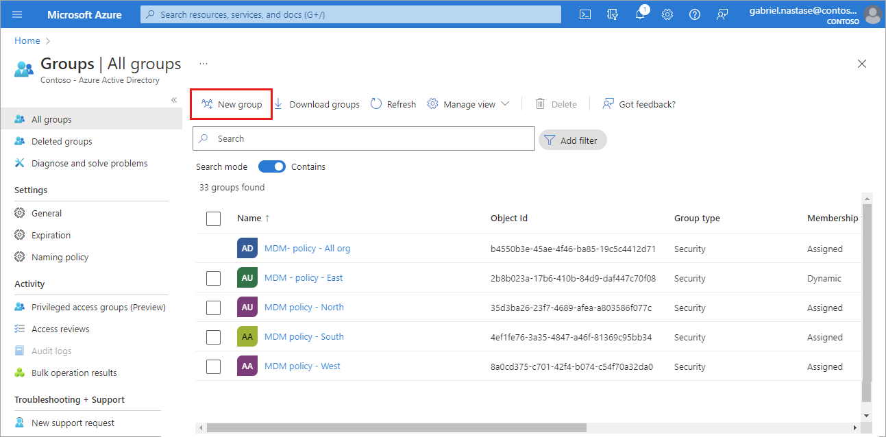

# Manage Azure Active Directory groups and group membership

Azure Active Directory (Azure AD) groups are used to manage users that all need the same access and permissions to resources, such as potentially restricted apps and services. Instead of adding special permissions to individual users, you create a group that applies the special permissions to every member of that group. 

This article covers basic group scenarios where a single group is added to a single resource and users are added as members to that group. For more complex scenarios like dynamic memberships and rule creation, see the [Azure Active Directory user management documentation](../enterprise-users/index.yml).

Before adding groups and members, review the [group and membership types article](../fundamentals/) to help you decide which options to use when you create a group.

## Create a basic group and add members
You can create a basic group and add your members at the same time using the Azure Active Directory (Azure AD) portal. To create a basic group and add members:

1. Sign in to the [Azure portal](https://portal.azure.com) using a Global administrator account for the directory.

1. Go to **Azure Active Directory** > **Groups** > **New group**.

    

1. Select a **Group type**. For more information on group types, see [Group and membership types](#group-types).

    - Selecting the **Microsoft 365** Group type enables the **Group email address** option.

1. Enter a **Group name.** Choose a name that you'll remember and that makes sense for the group. A check will be performed to determine if the name is already in use. If the name is already in use, you'll be asked to change the name of your group.

1. **Group description.** Add an optional description to your group.

1. Switch the **Azure AD roles can be assigned to the group** setting to yes to use this group to assign Azure AD roles to members.
    - Enabling this option automatically selects "Assigned" as the **Membership type.**
    - The option to add roles while creating the group is added to the process.

1. Select a **Membership type.** For more information on membership types, see [Group and membership types](#membership-types).

1. Optionally add **Owners** or **Members**. Members and owners can be added after creating your group.
    1. Select the link under each heading to populate a list of every user in your directory.
    1. Choose users from the list and then select the **Select** button at the bottom of the window.

    

1. Select **Create**. Your group is created and ready for you to manage other settings.

      

## Manage a group
Members and owners can be added and removed to existing Azure AD groups. The process is the same for members and owners.

Need to add multiple members at one time? Learn about the [add members in bulk](../enterprise-users/groups-bulk-import-members.md) option.

### To add members or owners of a group:

1. Sign in to the [Azure portal](https://portal.azure.com) using a Global administrator account for the directory.

1. Go to **Azure Active Directory** > **Groups**.

1. Select the group you need to manage.

1. Select either **Members** or **Owners**.

1. Select **+ Add** (members or owners).

1. Scroll through the list or enter a name in the search box. You can choose multiple names at one time. When you're ready, select the **Select** button.

    The **Group Overview** page updates to show the number of members who are now added to the group.

    

### To remove members or owners of a group:

1. Go to **Azure Active Directory** > **Groups**.

1. Select the group you need to manage.

1. Select either **Members** or **Owners**.

1. Choose a name from the list and select the **Remove** button.

### Turn off group welcome email

When any new Microsoft 365 group is created, whether with dynamic or static membership, a welcome notification is sent to all users who are added to the group. When any attributes of a user or device change, all dynamic group rules in the organization are processed for potential membership changes. Users who are added then also receive the welcome notification. You can turn this behavior off in [Exchange PowerShell](/powershell/module/exchange/users-and-groups/Set-UnifiedGroup).

### Edit group settings
Using Azure AD, you can edit a group's name, description, or membership type. 

To edit your group settings:

1. Sign in to the [Azure portal](https://portal.azure.com) using a Global administrator account for the directory.

1. Go to **Azure Active Directory** > **Groups**. The **Groups - All groups** page appears, showing all of your active groups.

1. Scroll through the list or enter a group name in the search box. Select the group you need to manage.

    

4. Select **Properties** from the *side menu.

    

5. Update the **General settings** information as needed, including:

    

    - **Group name.** Edit the existing group name.
    
    - **Group description.** Edit the existing group description.

    - **Group type.** You can't change the type of group after it's been created. To change the **Group type**, you must delete the group and create a new one.
    
    - **Membership type.** Change the membership type. If you enabled the **Azure AD roles can be assigned to the group** option, you cannot change the membership type. For more info about the various available membership types, see [How to: Create a basic group and add members using the Azure Active Directory portal](active-directory-groups-create-azure-portal.md). 
    
    - **Object ID.** You can't change the Object ID, but you can copy it to use in your PowerShell commands for the group. For more info about using PowerShell cmdlets, see [Azure Active Directory cmdlets for configuring group settings](../enterprise-users/groups-settings-v2-cmdlets.md).

## Delete a group
You can delete an Azure AD group for any number of reasons, but typically it'll be because you:

- Chose the incorrect **Group type** option.

- Created a duplicate group by mistake. 

- No longer need the group.

To delete a group:
1. Sign in to the [Azure portal](https://portal.azure.com) using a Global administrator account for the directory.

2. Go to **Azure Active Directory** > **Groups**.

3. Search for and select the group you want to delete.

    

4. Select **Delete**.

    The group is deleted from your Azure Active Directory tenant.

    

## Next steps

- [Learn about groups and assigning access rights to groups](../fundamentals/active-directory-groups-about-NEW.md)

- [Manage groups using PowerShell commands](../enterprise-users/groups-settings-v2-cmdlets.md)

- [Manage dynamic rules for users in a group](../enterprise-users/groups-create-rule.md)

- [Scenarios, limitations, and known issues using groups to manage licensing in Azure Active Directory](../enterprise-users/licensing-group-advanced.md#limitations-and-known-issues)

- [Associate or add an Azure subscription to Azure Active Directory](active-directory-how-subscriptions-associated-directory.md)
