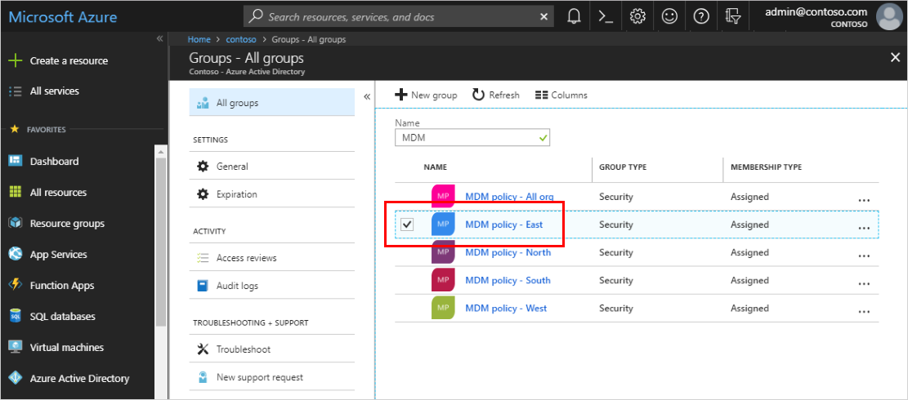
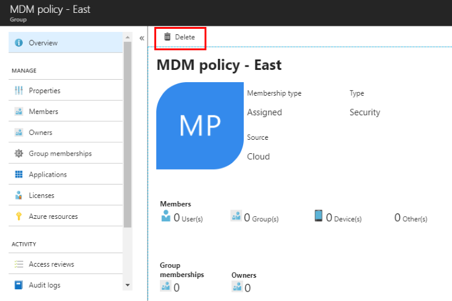

# Delete a group using Azure Active Directory
You can delete an Azure Active Directory (Azure AD) group for any number of reasons, but typically it will be because you:

- Incorrectly set the **Group type** to the wrong option.

- Created the wrong or a duplicate group by mistake. 

- No longer need the group.

## To delete a group
1. Sign in to the [Azure portal](https://portal.azure.com) using a Global administrator account for the directory.

2. Select **Azure Active Directory**, and then select **Groups**.

3. From the **Groups - All groups** page, search for and select the group you want to delete. For these steps, we'll use **MDM policy - East**.

    

4. On the **MDM policy - East Overview** page, and then select **Delete**.

    The group is deleted from your Azure Active Directory tenant.

    

## Next steps

- If you delete a group by mistake, you can create it again. For more information, see [How to create a basic group and add members](active-directory-groups-create-azure-portal.md).

- If you delete an Office 365 group by mistake, you might be able to restore it. For more information, see [Restore a deleted Office 365 group](../users-groups-roles/groups-restore-deleted.md).
