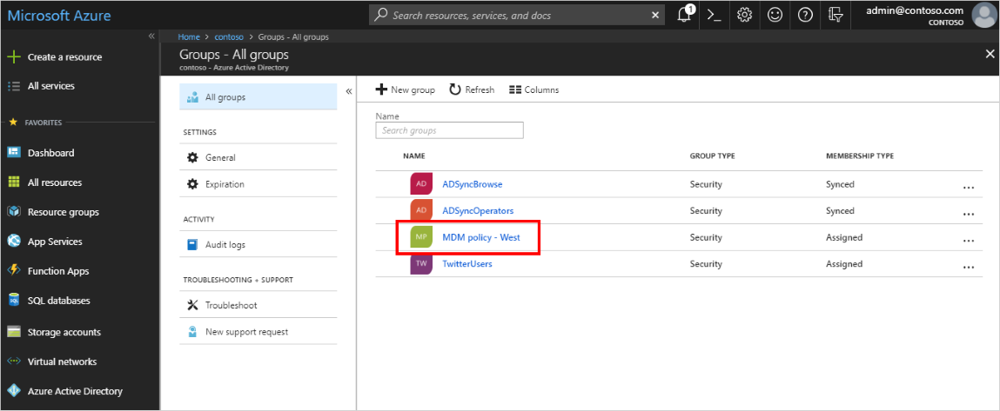
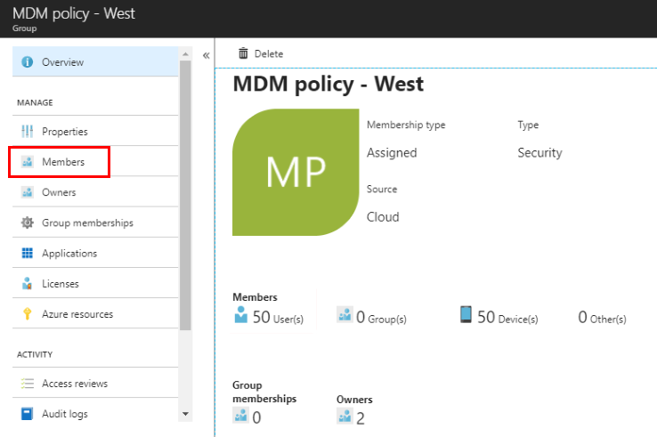
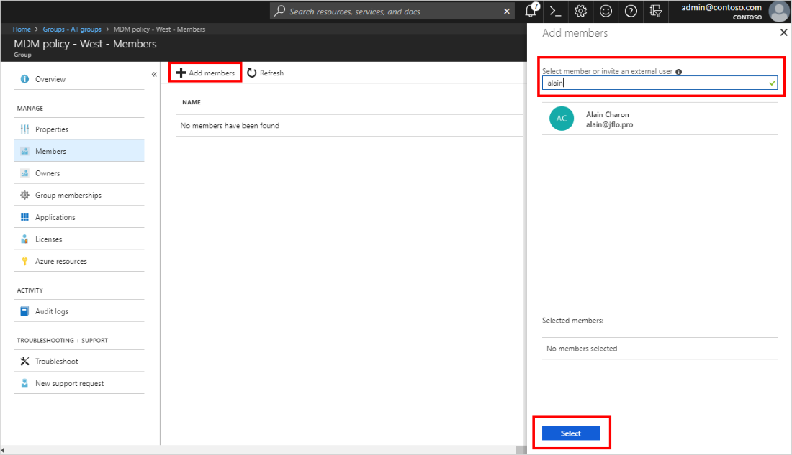
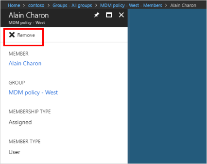

# Add or remove group members using Azure Active Directory
Using Azure Active Directory, you can continue to add and remove group members.

## To add group members

1. Sign in to the [Azure portal](https://portal.azure.com) using a Global administrator account for the directory.

2. Select **Azure Active Directory**, and then select **Groups**.

3. From the **Groups - All groups** page, search for and select the group you want to add the member to. In this case, use our previously created group, **MDM policy - West**.

    

4. From the **MDM policy - West Overview** page, select **Members** from the **Manage** area.

    

5. Select **Add members**, and then search and select each of the members you want to add to the group, and then choose **Select**.

    You'll get a message that says the members were added successfully.

    

6. Refresh the screen to see all of the member names added to the group.

## To remove group members

1. From the **Groups - All groups** page, search for and select the group you want to remove the member from. Again we'll use, **MDM policy - West**.

2. Select **Members** from the **Manage** area, search for and select the name of the member to remove, and then select **Remove**.

    

## Next steps

- [View your groups and members](active-directory-groups-view-azure-portal.md)

- [Edit your group settings](active-directory-groups-settings-azure-portal.md)

- [Manage access to resources using groups](active-directory-manage-groups.md)

- [Manage dynamic rules for users in a group](../users-groups-roles/groups-create-rule.md)

- [Associate or add an Azure subscription to Azure Active Directory](active-directory-how-subscriptions-associated-directory.md)
