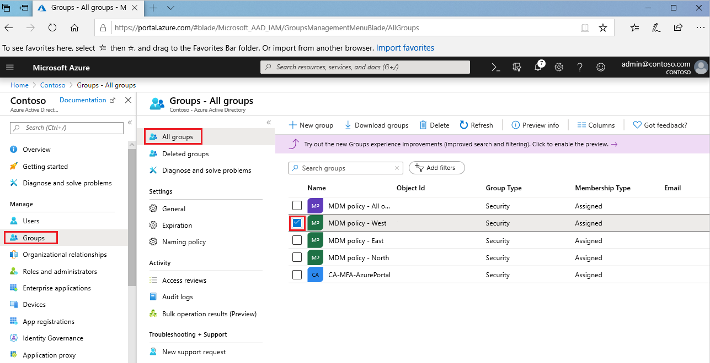
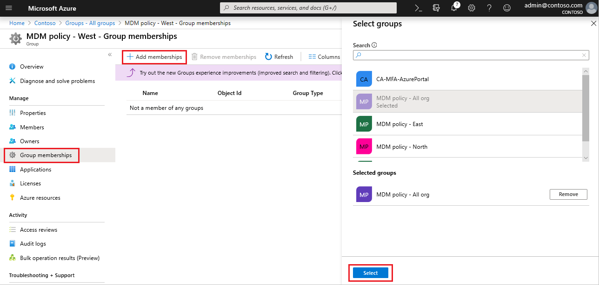
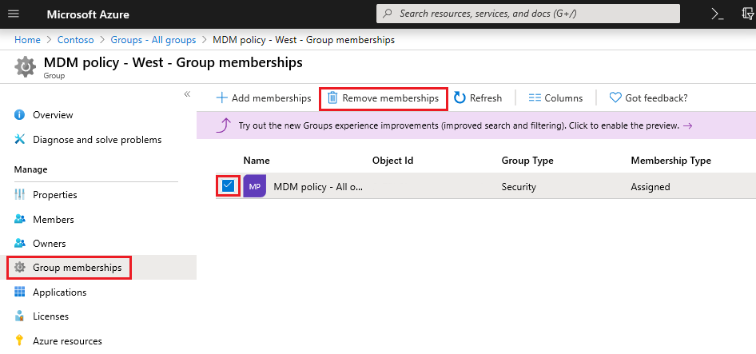

# Add or remove a group from another group using Azure Active Directory
This article helps you to add and remove a group from another group using Azure Active Directory.

>[!Note]
>If you're trying to delete the parent group, see [How to update or delete a group and its members](active-directory-groups-delete-group.md).

## Add a group to another group
You can add an existing Security group to another existing Security group (also known as nested groups), creating a member group (subgroup) and a parent group. The member group inherits the attributes and properties of the parent group, saving you configuration time.

>[!Important]
>We don't currently support:<ul><li>Adding groups to a group synced with on-premises Active Directory.</li><li>Adding Security groups to Office 365 groups.</li><li>Adding Office 365 groups to Security groups or other Office 365 groups.</li><li>Assigning apps to nested groups.</li><li>Applying licenses to nested groups.</li><li>Adding distribution groups in nesting scenarios.</li></ul>

### To add a group as a member of another group

1. Sign in to the [Azure portal](https://portal.azure.com) using a Global administrator account for the directory.

2. Select **Azure Active Directory**, and then select **Groups**.

3. On the **Groups - All groups** page, search for and select the group that's to become a member of another group. For this exercise, we're using the **MDM policy - West** group.

    >[!Note]
    >You can add your group as a member to only one group at a time. Additionally, the **Select Group** box filters the display based on matching your entry to any part of a user or device name. However, wildcard characters aren't supported.

    

4. On the **MDM policy - West - Group memberships** page, select **Group memberships**, select **Add**, locate the group you want your group to be a member of, and then choose **Select**. For this exercise, we're using the **MDM policy - All org** group.

    The **MDM policy - West** group is now a member of the **MDM policy - All org** group, inheriting all the properties and configuration of the MDM policy - All org group.

    

5. Review the **MDM policy - West - Group memberships** page to see the group and member relationship.

6. For a more detailed view of the group and member relationship, select the group name (**MDM policy - All org**) and take a look at the **MDM policy - West** page details.

## Remove a group from another group
You can remove an existing Security group from another Security group. However, removing the group also removes any inherited attributes and properties for its members.

### To remove a member group from another group
1. On the **Groups - All groups** page, search for and select the group that's to be removed as a member of another group. For this exercise, we're again using the **MDM policy - West** group.

2. On the **MDM policy - West overview** page, select **Group memberships**.

3. Select the **MDM policy - All org** group from the **MDM policy - West - Group memberships** page, and then select **Remove** from the **MDM policy - West** page details.

    

## Additional information
These articles provide additional information on Azure Active Directory.

- [View your groups and members](active-directory-groups-view-azure-portal.md)

- [Create a basic group and add members](active-directory-groups-create-azure-portal.md)

- [Add or remove members from a group](active-directory-groups-members-azure-portal.md)

- [Edit your group settings](active-directory-groups-settings-azure-portal.md)

- [Using a group to manage access to SaaS applications](../users-groups-roles/groups-saasapps.md)

- [Scenarios, limitations, and known issues using groups to manage licensing in Azure Active Directory](../users-groups-roles/licensing-group-advanced.md#limitations-and-known-issues)
