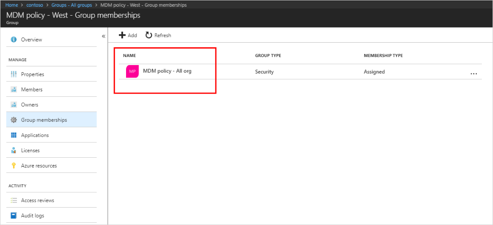
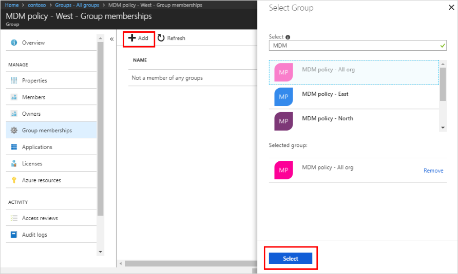
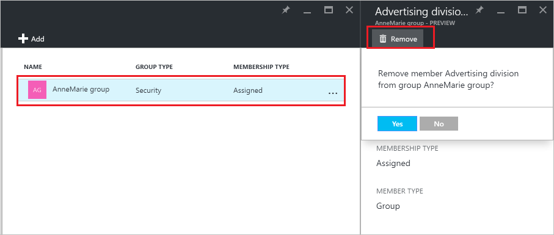

# Manage to which groups a group belongs in your Azure Active Directory tenant
Groups can contain other groups in Azure Active Directory. Here's how to manage those memberships.

## How do I find the groups of which my group is a member?
1. Sign in to the [Azure AD admin center](https://aad.portal.azure.com) with an account that's a global admin for the directory.
2. Select **Users and groups**.

   
1. Select **All groups**.

   
1. Select a group.
2. Select **Group memberships**.

   
1. To add your group as a member of another group, on the **Group - Group memberships** blade, select the **Add** command.
2. Select a group from the **Select Group** blade, and then select the **Select** button at the bottom of the blade. You can add your group to only one group at a time. The **User** box filters the display based on matching your entry to any part of a user or device name. No wildcard characters are accepted in that box.

   
8. To remove your group as a member of another group, on the **Group - Group memberships** blade, select a group.
9. Select the **Remove** command, and confirm your choice at the prompt.

   
10. When you finish changing group memberships for your group, select **Save**.

## Additional information
These articles provide additional information on Azure Active Directory.

* [See existing groups](active-directory-groups-view-azure-portal.md)
* [Create a new group and adding members](active-directory-groups-create-azure-portal.md)
* [Manage settings of a group](active-directory-groups-settings-azure-portal.md)
* [Manage members of a group](active-directory-groups-members-azure-portal.md)
* [Manage dynamic rules for users in a group](../users-groups-roles/groups-dynamic-membership.md)
