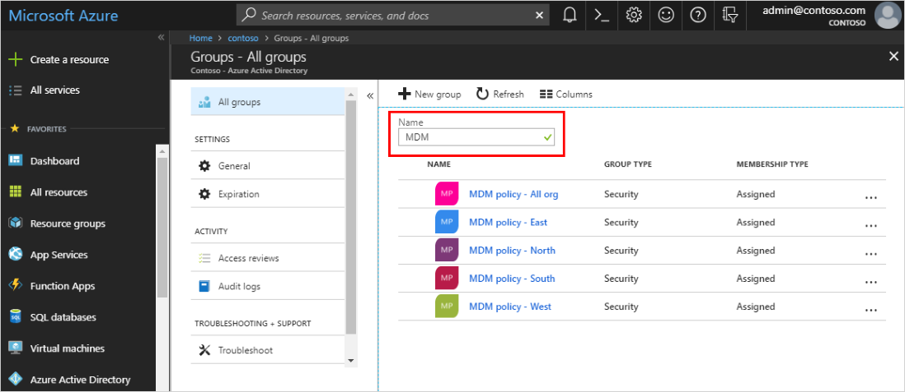
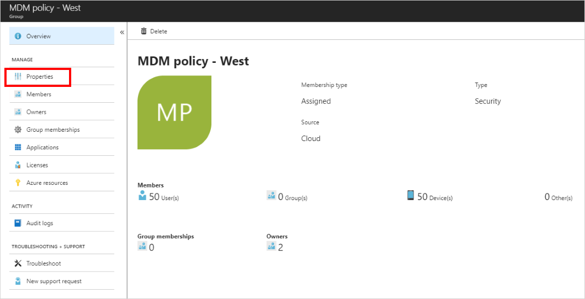
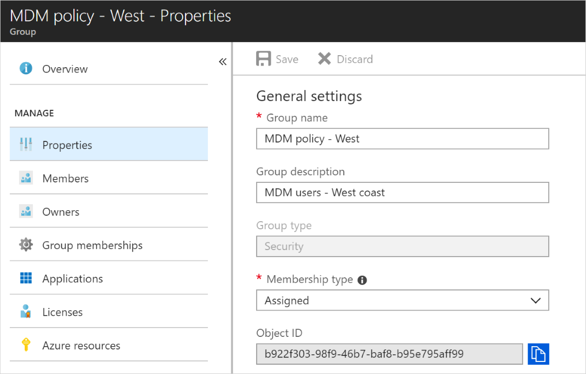

# Edit your group information using Azure Active Directory

Using Azure Active Directory (Azure AD), you can edit a group's settings, including updating its name, description, or membership type.

## To edit your group settings
1. Sign in to the [Azure portal](https://portal.azure.com) using a Global administrator account for the directory.

2. Select **Azure Active Directory**, and then select **Groups**.

    The **Groups - All groups** page appears, showing all of your active groups.

3. From the **Groups - All groups** page, type as much of the group name as you can into the **Search** box. For the purposes of this article, we're searching for the **MDM policy - West** group.

    The search results appear under the **Search** box, updating as you type more characters.

    

4. Select the group **MDM policy - West**, and then select **Properties** from the **Manage** area.

    

5. Update the **General settings** information as needed, including:

    

    - **Group name.** Edit the existing group name.
    
    - **Group description.** Edit the existing group description.

    - **Group type.** You can't change the type of group after it's been created. To change the **Group type**, you must delete the group and create a new one.
    
    - **Membership type.** Change the membership type. For more info about the various available membership types, see [How to: Create a basic group and add members using the Azure Active Directory portal](active-directory-groups-create-azure-portal.md).
    
    - **Object ID.** You can't change the Object ID, but you can copy it to use in your PowerShell commands for the group. For more info about using PowerShell cmdlets, see [Azure Active Directory cmdlets for configuring group settings](../users-groups-roles/groups-settings-v2-cmdlets.md).

## Next steps
These articles provide additional information on Azure Active Directory.

- [View your groups and members](active-directory-groups-view-azure-portal.md)

- [Create a basic group and add members](active-directory-groups-create-azure-portal.md)

- [How to add or remove members from a group](active-directory-groups-members-azure-portal.md)

- [Manage dynamic rules for users in a group](../users-groups-roles/groups-create-rule.md)

- [Manage memberships of a group](active-directory-groups-membership-azure-portal.md)

- [Manage access to resources using groups](active-directory-manage-groups.md)

- [Associate or add an Azure subscription to Azure Active Directory](active-directory-how-subscriptions-associated-directory.md)
