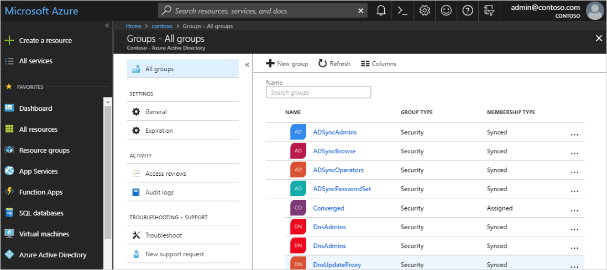
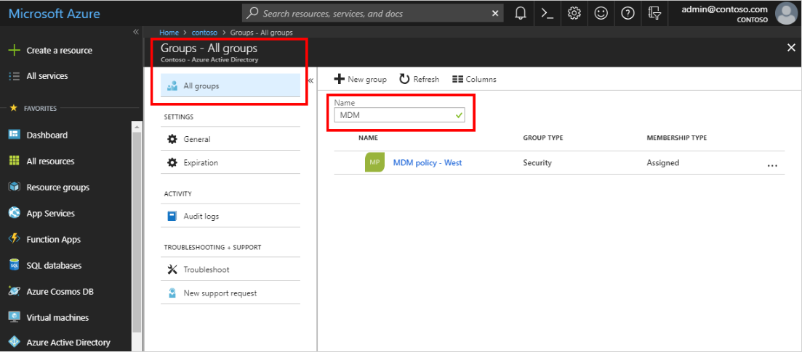
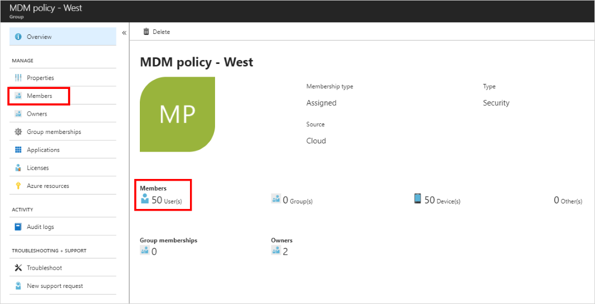
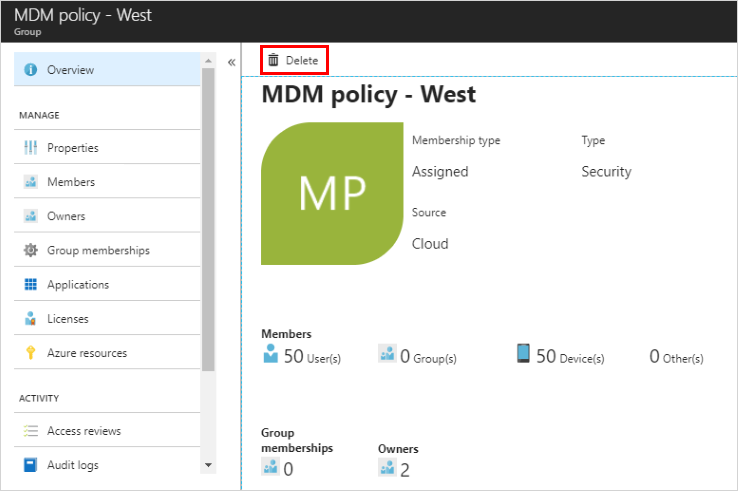

<!--As a brand-new Azure AD administrator, I need to view my organization’s groups along with the assigned members, so I can manage permissions to apps and services for people in my organization-->

# Quickstart: View your organization's groups and members in Azure Active Directory
You can view your organization's existing groups and group members using the Azure portal. Groups are used to manage users (members) that all need the same access and permissions for potentially restricted apps and services.

In this quickstart, you’ll view all of your organization's existing groups and view the assigned members.

If you don’t have an Azure subscription, create a [free account](https://azure.microsoft.com/free/) before you begin. 

## Prerequisites
Before you begin, you’ll need to:

- Create an Azure Active Directory tenant. For more information, see [Access the Azure Active Directory portal and create a new tenant](active-directory-access-create-new-tenant.md).

## Sign in to the Azure portal
You must sign in to the [Azure portal](https://portal.azure.com/) using a Global administrator account for the directory.

## Create a new group 
Create a new group, named _MDM policy - West_. For more information about creating a group, see [How to create a basic group and add members](active-directory-groups-create-azure-portal.md).

1. Select **Azure Active Directory**, **Groups**, and then select **New group**.

2. Complete the **Group** page:
    
    - **Group type:** Select **Security**
    
    - **Group name:** Type _MDM policy - West_
    
    - **Membership type:** Select **Assigned**.

3. Select **Create**.

## Create a new user
Create a new user, named _Alain Charon_. A user must exist before being added as a group member. Check the "Custom domain names" tab first to get the verified domain name in which to create users. For more information about creating a user, see [How to add or delete users](add-users-azure-active-directory.md).

1. Select **Azure Active Directory**, **Users**, and then select **New user**.

2. Complete the **User** page:

    - **Name:** Type _Alain Charon_.

    - **User name:** Type *alain\@contoso.com*.

3. Copy the auto-generated password provided in the **Password** box, and then select **Create**.

## Add a group member
Now that you have a group and a user, you can add _Alain Charon_ as a member to the _MDM policy - West_ group. For more information about adding group members, see [How to add or remove group members](active-directory-groups-members-azure-portal.md).

1. Select **Azure Active Directory** > **Groups**.

2. From the **Groups - All groups** page, search for and select the **MDM policy - West** group.

3. From the **MDM policy - West Overview** page, select **Members** from the **Manage** area.

4. Select **Add members**, and then search and select **Alain Charon**.

5. Choose **Select**.

## View all groups
You can see all the groups for your organization in the **Groups - All groups** page of the Azure portal.

- Select Azure **Active Directory** > **Groups**.

    The **Groups - All groups** page appears, showing all your active groups.

    

## Search for the group
Search the **Groups – All groups** page to find the **MDM policy – West** group.

1. From the **Groups - All groups** page, type _MDM_ into the **Search** box.

    The search results appear under the **Search** box, including the _MDM policy - West_ group.

    

3. Select the group **MDM policy – West**.

4. View the group info on the **MDM policy - West Overview** page, including the number of members of that group.

    

## View group members
Now that you’ve found the group, you can view all the assigned members.

- Select **Members** from the **Manage** area, and then review the complete list of member names assigned to that specific group, including _Alain Charon_.

    

## Clean up resources
This group is used in several of the how-to processes that are available in the **How-to guides** section of this documentation. However, if you'd rather not use this group, you can delete it and its assigned members using the following steps:

1. On the **Groups - All groups** page, search for the **MDM policy - West** group.

2.	Select the **MDM policy - West** group.

    The **MDM policy - West Overview** page appears.

3. Select **Delete**.

    The group and its associated members are deleted.

    

    >[!Important]
    >This doesn't delete the user Alain Charon, just his membership in the deleted group.

## Next steps
Advance to the next article to learn how to associate a subscription to your Azure AD directory.

> [!div class="nextstepaction"]
> [Associate an Azure subscription](active-directory-how-subscriptions-associated-directory.md)
