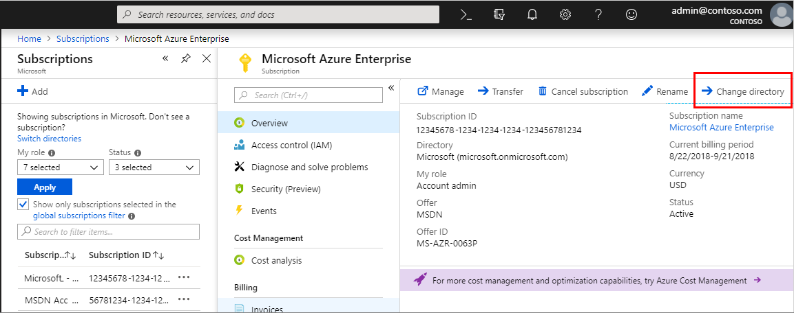
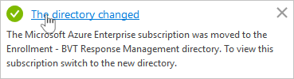
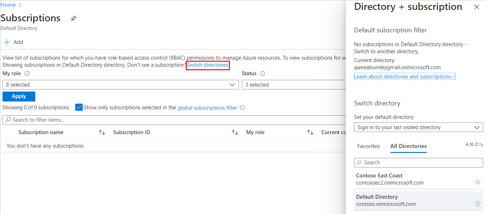

# Associate or add an Azure subscription to your Azure Active Directory tenant

An Azure subscription has a trust relationship with Azure Active Directory (Azure AD), which means that the subscription trusts Azure AD to authenticate users, services, and devices. Multiple subscriptions can trust the same Azure AD directory, but each subscription can only trust a single directory.

If your subscription expires, you lose access to all the other resources associated with the subscription. However, the Azure AD directory remains in Azure, letting you associate and manage the directory using a different Azure subscription.

All of your users have a single *home* directory for authentication. However, your users can also be guests in other directories. You can see both the home and guest directories for each user in Azure AD.

> [!Important]
> When you associate a subscription to a different directory, users that have roles assigned using [role-based access control (RBAC)](../../role-based-access-control/role-assignments-portal.md) will lose their access. Classic subscription administrators (Service Administrator and Co-Administrators) will also lose access.
> 
> Additionally, moving your Azure Kubernetes Service (AKS) cluster to a different subscription, or moving the cluster-owning subscription to a new tenant, causes the cluster to lose functionality due to lost role assignments and service principals rights. For more information about AKS, see [Azure Kubernetes Service (AKS)](https://docs.microsoft.com/azure/aks/).

## Before you begin

Before you can associate or add your subscription, you must perform the following tasks:

1. Review the following list of changes and how you might be affected:

    - Users that have been assigned roles using RBAC will lose their access
    - Service Administrator and Co-Administrators will lose access
    - If you have any key vaults, they'll be inaccessible and you'll have to fix them after association
    - If you have any managed identities for resources such as Virtual Machines or Logic Apps, you'll have to re-enable or recreate them after the association
    - If you have a registered Azure Stack, you'll have to re-register it after association

1. Sign in using an account that:
    - Has an [Owner](../../role-based-access-control/built-in-roles.md#owner) role assignment for the subscription. For information about how to assign the Owner role, see [Manage access to Azure resources using RBAC and the Azure portal](../../role-based-access-control/role-assignments-portal.md).
    - Exists in both the current directory that's associated with the subscription and in the new directory that's where you want to associate the subscription going forward. For more information about getting access to another directory, see [How do Azure Active Directory admins add B2B collaboration users?](../b2b/add-users-administrator.md).

1. Make sure you're not using an Azure Cloud Service Providers (CSP) subscription (MS-AZR-0145P, MS-AZR-0146P, MS-AZR-159P), a Microsoft Internal subscription (MS-AZR-0015P), or a Microsoft Imagine subscription (MS-AZR-0144P).
    
## To associate an existing subscription to your Azure AD directory

1. Sign in and select the subscription you want to use from the [Subscriptions page in Azure portal](https://portal.azure.com/#blade/Microsoft_Azure_Billing/SubscriptionsBlade).

2. Select **Change directory**.

    

3. Review any warnings that appear, and then select **Change**.

    

    The directory is changed for the subscription and you get a success message.

    
4. Use the **Directory switcher** to go to your new directory. It can take several hours for everything to show up properly. If it seems to be taking too long, make sure you check the **Global subscription filter** for the moved subscription, to make sure it's not simply hidden.

    

Changing the subscription directory is a service-level operation, so it doesn't affect subscription billing ownership. The Account Admin can still change the Service Admin from the [Account Center](https://account.azure.com/subscriptions). To delete the original directory, you must transfer the subscription billing ownership to a new Account Admin. To learn more about transferring billing ownership, see [Transfer ownership of an Azure subscription to another account](../../billing/billing-subscription-transfer.md).

## Post association steps
After you associate a subscription to a different directory, there might be additional steps that you must perform to resume operations.

1. If you have any key vaults, you must change the key vault tenant ID. For more information, see [Change a key vault tenant ID after a subscription move](../../key-vault/key-vault-subscription-move-fix.md).

2. If you were using system-assigned Managed Identities for resources, you must re-enable these. If you were using user-assigned Managed Identities, you must re-create these. After re-enabling or recreating the Managed Identities, you must re-establish the permissions assigned to those identities. For more information see [What is managed identities for Azure resources?](../managed-identities-azure-resources/overview.md).

3. If you have registered an Azure Stack using this subscription, you must re-register. For more information, see [Register Azure Stack with Azure](/azure-stack/operator/azure-stack-registration).

## Next steps

- To create a new Azure AD tenant, see [Access Azure Active Directory to create a new tenant](active-directory-access-create-new-tenant.md)

- To learn more about how resource access is controlled in Microsoft Azure, see [Understanding resource access in Azure](../../role-based-access-control/rbac-and-directory-admin-roles.md)

- To learn more about how to assign roles in Azure AD, see [How to assign directory roles to users with Azure Active Directory](active-directory-users-assign-role-azure-portal.md)
