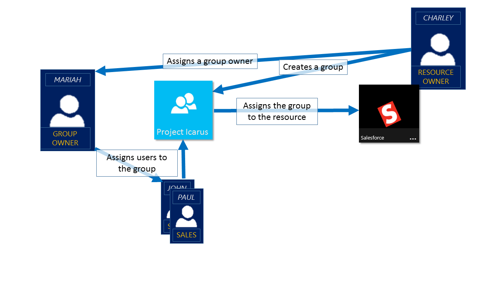
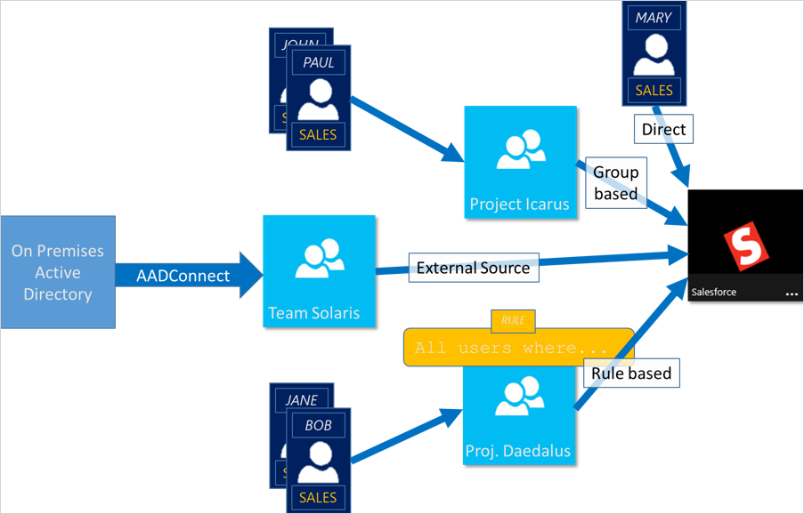

# Learn about access management using Azure Active Directory groups
Azure Active Directory (Azure AD) helps you to manage your cloud-based apps, on-premises apps, and your resources using your organization's groups. Your resources can be part of the directory, such as permissions to manage objects through roles in the directory, or external to the directory, such as for Software as a Service (SaaS) apps, Azure services, SharePoint sites, and on-premises resources.

>[!NOTE]
>To use Azure Active Directory, you need an Azure account. If you don't have an account, you can [sign up for a free Azure account](https://azure.microsoft.com/free/).

## How does access management in Azure AD work?
Azure AD helps you give access to your organization's resources by providing access rights to a single user or to an entire Azure AD group. Using groups lets the resource owner (or Azure AD directory owner), assign a set of access permissions to all the members of the group, instead of having to provide the rights one-by-one. The resource or directory owner can also give management rights for the member list to someone else, such as a department manager or a Helpdesk administrator, letting that person add and remove members, as needed. For more information about how to manage group owners, see [Manage group owners](active-directory-accessmanagement-managing-group-owners.md)

## Ways to assign access rights
There are four ways to assign resource access rights to your users:

- **Direct assignment.** The resource owner directly assigns the user to the resource.

- **Group assignment.** The resource owner assigns an Azure AD group to the resource, which automatically gives all of the group members access to the resource. Group membership is managed by both the group owner and the resource owner, letting either owner add or remove members from the group. For more information about adding or removing group membership, see [How to: Add or remove a group from another group using the Azure Active Directory portal](active-directory-groups-membership-azure-portal.md). 

- **Rule-based assignment.** The resource owner creates a group and uses a rule to define which users are assigned to a specific resource. The rule is based on attributes that are assigned to individual users. The resource owner manages the rule, determining which attributes and values are required to allow access the resource. For more information, see [Create a dynamic group and check status](../users-groups-roles/groups-create-rule.md).

    You can also Watch this short video for a quick explanation about creating and using dynamic groups:

    >[!VIDEO https://channel9.msdn.com/Series/Azure-Active-Directory-Videos-Demos/Azure-AD--Introduction-to-Dynamic-Memberships-for-Groups/player]

- **External authority assignment.** Access comes from an external source, such as an on-premises directory or a SaaS app. In this situation, the resource owner assigns a group to provide access to the resource and then the external source manages the group members.

   

## Can users join groups without being assigned?
The group owner can let users find their own groups to join, instead of assigning them. The owner can also set up the group to automatically accept all users that join or to require approval.

After a user requests to join a group, the request is forwarded to the group owner. If it's required, the owner can approve the request and the user is notified of the group membership. However, if you have multiple owners and one of them disapproves, the user is notified, but isn't added to the group. For more information and instructions about how to let your users request to join groups, see [Set up Azure AD so users can request to join groups](../users-groups-roles/groups-self-service-management.md)

## Next steps
Now that you have a bit of an introduction to access management using groups, you start to manage your resources and apps.

- [Create a new group using Azure Active Directory](active-directory-groups-create-azure-portal.md) or [Create and manage a new group using PowerShell cmdlets](../users-groups-roles/groups-settings-v2-cmdlets.md)

- [Use groups to assign access to an integrated SaaS app](../users-groups-roles/groups-saasapps.md)

- [Sync an on-premises group to Azure using Azure AD Connect](../hybrid/whatis-hybrid-identity.md)