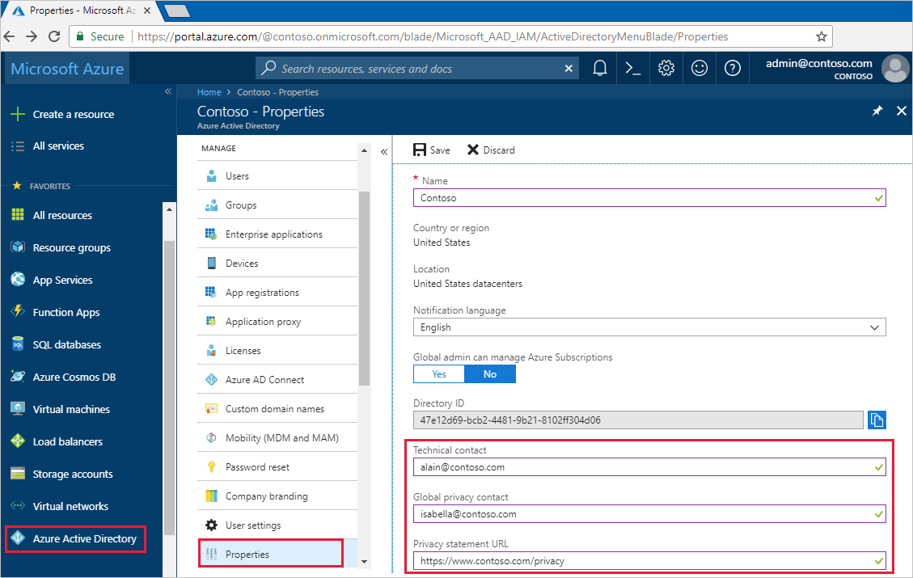

# How-to: Add your privacy info using Azure Active Directory
This article explains how a tenant admin can add privacy-related info to an organization’s Azure Active Directory (Azure AD) tenant, through the Azure portal.

We strongly recommend you add both your global privacy contact and your organization’s privacy statement, so your internal employees and external guests can review your policies. Because privacy statements are uniquely created and tailored for each business, we strongly recommend you contact a lawyer for assistance.

[!INCLUDE [GDPR-related guidance](../../../includes/gdpr-dsr-and-stp-note.md)]

## Add your privacy info on Azure AD
You add your organization's privacy information in the **Properties** area of Azure AD.

### To access the Properties area and add your privacy information

1.	Sign in to the Azure portal as a tenant administrator.

2.	On the left navbar, select **Azure Active Directory**, and then select **Properties**.

    The **Properties** area appears.

    

3.	Add your privacy info for your employees:

    - **Technical contact.** Type the email address for the person to contact for technical support within your organization.
	
    - **Global privacy contact.** Type the email address for the person to contact for inquiries about personal data privacy. This person is also who Microsoft contacts if there's a data breach. If there's no person listed here, Microsoft contacts your global administrators.

    - **Privacy statement URL.** Type the link to your organization’s document that describes how your organization handles both internal and external guest's data privacy.

        >[!Important]
        >If you don’t include either your own privacy statement or your privacy contact, your external guests will see text in the **Review Permissions** box that says, **<_your org name_> has not provided links to their terms for you to review**. For example, a guest user will see this message when they receive an invitation to access an organization through B2B collaboration.

        

4.	Select **Save**.

## Next steps
- [Azure Active Directory B2B collaboration invitation redemption](https://aka.ms/b2bredemption)
- [Add or change profile information for a user in Azure Active Directory](active-directory-users-profile-azure-portal.md)