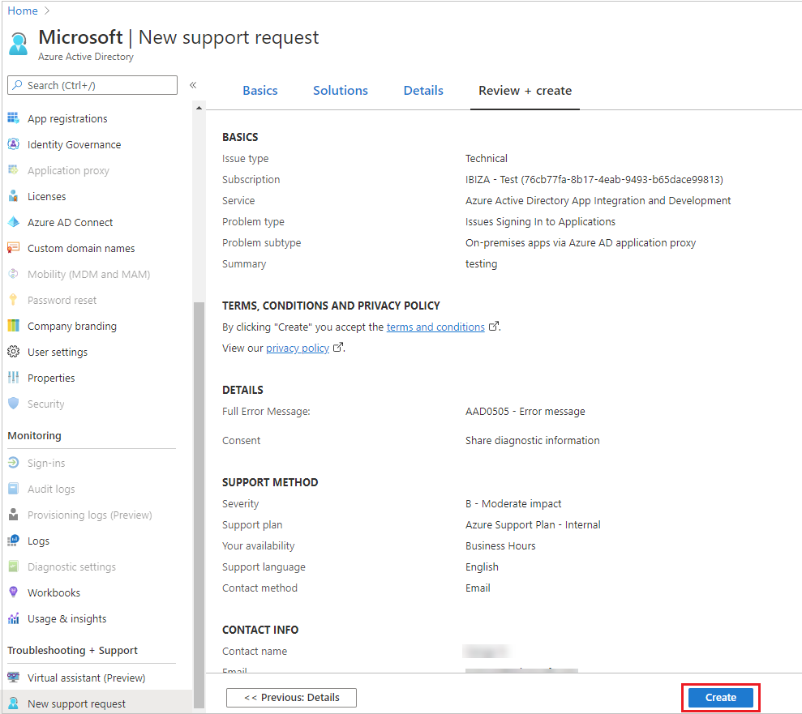

# Find help and open a support ticket for Azure Active Directory
Microsoft provides global technical, pre-sales, billing, and subscription support for Azure Active Directory (Azure AD). Support is available both online and by phone for Microsoft Azure paid and trial subscriptions. Phone support and online billing support are available in additional languages. 

## Find help without opening a support ticket

Before creating a support ticket, check out the following resources for answers and information. 

* For content such as how-to information or code samples for IT professionals and developers, see the [technical documentation at docs.microsoft.com](https://docs.microsoft.com/azure/active-directory/).

* The [Microsoft Technical Community](https://techcommunity.microsoft.com/) is the place for our IT pro partners and customers to collaborate, share, and learn. The [Microsoft Technical Community Info Center](https://techcommunity.microsoft.com/t5/Community-Info-Center/ct-p/Community-Info-Center) is used for announcements, blog posts, ask-me-anything (AMA) interactions with experts, and more. You can also [join the community to submit your ideas](https://techcommunity.microsoft.com/t5/Communities/ct-p/communities).

## Open a support ticket

If you are unable to find answers by using self-help resources, you can open an online support ticket. You should open each support ticket for only a single problem, so that we can connect you to the support engineers who are subject matter experts for your problem. Also, Azure Active Directory engineering teams prioritize their work based on incidents that are generated, so you're often contributing to service improvements.

### How to open a support ticket for Azure AD in the Azure portal

> [!NOTE]
> For billing or subscription issues, you must use the [Microsoft 365 admin center](https://admin.microsoft.com).
> 

1. Sign in to [the Azure portal](https://portal.azure.com) and open **Azure Active Directory**.
   
1. Scroll down to **Troubleshooting + Support** and select **New support request**.
   
1. On the **Basics** blade, for **Issue type**, select **Technical**.

1. Select your **Subscription**.

1. For **Service**, select **Azure Active Directory**.

1. Create a **Summary** for the request. The summary must be under 140 characters.
  
1. Select a **Problem type**, and then select a category for that type. At this point, you are also offered self-help information for your problem category.
  
1. Add the rest of your problem information and click **Next**. 

1. At this point, you are offered self-help solutions and documentation in the **Solutions** blade. If none of the solutions there resolve your problem, click **Next**. 

1. On the **Details** blade, fill out the required details and select a [Severity](https://azure.microsoft.com/support/plans/response/). 
 
    
 
1. Provide your contact information and select **Next**. 

1. Provide your contact information and select **Create**.
  

### How to open a support ticket for Azure AD in the Microsoft 365 admin center

> [!NOTE]
> Support for Azure AD in the [Microsoft 365 admin center](https://admin.microsoft.com) is offered for administrators only. 

1. Sign in to the [Microsoft 365 admin center](https://admin.microsoft.com) with an account that has an Enterprise Mobility + Security (EMS) license.

1. On the **Support** tile, select **New service request**:

1. On the **Support Overview** page, select **Identity management** or **User and domain management**:

1. For **Feature**, select the Azure AD feature for which you want support.

1. For **Symptom**, select an appropriate symptom, summarize your issue and provide relevant details, and then select **Next**.

1. Select one of the offered self-help resources, or select **Yes, continue** or **No, cancel request**.

1. If you continue, you are asked for more details. You can attach any files you have that represent the problem, and then select **Next**.

1. Provide your contact information and select **Submit request**.

## Get phone support

See the [Contact Microsoft for support](https://portal.office.com/Support/ContactUs.aspx) page to obtain support phone numbers.

##  Next steps

* [Microsoft Tech Community](https://techcommunity.microsoft.com/)

* [Technical documentation at docs.microsoft.com](https://docs.microsoft.com/azure/active-directory/)
