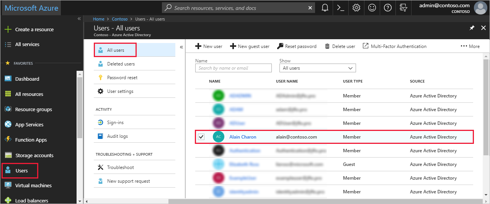
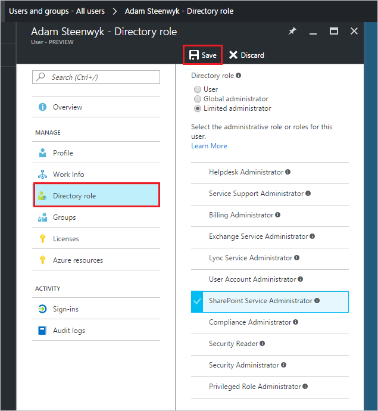

# Assign a user to administrator roles in Azure Active Directory
This article explains how to assign an administrative role to a user in Azure Active Directory (Azure AD). For information about adding new users in your organization, see [Add new users to Azure Active Directory](../add-users-azure-active-directory.md). Added users don't have administrator permissions by default, but you can assign roles to them at any time.

## Assign a role to a user
1. Sign in to the [Azure AD admin center](https://aad.portal.azure.com) with an account that's a global admin for the directory.

2. Select **Users**, and then select a specific user from the list.

    

3. For the selected user, select **Directory role**, seclet **Add role**, and then pick the appropriate admin roles from the **Directory roles** list. For more information about administrative roles, see [Assigning administrator roles in Azure AD](../active-directory-assign-admin-roles-azure-portal.md). 

    

1. Press **Select** to save.

## Next steps
* [Quickstart: Add or delete users in Azure Active Directory](add-users-azure-active-directory.md)
* [Manage user profiles](active-directory-users-profile-azure-portal.md)
* [Add guest users from another directory](../b2b/what-is-b2b.md) 
* [Assign a user to a role in your Azure AD](active-directory-users-assign-role-azure-portal.md)
* [Restore a deleted user](active-directory-users-restore.md)
