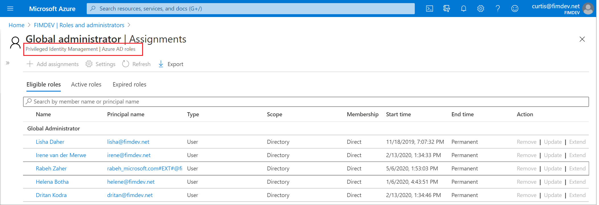

# Assign administrator and non-administrator roles to users with Azure Active Directory

In Azure Active Directory (Azure AD), if one of your users needs permission to manage Azure AD resources, you must assign them to a role that provides the permissions they need. For info on which roles manage Azure resources and which roles manage Azure AD resources, see [Classic subscription administrator roles, Azure roles, and Azure AD roles](../../role-based-access-control/rbac-and-directory-admin-roles.md).

For more information about the available Azure AD roles, see [Assigning administrator roles in Azure Active Directory](../roles/permissions-reference.md). To add users, see [Add new users to Azure Active Directory](add-users-azure-active-directory.md).

## Assign roles

A common way to assign Azure AD roles to a user is on the **Assigned roles** page for a user. You can also configure the user eligibility to be elevated just-in-time into a role using Privileged Identity Management (PIM). For more information about how to use PIM, see [Privileged Identity Management](../privileged-identity-management/index.yml).

> [!Note]
> If you have an Azure AD Premium P2 license plan and already use PIM, all role management tasks are performed in the [Privileged Identity Management experience](../roles/manage-roles-portal.md). This feature is currently limited to assigning only one role at a time. You can't currently select multiple roles and assign them to a user all at once.
>
> 

## Assign a role to a user

1. Go to the [Azure portal](https://portal.azure.com/) and sign in using a Global administrator account for the directory.

2. Search for and select **Azure Active Directory**.

      

3. Select **Users**.

4. Search for and select the user getting the role assignment. For example, _Alain Charon_.

      

5. On the **Alain Charon - Profile** page, select **Assigned roles**.

    The **Alain Charon - Administrative roles** page appears.

6. Select **Add assignments**, select the role to assign to Alain (for example, _Application administrator_), and then choose **Select**.

    

    The Application administrator role is assigned to Alain Charon and it appears on the **Alain Charon - Administrative roles** page.

## Remove a role assignment

If you need to remove the role assignment from a user, you can also do that from the **Alain Charon - Administrative roles** page.

### To remove a role assignment from a user

1. Select **Azure Active Directory**, select **Users**, and then search for and select the user getting the role assignment removed. For example, _Alain Charon_.

2. Select **Assigned roles**, select **Application administrator**, and then select **Remove assignment**.

    

    The Application administrator role is removed from Alain Charon and it no longer appears on the **Alain Charon - Administrative roles** page.

## Next steps

- [Add or delete users](add-users-azure-active-directory.md)

- [Add or change profile information](active-directory-users-profile-azure-portal.md)

- [Add guest users from another directory](../external-identities/what-is-b2b.md)

Other user management tasks you can check out
are available in [Azure Active Directory user management documentation](../enterprise-users/index.yml).
