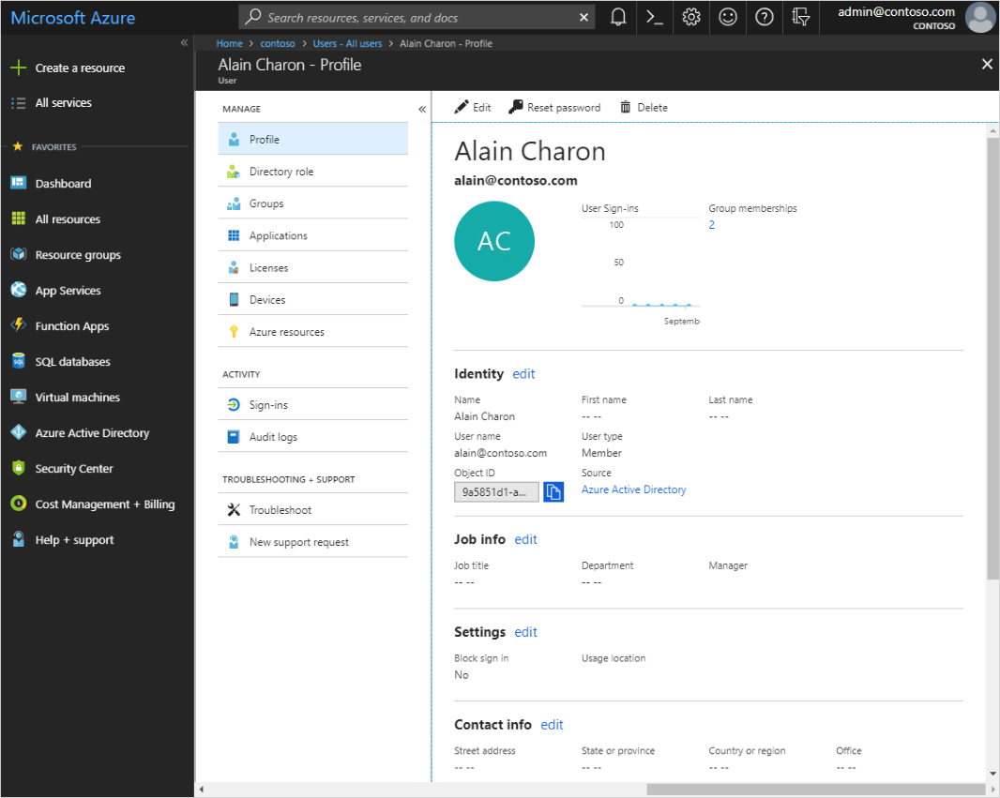
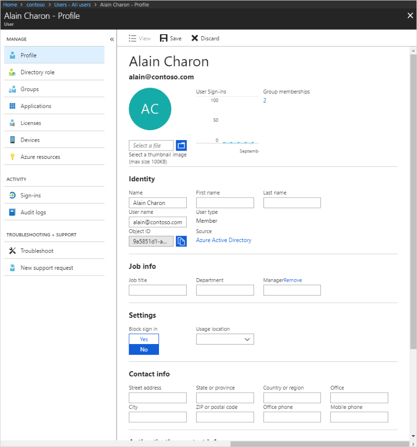

# Add or update a user's profile information using Azure Active Directory
Add user profile information, including a profile picture, job-specific information, and some settings using Azure Active Directory (Azure AD). For more information about adding new users, see [How to add or delete users in Azure Active Directory](add-users-azure-active-directory.md).

## Add or change profile information
As you'll see, there's more information available in a user's profile than what you're able to add during the user's creation. All this additional information is optional and can be added as needed by your organization.

## To add or change profile information
1. Sign in to the [Azure portal](https://portal.azure.com/) as a User administrator for the organization.

2. Select **Azure Active Directory**, select **Users**, and then select a user. For example, _Alain Charon_.

    The **Alain Charon - Profile** page appears.

    

3. Select **Edit** to optionally add or update the information included in each of the available sections.

    

    - **Profile picture.** Select a thumbnail image for the user's account. This picture appears in Azure Active Directory and on the user's personal pages, such as the myapps.microsoft.com page.

    - **Identity.** Add or update an additional identity value for the user, such as a married last name. You can set this name independently from the values of First name and Last name. For example, you could use it to include initials, a company name, or to change the sequence of names shown. In another example, for two users whose names are ‘Chris Green’ you could use the Identity string to set their names to 'Chris B. Green' 'Chris R. Green (Contoso).'

    - **Job info.** Add any job-related information, such as the user's job title, department, or manager.

    - **Settings.** Decide whether the user can sign in to Azure Active Directory tenant. You can also specify the user's global location.

    - **Contact info.** Add any relevant contact information for the user, except for some user's phone or mobile contact info (only a global administrator can update for users in administrator roles).

    - **Authentication contact info.** Verify this information to make sure there's an active phone number and email address for the user. This information is used by Azure Active Directory to make sure the user is really the user during sign-in. Authentication contact info can be updated only by a global administrator.

4. Select **Save**.

    All your changes are saved for the user.

    >[!Note]
    >You must use Windows Server Active Directory to update the identity, contact info, or job info for users whose source of authority is Windows Server Active Directory. After you complete your update, you must wait for the next synchronization cycle to complete before you'll see the changes.

## Next steps
After you've updated your users' profiles, you can perform the following basic processes:

- [Add or delete users](add-users-azure-active-directory.md)

- [Assign roles to users](active-directory-users-assign-role-azure-portal.md)

- [Create a basic group and add members](active-directory-groups-create-azure-portal.md)

Or you can perform other user management tasks, such as assigning delegates, using policies, and sharing user accounts. For more information about other available actions, see [Azure Active Directory user management documentation](../users-groups-roles/index.yml).
