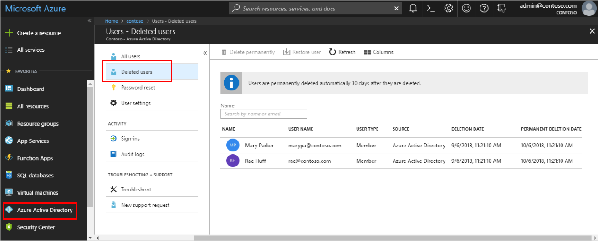
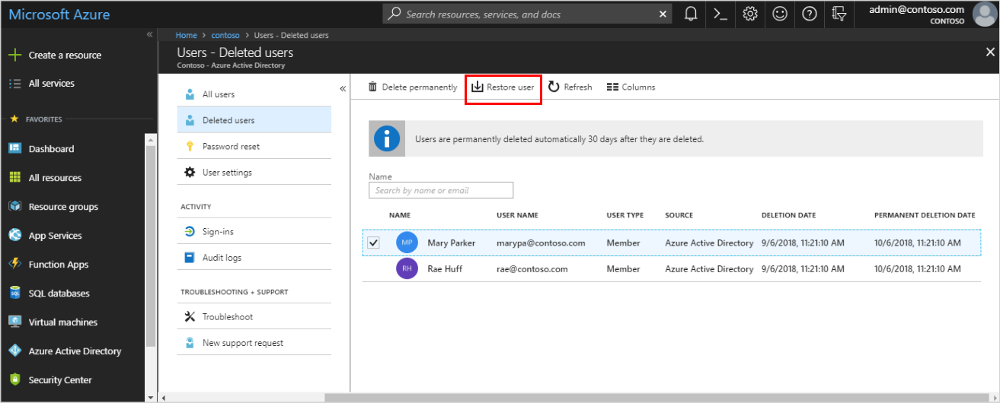
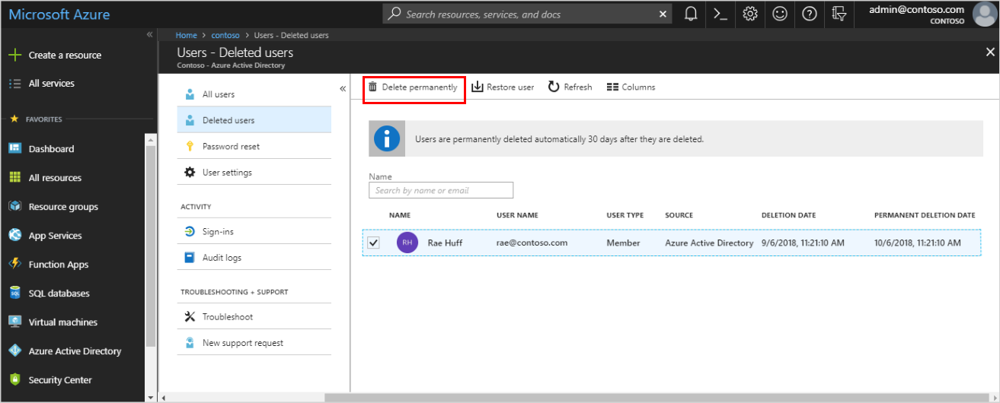

# Restore or remove a recently deleted user using Azure Active Directory
After you delete a user, the account remains in a suspended state for 30 days. During that 30-day window, the user account can be restored, along with all its properties. After that 30-day window passes, the user is automatically, and permanently, deleted.

You can view your restorable users, restore a deleted user, or permanently delete a user using Azure Active Directory (Azure AD) in the Azure portal.

>[!Important]
>Neither you nor Microsoft customer support can restore a permanently deleted user.

## Required permissions
You must have one of the following roles to restore and permanently delete users.

- Global administrator

- Partner Tier1 Support

- Partner Tier2 Support

- User administrator

## View your restorable users
You can see all the users that were deleted less than 30 days ago. These users can be restored.

### To view your restorable users
1. Sign in to the [Azure portal](https://portal.azure.com/) using a Global administrator account for the organization.

2. Select **Azure Active Directory**, select **Users**, and then select **Deleted users**.

    Review the list of users that are available to restore.

    

## Restore a recently deleted user

When a user account is deleted from the organization, the account is in a suspended state and all the related organization information is preserved. When you restore a user, this organization information is also restored.

> [!Note]
> Once a user is restored, licenses that were assigned to the user at the time of deletion are also restored even if there are no seats available for those licenses. If you are then consuming more licenses more than you purchased, your organization could be temporarily out of compliance for license usage.

### To restore a user
1. On the **Users - Deleted users** page, search for and select one of the available users. For example, _Mary Parker_.

2. Select **Restore user**.

    

## Permanently delete a user
You can permanently delete a user from your organization without waiting the 30 days for automatic deletion. A permanently deleted user can't be restored by you, another administrator, nor by Microsoft customer support.

>[!Note]
>If you permanently delete a user by mistake, you'll have to create a new user and manually enter all the previous information. For more information about creating a new user, see [Add or delete users](add-users-azure-active-directory.md).

### To permanently delete a user

1. On the **Users - Deleted users** page, search for and select one of the available users. For example, _Rae Huff_.

2. Select **Delete permanently**.

    

## Next steps
After you've restored or deleted your users, you can perform the following basic processes:

- [Add or delete users](add-users-azure-active-directory.md)

- [Assign roles to users](active-directory-users-assign-role-azure-portal.md)

- [Add or change profile information](active-directory-users-profile-azure-portal.md)

- [Add guest users from another organization](../b2b/what-is-b2b.md)

For more information about other available user management tasks, [Azure AD user management documentation](../users-groups-roles/index.yml).
