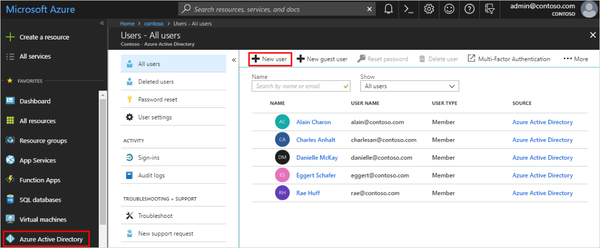
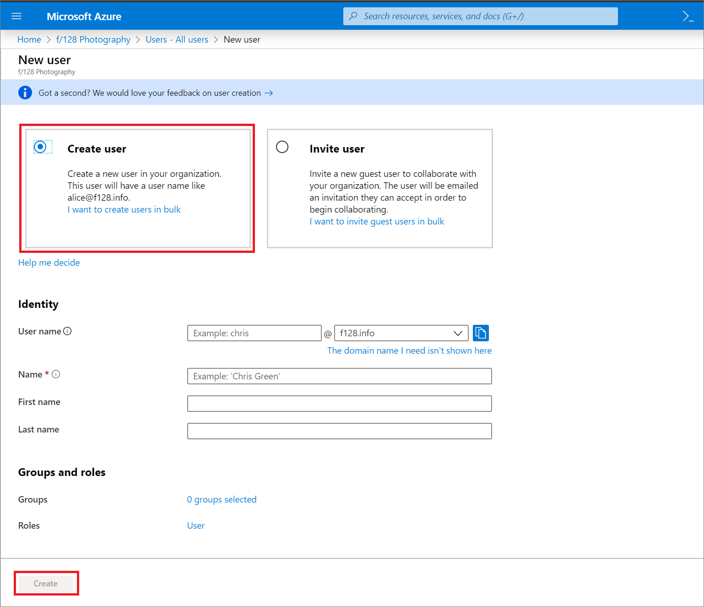
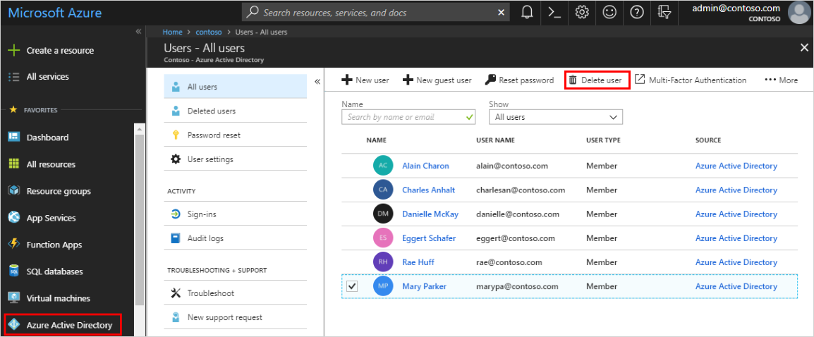

# How to: Add or delete users using Azure Active Directory
Add new users or delete existing users from your Azure Active Directory (Azure AD) tenant, using Azure AD.

## Add a new user
You can create a new user using the Azure Active Directory.

### To add a new user
1. Sign in to the [Azure portal](https://portal.azure.com/) as a Global administrator or user administrator for the directory.

2. Select **Azure Active Directory**, select **Users**, and then select **New user**.

    

3. On the **User** page, fill out the required information.

    

    - **Name (required).** The first and last name of the new user. For example, Mary Parker.

    - **User name (required).** The user name of the new user. For example, mary@contoso.com. 
    
        The domain part of the user name must use either the initial default domain name, <_yourdomainname_>.onmicrosoft.com, or a custom domain name, such as contoso.com. For more information about how to create a custom domain name, see [How to add a custom domain name to Azure Active Directory](add-custom-domain.md).

    - **Profile.** Optionally, you can add more information about the user. You can also add user information at a later time. For more information about adding user info, see [How to add or change user profile information](active-directory-users-profile-azure-portal.md).

    - **Groups.** Optionally, you can add the user to one or more existing groups. You can also add the user to groups at a later time. For more information about adding users to groups, see [How to create a basic group and add members](active-directory-groups-create-azure-portal.md).

    - **Directory role.** Optionally, you can add the user to a directory role. You can assign the user to be a global administrator, or to one or more of the other administrator roles in Azure AD. For more information about assigning roles, see [How to assign roles to users](active-directory-users-assign-role-azure-portal.md).

4. Copy the auto-generated password provided in the **Password** box. You'll need to give this password to the user for the initial sign-in process.

5. Select **Create**.

    The user is created and added to your Azure AD tenant.

## Add a new user within a hybrid environment
If you have an environment with both Azure Active Directory (cloud) and Windows Server Active Directory (on-premises), you can add new users by syncing the existing user account data. For more information about hybrid environments and users, see [Integrate your on-premises directories with Azure Active Directory](../hybrid/whatis-hybrid-identity.md).

## Delete a user
You can delete an existing user using Azure Active Directory.

### To delete a user
1. Sign in to the [Azure portal](https://portal.azure.com/) using a Global administrator account for the directory.

2. Select **Azure Active Directory**, select **Users**, and then search for and select the user you want to delete from your Azure AD tenant. For example, _Mary Parker_.

3. Select **Delete user**.

    

    The user is deleted and no longer appears on the **Users - All users** page. The user can be seen on the **Deleted users** page for the next 30 days and can be restored during that time. For more information about restoring a user, see [How to restore or permanently remove a recently deleted user](active-directory-users-restore.md).

    >[!Note]
    >You must use Windows Server Active Directory to update the identity, contact info, or job info for users whose source of authority is Windows Server Active Directory. After you complete your update, you must wait for the next synchronization cycle to complete before you'll see the changes.

## Next steps
After you've added your users, you can perform the following basic processes:

- [Add or change profile information](active-directory-users-profile-azure-portal.md)

- [Assign roles to users](active-directory-users-assign-role-azure-portal.md)

- [Create a basic group and add members](active-directory-groups-create-azure-portal.md)

- [Work with dynamic groups and users](../users-groups-roles/groups-create-rule.md)

Or you can perform other user management tasks, such as [adding guest users from another directory](../b2b/what-is-b2b.md) or [restoring a deleted user](active-directory-users-restore.md). For more information about other available actions, see [Azure Active Directory user management documentation](../users-groups-roles/index.yml).