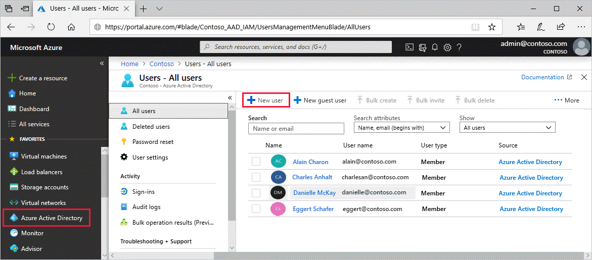

# Add or delete users using Azure Active Directory

Add new users or delete existing users from your Azure Active Directory (Azure AD) organization. To add or delete users you must be a User administrator or Global administrator. 

## Add a new user

You can create a new user using the Azure Active Directory portal.

To add a new user, follow these steps:

1. Sign in to the [Azure portal](https://portal.azure.com/) as a User administrator for the organization.

1. Search for and select *Azure Active Directory* from any page.

1. Select **Users**, and then select **New user**.

    

1. On the **User** page, enter information for this user:

   - **Name**. Required. The first and last name of the new user. For example, *Mary Parker*.

   - **User name**. Required. The user name of the new user. For example, `mary@contoso.com`.

     The domain part of the user name must use either the initial default domain name, *\<yourdomainname>.onmicrosoft.com*, or a custom domain name, such as *contoso.com*. For more information about how to create a custom domain name, see [Add your custom domain name using the Azure Active Directory portal](add-custom-domain.md).

   - **Profile**. Optionally, you can add more information about the user. You can also add user information at a later time. For more information about adding user information, see [Add or update a user's profile information using Azure Active Directory](active-directory-users-profile-azure-portal.md).

   - **Groups**. Optionally, you can add the user to one or more existing groups. You can also add the user to groups at a later time. For more information about adding users to groups, see [Create a basic group and add members using Azure Active Directory](active-directory-groups-create-azure-portal.md).

   - **Directory role**. Optionally, you can add the user to an Azure AD administrator role. You can assign the user to be a Global administrator or one or more of the limited administrator roles in Azure AD. For more information about assigning roles, see [Assign administrator and non-administrator roles to users with Azure Active Directory](active-directory-users-assign-role-azure-portal.md).

1. Copy the autogenerated password provided in the **Password** box. You'll need to give this password to the user to sign in for the first time.

1. Select **Create**.

    The user is created and added to your Azure AD tenant.

## Add a new user within a hybrid environment

If you have an environment with both Azure Active Directory (cloud) and Windows Server Active Directory (on-premises), you can add new users by syncing the existing user account data. For more information about hybrid environments and users, see [What is hybrid identity with Azure Active Directory?](../hybrid/whatis-hybrid-identity.md).

## Delete a user

You can delete an existing user using Azure Active Directory portal.

To delete a user, follow these steps:

1. Sign in to the [Azure portal](https://portal.azure.com/) using a User administrator account for the organization.

1. Search for and select *Azure Active Directory* from any page.

1. Search for and select the user you want to delete from your Azure AD tenant. For example, _Mary Parker_.

1. Select **Delete user**.

    

The user is deleted and no longer appears on the **Users - All users** page. The user can be seen on the **Deleted users** page for the next 30 days and can be restored during that time. For more information about restoring a user, see [Restore or remove a recently deleted user using Azure Active Directory](active-directory-users-restore.md).

When a user is deleted, any licenses consumed by the user are made available for other users.

>[!Note]
>You must use Windows Server Active Directory to update the identity, contact information, or job information for users whose source of authority is Windows Server Active Directory. After you complete your update, you must wait for the next synchronization cycle to complete before you'll see the changes.

## Next steps

After you've added your users, you can do the following basic processes:

- [Add or change profile information](active-directory-users-profile-azure-portal.md)

- [Assign roles to users](active-directory-users-assign-role-azure-portal.md)

- [Create a basic group and add members](active-directory-groups-create-azure-portal.md)

- [Work with dynamic groups and users](../users-groups-roles/groups-create-rule.md)

Or you can do other user management tasks, such as [adding guest users from another directory](../b2b/what-is-b2b.md) or [restoring a deleted user](active-directory-users-restore.md). For more information about other available actions, see [Azure Active Directory user management documentation](../users-groups-roles/index.yml).
