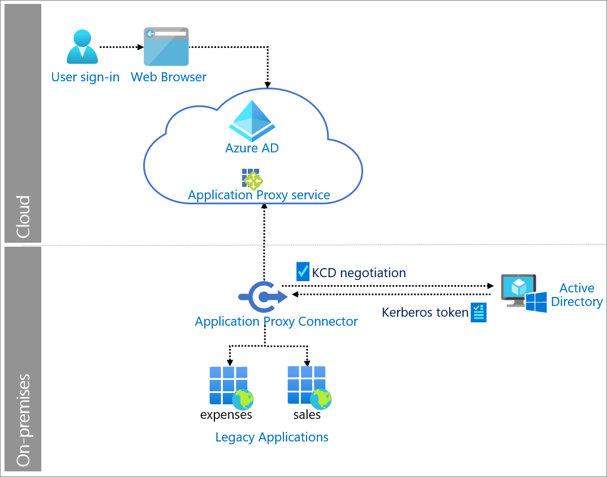

# Windows authentication - Kerberos constrained delegation with Azure Active Directory

Kerberos Constrained Delegation (KCD) provides constrained delegation between resources and is based on Service Principle Names. It requires domain administrators to create the delegations and is limited to a single domain. Resource-based KCD is often used as a way of providing Kerberos authentication for a web application that has users in multiple domains within an Active Directory forest.

Azure Active Directory Application Proxy can provide single sign-on (SSO) and remote access to KCD-based applications that require a Kerberos ticket for access and Kerberos Constrained Delegation (KCD).

You enable SSO to your on-premises KCD applications that use Integrated Windows Authentication (IWA) by giving Application Proxy connectors permission to impersonate users in Active Directory. The Application Proxy connector uses this permission to send and receive tokens on the users' behalf.

## Use when

There is a need to provide remote access, protect with pre-authentication, and provide SSO to on-premises IWA applications.

## Components of system

* **User**: Accesses legacy application served by Application Proxy.

* **Web browser**: The component that the user interacts with to access the external URL of the application.

* **Azure AD**: Authenticates the user. 

* **Application Proxy service**: Acts as reverse proxy to send request from the user to the on-premises application. It sits in Azure AD. Application Proxy can also enforce any conditional access policies.

* **Application Proxy connector**: Installed on-premises on Windows servers to provide connectivity to the application. Returns the response to Azure AD. Performs KCD negotiation with Active Directory, impersonating the user to get a Kerberos token to the application.

* **Active Directory**: Sends the Kerberos token for the application to the Application Proxy connector.

* **Legacy applications**: Applications that receive user requests from Application Proxy. The legacy applications return the response to the Application Proxy connector.

## Implement Windows authentication (KCD) with Azure AD

* [Kerberos Constrained Delegation for single sign-on to your apps with Application Proxy](https://docs.microsoft.com/azure/active-directory/manage-apps/application-proxy-configure-single-sign-on-with-kcd) 

* [Add an on-premises application for remote access through Application Proxy in Azure Active Directory](https://docs.microsoft.com/azure/active-directory/manage-apps/application-proxy-add-on-premises-application)

 
