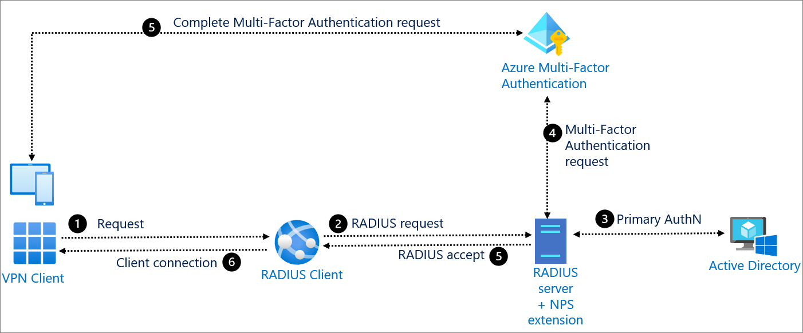

# RADIUS authentication with Azure Active Directory

Remote Authentication Dial-In User Service (RADIUS) is a network protocol that secures a network by enabling centralized authentication and authorization of dial-in users. Many applications still rely on the RADIUS protocol to authenticate users.

Microsoft Windows Server has a role called the Network Policy Server (NPS), which can act as a RADIUS server and support RADIUS authentication.

Azure Active Directory (Azure AD) enables Multi-factor authentication with RADIUS-based systems. If a customer wants to apply Azure Multi-Factor Authentication to any of the previously mentioned RADIUS workloads, they can install the Azure Multi-Factor Authentication NPS extension on their Windows NPS server. 

The Windows NPS server authenticates a user’s credentials against Active Directory, and then sends the Multi-Factor Authentication request to Azure. The user then receives a challenge on their mobile authenticator. Once successful, the client application is allowed to connect to the service. 

## Use when: 

You need to add Multi-Factor Authentication to applications like
* a Virtual Private Network (VPN)
* WiFi access
* Remote Desktop Gateway (RDG)
* Virtual Desktop Infrastructure (VDI)
* Any others that depend on the RADIUS protocol to authenticate users into the service. 

> [!NOTE]
> Rather than relying on RADIUS and the Azure Multi-Factor Authentication NPS extension to apply Azure Multi-Factor Authentication to VPN workloads, we recommend that you upgrade your VPN’s to SAML and directly federate your VPN with Azure AD. This gives your VPN the full breadth of Azure AD protection, including Conditional Access, Multi-Factor Authentication, device compliance, and Identity Protection.

## Components of the system 

* **Client application (VPN client)**: Sends authentication request to the RADIUS client.

* **RADIUS client**: Converts requests from client application and sends them to RADIUS server that has the NPS extension installed.

* **RADIUS server**: Connects with Active Directory to perform the primary authentication for the RADIUS request. Upon success, passes the request to Azure Multi-Factor Authentication NPS extension.

* **NPS extension**: Triggers a request to Azure Multi-Factor Authentication for a secondary authentication. If successful, NPS extension completes the authentication request by providing the RADIUS server with security tokens that include Multi-Factor Authentication claim, issued by Azure’s Security Token Service.

* **Azure Multi-Factor Authentication**: Communicates with Azure AD to retrieve the user’s details and performs a secondary authentication using a verification method configured by the user.

## Implement RADIUS with Azure AD 

* [Provide Azure Multi-Factor Authentication capabilities using NPS](https://docs.microsoft.com/azure/active-directory/authentication/howto-mfa-nps-extension) 

* [Configure the Azure Multi-Factor Authentication NPS extension](https://docs.microsoft.com/azure/active-directory/authentication/howto-mfa-nps-extension-advanced) 

* [VPN with Azure Multi-Factor Authentication using the NPS extension](https://docs.microsoft.com/azure/active-directory/authentication/howto-mfa-nps-extension-vpn) 

  
‎ 

 
