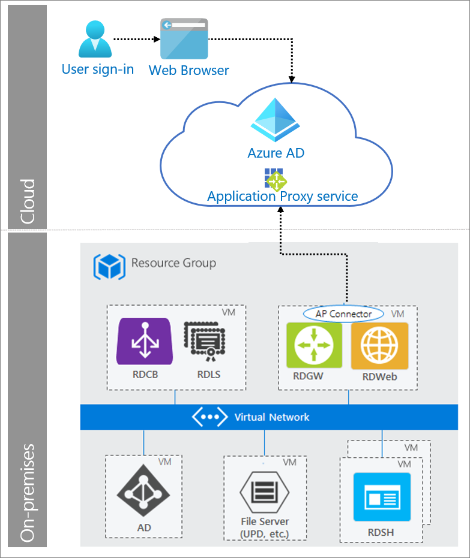

# Remote Desktop Gateway Services

A standard Remote Desktop Services (RDS) deployment includes various [Remote Desktop role services](https://technet.microsoft.com/windows-server-docs/compute/remote-desktop-services/desktop-hosting-logical-architecture) running on Windows Server. The RDS deployment with Azure Active Directory (Azure AD) Application Proxy has a permanent outbound connection from the server running the connector service. Other deployments leave open inbound connections through a load balancer. This authentication pattern allows you to offer more types of applications by publishing on-premises applications through Remote Desktop Services. It also reduces the attack surface of their deployment by using Azure AD Application Proxy.

## Use when

You need to provide remote access and protect your Remote Desktop Services deployment with pre-authentication.

## Components of system

* **User**: Accesses RDS served by Application Proxy.

* **Web browser**: The component that the user interacts with to access the external URL of the application.

* **Azure AD**: Authenticates the user. 

* **Application Proxy service**: Acts as reverse proxy to forward request from the user to RDS. Application Proxy can also enforce any Conditional Access policies. 

* **Remote Desktop Services**: Acts as a platform for individual virtualized applications, providing secure mobile and remote desktop access, and providing end users the ability to run their applications and desktops from the cloud. 

## Implement Remote Desktop Gateway services with Azure AD

* [Publish remote desktop with Azure AD Application Proxy](https://docs.microsoft.com/azure/active-directory/manage-apps/application-proxy-integrate-with-remote-desktop-services) 

* [Add an on-premises application for remote access through Application Proxy in Azure AD](https://docs.microsoft.com/azure/active-directory/manage-apps/application-proxy-add-on-premises-application)

 
