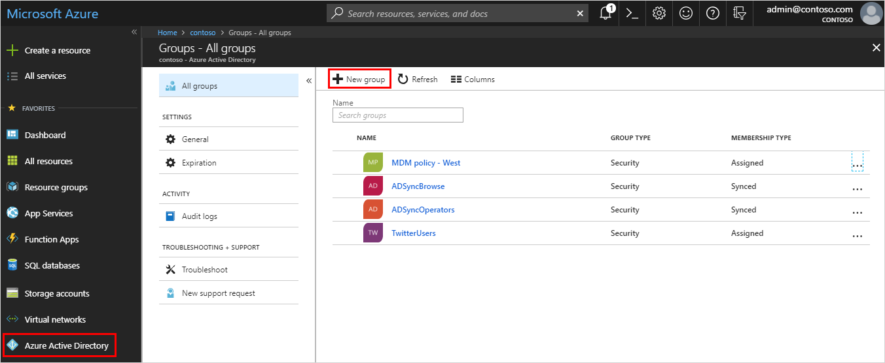
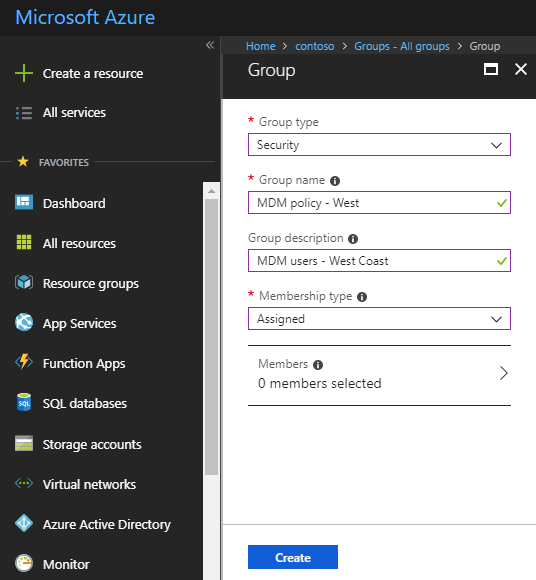
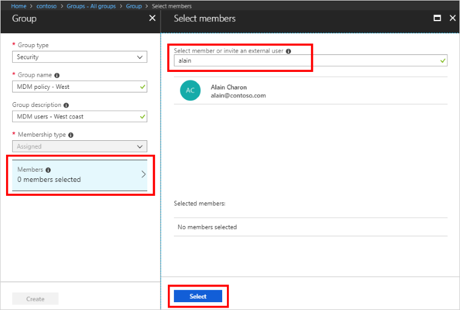

# How to: Create a basic group and add members using the Azure Active Directory portal

You can create a basic group using the Azure Active Directory (Azure AD) portal. For the purposes of this article, a basic group is assigned to a single resource by the resource owner (administrator) and includes specific members (employees) that need to access that resource. For more complex scenarios, including dynamic memberships and rule creation, see the [Azure Active Directory user management documentation](../users-groups-roles/index.yml).

## Create a basic group and assign members
You can create a basic group and add your members at the same time.

### To create a basic group and assign members
1. Sign in to the [Azure AD portal](https://portal.azure.com) using a Global administrator account for the directory.

2. Select **Azure Active Directory**, **Groups**, and then select **New group**.

    

3. In the **Group** blade, fill out the required information.

    

    - **Group type (required).** Select a pre-defined group type. This includes:
        
        - **Security**. Used to manage member and computer access to shared resources for a group of users. For example, you can create a security group for a specific security policy. By doing it this way, you can assign permissions to all the members at once, instead of having to add permissions to each member individually. For more info about managing access to resources, see [Manage access to resources with Azure Active Directory groups](active-directory-manage-groups.md).
        
        - **Office 365**. Provides a place to collaborate by giving members access to a shared mailbox, calendar, files, SharePoint site, and more. This option also lets you give people outside of your organization access to the group. For more info about Office 365 Groups, see [Learn about Office 365 Groups](https://support.office.com/article/learn-about-office-365-groups-b565caa1-5c40-40ef-9915-60fdb2d97fa2).

    - **Group name (required).** Add a name for the group, something that you'll remember and that makes sense.

    - **Group description.** Add an optional description to your group.

    - **Membership type (required).** Select a pre-defined membership type. This includes:

        - **Assigned.** Lets you assign specific employees to be members of this group and to have unique permissions. For the purposes of this article, we're using this option.

        - **Dynamic user.** Lets you use dynamic group rules to automatically add and remove members. If a member's attributes change, the system looks at your dynamic group rules for the directory to see if the member meets the rule requirements (is added) or no longer meets the rules requirements (is removed). For more info about creating a dynamic group for users, see [Create a dyncamic group and check status](../users-groups-roles/groups-create-rule.md).

        - **Dynamic device.** Lets you use dynamic group rules to automatically add and remove devices. If a device's attributes change, the system looks at your dynamic group rules for the directory to see if the device meets the rule requirements (is added) or no longer meets the rules requirements (is removed). For more info about creating a dynamic group for devices, see [Create a dyncamic group and check status](../users-groups-roles/groups-create-rule.md).

        >[!Important]
        >You can create a dynamic group for either devices or users, but not for both. You also can't create a device group based on the device owners' attributes. Device membership rules can only reference device attributions.

4. Select **Create**.

    Your group is created and ready for you to assign members.

5. Select the **Members** area, and then begin searching for the members to add to your group from the **Select members** blade.

    

6. When you're done adding members, choose **Select**.

    The **Group** blade updates to show the number of members that are now assigned to the group.

## Assign, add, or remove members at a later time
If you didn't assign your members as part of your group creation process, you can still do it -  just a bit differently. This also works if you want to add more members or remove existing members.

### To assign, add, or remove members

1. From the **Groups - All groups** blade, select the group you want to update. In this case, use our previously created group, **MDM policy - West**.

    

2. Select **Members**, and then select **Add members**.

    The **Add members** blade appears.

    

3. Select each of the members you want to include in your group, and then choose **Select**.

    You'll get a message that says the member was added successfully.

4. Refresh the screen to see all of the member names.

## View your group with members
Whether you add your members as part of the group creation process or later, you can always view your groups and associated members.

### To view your groups and assigned members
1. Select **Groups**, and then select your group name. In this case, _MDM policy - West_.

    The group information appears, with the number of included members.

2. If you want to see the member names, select **Members** from the **Manage** area, and review the list.

## Next steps
Now that you've added a group and at least one user, you can

- [Add more users to your Azure AD directory](add-users-azure-active-directory.md)
- [Manage your groups and members](active-directory-manage-groups.md)
- [Manage your group settings](active-directory-groups-settings-azure-portal.md)
- [Associate or add an Azure subscription to Azure Active Directory](active-directory-how-subscriptions-associated-directory.md)