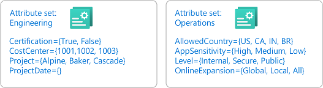
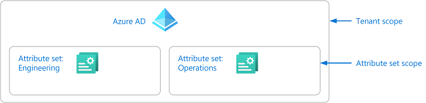
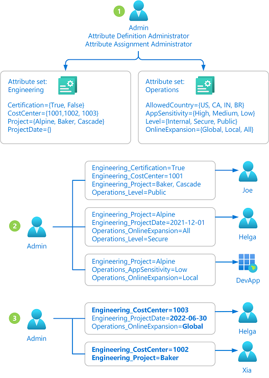
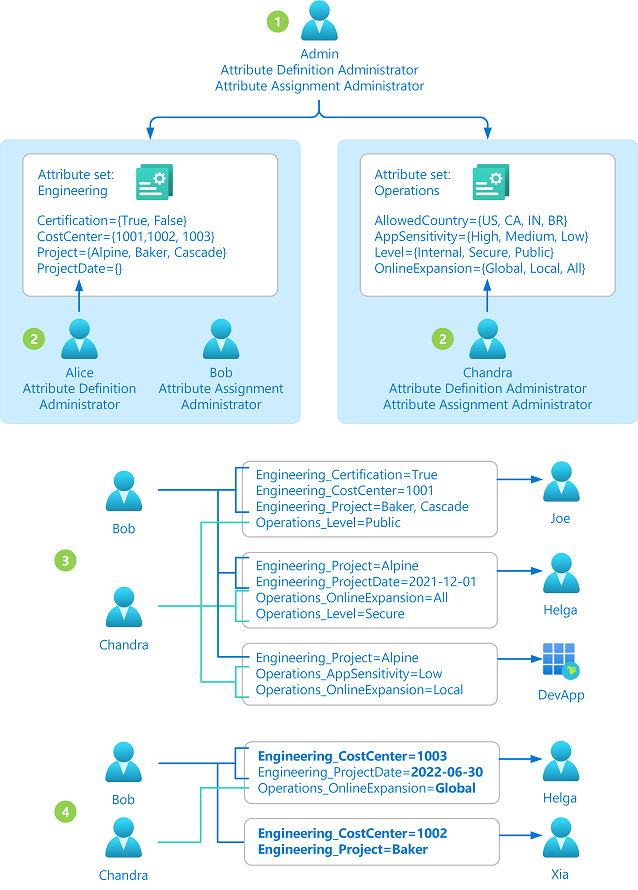

# Manage access to custom security attributes in Azure AD (Preview)

> [!IMPORTANT]
> Custom security attributes are currently in PREVIEW.
> See the [Supplemental Terms of Use for Microsoft Azure Previews](https://azure.microsoft.com/support/legal/preview-supplemental-terms/) for legal terms that apply to Azure features that are in beta, preview, or otherwise not yet released into general availability.

For people in your organization to effectively work with [custom security attributes](custom-security-attributes-overview.md), you must grant the appropriate access. Depending on the information you plan to include in custom security attributes, you might want to restrict custom security attributes or you might want to make them broadly accessible in your organization. This article describes how to manage access to custom security attributes.

## Prerequisites

To manage access to custom security attributes, you must have:

- Azure AD Premium P1 or P2 license
- [Attribute Assignment Administrator](../roles/permissions-reference.md#attribute-assignment-administrator)

> [!IMPORTANT]
> [Global Administrator](../roles/permissions-reference.md#global-administrator), [Global Reader](../roles/permissions-reference.md#global-reader), [Privileged Role Administrator](../roles/permissions-reference.md#privileged-role-administrator), and [User Administrator](../roles/permissions-reference.md#user-administrator) do not have permissions to read, filter, define, manage, or assign custom security attributes.

## Step 1: Figure out how to organize your attributes

Every custom security attribute must be part of an attribute set. An attribute set is a way to group and manage related custom security attributes. You'll need to figure out how you want add attributes sets for your organization. For example, you might want to add attribute sets based on departments, teams, or projects. Your ability to grant access to custom security attributes will depend on how you organize your attribute sets.

## Step 2: Identify the needed scope

Scope is the set of resources that the access applies to. For custom security attributes, you can assign roles at the tenant scope or at the attribute set scope. If you want to assign broad access, you can assign roles at tenant scope. However, if you want to limit access to particular attribute sets, you can assign roles at the attribute set scope.

## Step 3: Review the available roles

You need to determine who needs access to work with custom security attributes in your organization. To manage access to custom security attributes, there are four Azure AD built-in roles.  Note that [Global Administrator](../roles/permissions-reference.md#global-administrator), [Global Reader](../roles/permissions-reference.md#global-reader), [Privileged Role Administrator](../roles/permissions-reference.md#privileged-role-administrator), and [User Administrator](../roles/permissions-reference.md#user-administrator), by default, do not have permissions to read, filter, define, manage, or assign custom security attributes.

- [Attribute Assignment Administrator](../roles/permissions-reference.md#attribute-assignment-administrator)
- [Attribute Assignment Reader](../roles/permissions-reference.md#attribute-assignment-reader)
- [Attribute Definition Administrator](../roles/permissions-reference.md#attribute-definition-administrator)
- [Attribute Definition Reader](../roles/permissions-reference.md#attribute-definition-reader)

The following table provides a high-level comparison of the custom security attributes roles.

| Permission | Global Admin | Attribute Definition Admin | Attribute Assignment Admin | Attribute Definition Reader | Attribute Assignment Reader |
| --- | :---: | :---: | :---: | :---: | :---: |
| Read attribute sets |  | :heavy_check_mark: | :heavy_check_mark: | :heavy_check_mark: | :heavy_check_mark: |
| Read attribute definitions |  | :heavy_check_mark: | :heavy_check_mark: | :heavy_check_mark: |  |
| Read attribute assignments for users and applications (service principals) |  |  | :heavy_check_mark: |  | :heavy_check_mark: | 
| Add and update attribute sets |  | :heavy_check_mark: |  |  |  |
| Add and update attribute definitions |  | :heavy_check_mark: |  |  |  |
| Assign attributes to users and applications (service principals) |  |  | :heavy_check_mark: |  |  |

## Step 4: Determine your delegation strategy

This step describes two ways to manage access to custom security attributes. The first way is to manage them centrally and the second way is to delegate management to others.

#### Manage attributes centrally

An administrator that has been assigned the Attribute Definition Administrator and Attribute Assignment Administrator roles at the tenant scope can manage all aspects of custom security attributes. The following steps show how custom security attributes are defined and assigned by a single administrator.

1. The administrator adds attribute sets and defines attributes.
1. The administrator assigns attributes to Azure AD objects.
1. The administrator updates and maintains attributes.

Advantages of managing centrally

- All custom security attributes can be managed by one or two administrators
- Can work for small organizations

Disadvantages of managing centrally

- Administrator might get several requests to define and assign custom security attributes
- Does not scale for large organizations

#### Manage attributes with delegation

An administrator may not know all the situations of how custom security attributes should be defined and assigned. Typically it's users within the respective departments, teams, or projects who know the most about their area. Instead of assigning one or two administrators to manage all custom security attributes, you can instead delegate the management at the attribute set scope. This also follows the best practice of least privilege to grant just the permissions other administrators need to do their job and avoid unnecessary access. The following steps show how the management of custom security attributes being delegated to multiple administrators.

1. The administrator adds attribute sets. The administrator delegates who can read, define, or assign custom security attributes for each attribute set.
1. The delegated Attribute Definition Administrators define attributes in the attribute sets they have been granted access to.
1. The delegated Attribute Assignment Administrators assign attributes from their attribute sets to Azure AD objects.
1. The delegated Attribute Definition Administrators and Attribute Assignment Administrators update and maintain attributes.

Advantages of using delegation

- Management is distributed
- Allows delegated readers and administrators to read and manage their own custom security attributes
- Grants just the permissions delegated readers and administrators need

Disadvantages of using delegation

- Does require that an administrator to develop an attribute set organization

## Step 5: Select the appropriate role and scope

The following table can help you determine which roles to assign and the scope.

| I want to grant this access | Assign this role | Scope |
| --- | --- | --- |
| <ul><li>Read, add, and update all attribute sets in a tenant</li><li>Read, add, and update all attribute definitions in a tenant</li></ul> | Attribute Definition Administrator |  |
| <ul><li>Read, add, and update attribute definitions in a scoped attribute set</li><li>**Cannot** update the scoped attribute set</li><li>**Cannot** read, add, or update other attribute sets</li></ul> | Attribute Definition Administrator |  |
| <ul><li>Read all attribute sets in a tenant</li><li>Read all attribute definitions in a tenant</li><li>Read all attribute assignments in a tenant for users and applications (service principals)</li><li>Assign all attributes in a tenant to users and applications (service principals)</li></ul> | Attribute Assignment Administrator |  |
| <ul><li>Read attribute definitions in a scoped attribute set</li><li>Read attribute assignments that use attributes in a scoped attribute set for users and applications (service principals)</li><li>Assign attributes in a scoped attribute set to users and applications (service principals)</li><li>**Cannot** read attributes in other attribute sets</li><li>**Cannot** read attribute assignments that use attributes in other attribute sets</li></ul> | Attribute Assignment Administrator |  |
| <ul><li>Read all attribute sets in a tenant</li><li>Read all attribute definitions in a tenant</li></ul> | Attribute Definition Reader |  |
| <ul><li>Read attribute definitions in a scoped attribute set</li><li>**Cannot** read other attribute sets</li></ul> | Attribute Definition Reader |  |
| <ul><li>Read all attribute sets in a tenant</li><li>Read all attribute assignments in a tenant for users and applications (service principals)</li></ul> | Attribute Assignment Reader |  |
| <ul><li>Read attribute assignments that use attributes in a scoped attribute set for users and applications (service principals)</li><li>**Cannot** read attribute assignments that use attributes in other attribute sets</li></ul> | Attribute Assignment Reader |  |

## Step 6: Assign roles

To grant access, follow these steps to assign one of the custom security attribute roles. 

#### Assign roles at attribute set scope

1. Sign in to the [Azure portal](https://portal.azure.com) or [Azure AD admin center](https://aad.portal.azure.com).

1. Click **Azure Active Directory**.

1. In the left navigation menu, click **Custom security attributes (Preview)**.

1. Click the attribute set you want grant access to.

1. Click **Roles and administrators**.

    

1. Add assignments for the custom security attribute roles.

    > [!NOTE]
    > If you are using Azure AD Privileged Identity Management (PIM), eligible role assignments at attribute set scope currently aren't supported. Permanent role assignments at attribute set scope are supported, but the **Assigned roles** page for a user doesn't list the role assignments.
    
    > [!NOTE]
    > Users with attribute set scope role assignments currently can see other attribute sets and custom security attribute definitions.
    
#### Assign roles at tenant scope

1. Sign in to the [Azure portal](https://portal.azure.com) or [Azure AD admin center](https://aad.portal.azure.com).

1. Click **Azure Active Directory**.

1. In the left navigation menu, click **Roles and administrators**.

    

1. Add assignments for the custom security attribute roles.

## Next steps

- [Add or deactivate custom security attributes in Azure AD](custom-security-attributes-add.md)
- [Assign or remove custom security attributes for a user](../enterprise-users/users-custom-security-attributes.md)
- [Troubleshoot custom security attributes in Azure AD](custom-security-attributes-troubleshoot.md)
