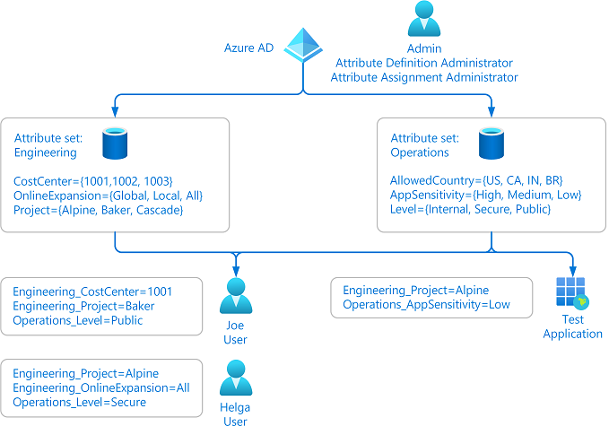
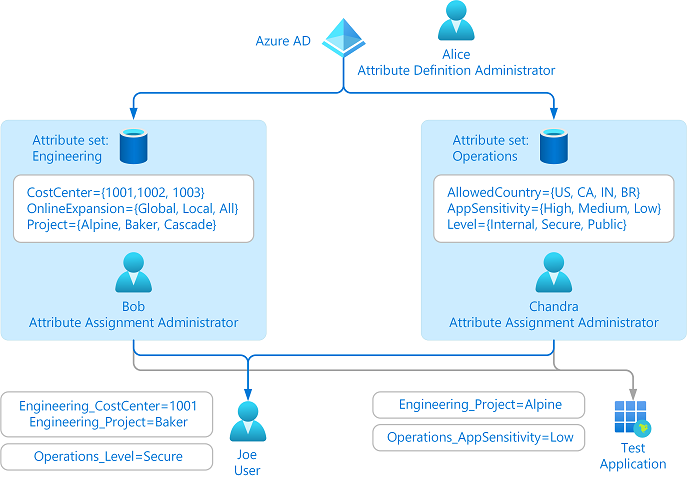
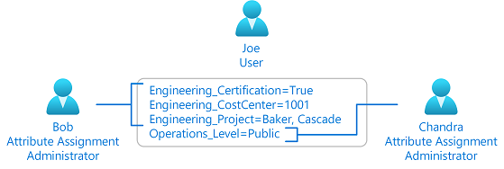
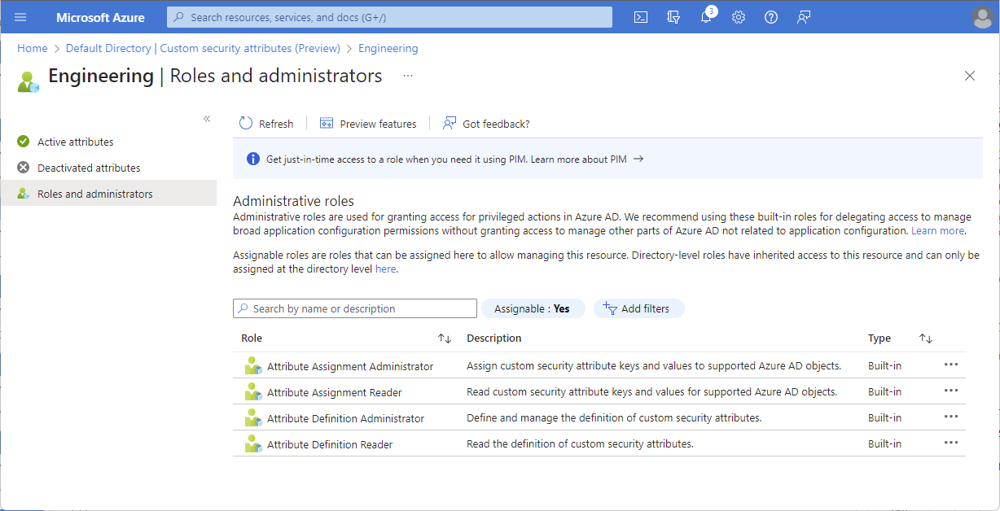

# Manage access to custom security attributes in Azure AD (Preview)

> [!IMPORTANT]
> Custom security attributes are currently in PREVIEW.
> See the [Supplemental Terms of Use for Microsoft Azure Previews](https://azure.microsoft.com/support/legal/preview-supplemental-terms/) for legal terms that apply to Azure features that are in beta, preview, or otherwise not yet released into general availability.

You can delegate the management of custom security attributes to others in your organization at the tenant level or at the attribute set level.

## Prerequisites

To manage access to custom security attributes, you must have:

- Azure AD Premium P1 or P2 license
- An Azure AD role with the following permissions, such as Attribute Assignment Administrator:

    - `microsoft.directory/attributeSets/allProperties/read`
    - `microsoft.directory/customSecurityAttributeDefinitions/allProperties/read`

    > [!IMPORTANT]
    > [Global Administrator](../roles/permissions-reference.md#global-administrator), [Global Reader](../roles/permissions-reference.md#global-reader), [Privileged Role Administrator](../roles/permissions-reference.md#privileged-role-administrator), and [User Administrator](../roles/permissions-reference.md#user-administrator) do not have permissions to read, filter, define, manage, or assign custom security attributes.

## Manage attributes without delegation

An administrator that has been assigned the Attribute Definition Administrator and Attribute Assignment Administrator roles at the tenant level can manage all aspects of custom security attributes. The following diagram shows custom security attributes are defined and assigned by a single administrator.

## Manage attributes with delegation

An administrator may not know all the situations of how custom security attributes should be defined and assigned. Typically it's users within the respective departments, teams, or projects who know the most about their area. Instead of assigning one or two administrators to manage all custom security attributes, you can instead delegate the management at the attribute set level. This also follows the best practice of least privilege to grant just the permissions other administrators need to do their job and avoid unnecessary access. The following diagram shows the management of custom security attributes being delegated to multiple administrators.

In this scenario, delegated administrators can only assign attributes from the attribute sets they have been granted access to.

## Which roles to assign

The following table lists which roles to assign and the scope to read, manage, and assign custom security attributes and attribute sets.

| I want to grant this access | Assign this role | Scope |
| --- | --- | --- |
| Read custom security attributes in a particular attribute set | Attribute Definition Reader | Attribute set |
| Read all custom security attributes | Attribute Definition Reader | Tenant |
| Manage custom security attributes in a particular attribute set | Attribute Definition Administrator | Attribute set |
| Manage all custom security attributes | Attribute Definition Administrator | Tenant |
| Read custom security attribute assignments for users and enterprise applications (service principals) from a particular attribute set | Attribute Assignment Reader | Attribute set |
| Read all custom security attribute assignments for users and enterprise applications (service principals) | Attribute Assignment Reader | Tenant |
| Assign custom security attributes to users and enterprise applications (service principals) from a particular attribute set | Attribute Assignment Administrator | Attribute set |
| Assign all custom security attributes to users and enterprise applications (service principals) | Attribute Assignment Administrator | Tenant |

## Grant access at the attribute set scope

1. Sign in to the [Azure portal](https://portal.azure.com) or [Azure AD admin center](https://aad.portal.azure.com).

1. Click **Azure Active Directory**.

1. In the left navigation menu, click **Custom security attributes (Preview)**.

1. Click the attribute set you want grant access to.

1. Click **Roles and administrators**.

    

1. Add assignments to one of the following roles:

    - Attribute Assignment Administrator
    - Attribute Assignment Reader
    - Attribute Definition Administrator
    - Attribute Definition Reader

> [!NOTE]
> Users with attribute set-level role assignments currently can see other attribute sets and custom security attribute definitions.

## Grant access at the tenant scope

1. Sign in to the [Azure portal](https://portal.azure.com) or [Azure AD admin center](https://aad.portal.azure.com).

1. Click **Azure Active Directory**.

1. In the left navigation menu, click **Roles and administrators**.

    

1. Add assignments to one of the following roles:

    - Attribute Assignment Administrator
    - Attribute Assignment Reader
    - Attribute Definition Administrator
    - Attribute Definition Reader

## Next steps

- [Add or deactivate custom security attributes in Azure AD](custom-security-attributes-add.md)
- [Assign or remove custom security attributes for a user](../enterprise-users/users-custom-security-attributes.md)
- [Troubleshoot custom security attributes in Azure AD](custom-security-attributes-troubleshoot.md)
