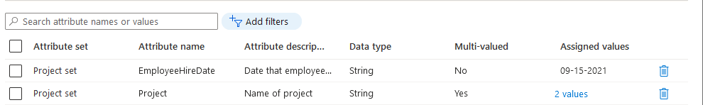
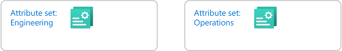
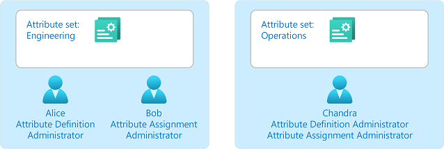
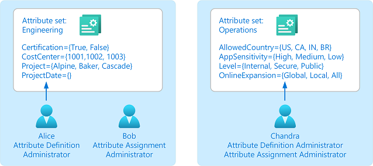
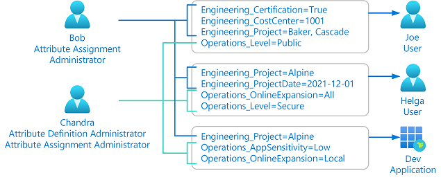
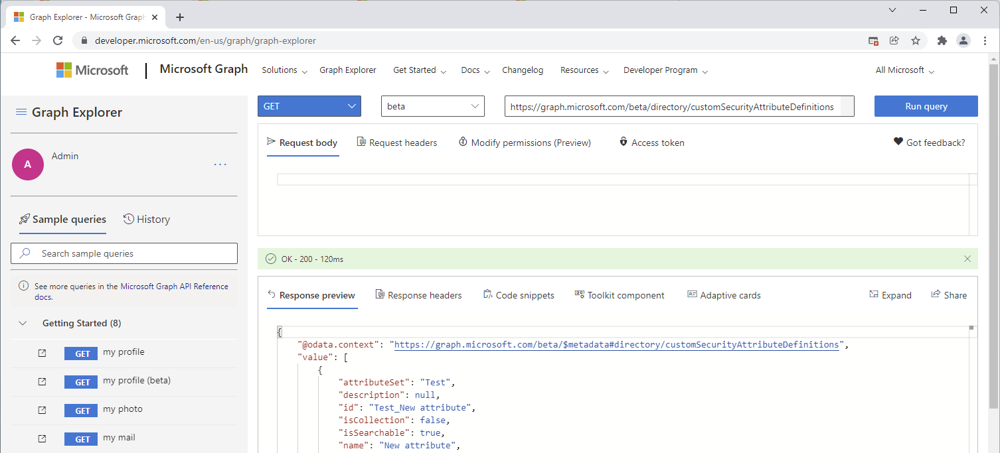

# What are custom security attributes in Microsoft Entra ID? (Preview)

> [!IMPORTANT]
> Custom security attributes are currently in PREVIEW.
> For more information about previews, see [Universal License Terms For Online Services](https://www.microsoft.com/licensing/terms/product/ForOnlineServices/all).

Custom security attributes in Microsoft Entra ID are business-specific attributes (key-value pairs) that you can define and assign to Microsoft Entra objects. These attributes can be used to store information, categorize objects, or enforce fine-grained access control over specific Azure resources. Custom security attributes can be used with [Azure attribute-based access control (Azure ABAC)](../../role-based-access-control/conditions-overview.md).

## Why use custom security attributes?

Here are some scenarios where you could use custom security attributes:

- Extend user profiles, such as add Hourly Salary to all my employees.
- Ensure only administrators can see the Hourly Salary attribute in my employees' profiles.
- Categorize hundreds or thousands of applications to easily create a filterable inventory for auditing.
- Grant users access to the Azure Storage blobs belonging to a project.

## What can I do with custom security attributes?

Custom security attributes include these capabilities:

- Define business-specific information (attributes) for your tenant.
- Add a set of custom security attributes on users and applications.
- Manage Microsoft Entra objects using custom security attributes with queries and filters.
- Provide attribute governance so attributes determine who can get access.

Custom security attributes **aren't** supported in the following areas:

- [Microsoft Entra Domain Services](../../active-directory-domain-services/overview.md)
- [SAML token claims](../develop/saml-claims-customization.md)

## Features of custom security attributes

Custom security attributes include these features:

- Available tenant-wide​
- Include a description
- Support different data types: Boolean, integer, string​
- Support single value or multiple values
- Support user-defined free-form values​ or predefined values
- Assign custom security attributes to directory synced users from an on-premises Active Directory

The following example shows how you can specify custom security attribute values that are single, multiple, free-form, or predefined.

## Objects that support custom security attributes

You can add custom security attributes for the following Microsoft Entra objects:

- Microsoft Entra users
- Microsoft Entra enterprise applications (service principals)

## How do custom security attributes compare with extensions?

While both extensions and custom security attributes can be used to extend objects in Microsoft Entra ID and Microsoft 365, they are suitable for fundamentally different custom data scenarios. Here are some ways that custom security attributes compare with [extensions](/graph/extensibility-overview):

| Capability | Extensions | Custom security attributes |
|--|--|--|
| Extend Microsoft Entra ID and Microsoft 365 objects | Yes | Yes |
| Supported objects | Depends on the extension type | Users and service principals |
| Restricted access | No. Anyone with permissions to read the object can read the extension data. | Yes. Read and write access is restricted through a separate set of permissions and RBAC. |
| When to use | Store data to be used by an application   Store non-sensitive data | Store sensitive data   Use for authorization scenarios |
| License requirements | Available in all editions of Microsoft Entra ID | Requires a Microsoft Entra ID P1 or P2 license |

For more information about working with extensions, see [Add custom data to resources using extensions](/graph/extensibility-overview).

## Steps to use custom security attributes

1. **Check permissions**

    Check that you are assigned the [Attribute Definition Administrator](../roles/permissions-reference.md#attribute-definition-administrator) or [Attribute Assignment Administrator](../roles/permissions-reference.md#attribute-assignment-administrator) roles. If not, check with your administrator to assign you the appropriate role at tenant scope or attribute set scope. By default, [Global Administrator](../roles/permissions-reference.md#global-administrator) and other administrator roles do not have permissions to read, define, or assign custom security attributes. If necessary, a Global Administrator can assign these roles to themselves.

    

1. **Add attribute sets**

    Add attribute sets to group and manage related custom security attributes. [Learn more](custom-security-attributes-add.md)

    

1. **Manage attribute sets**

    Specify who can read, define, or assign custom security attributes in an attribute set. [Learn more](custom-security-attributes-manage.md)

    

1. **Define attributes**

    Add your custom security attributes to your directory. You can specify the date type (Boolean, integer, or string) and whether values are predefined, free-form, single, or multiple. [Learn more](custom-security-attributes-add.md)

    

1. **Assign attributes**

    Assign custom security attributes to Microsoft Entra objects for your business scenarios. [Learn more](../enterprise-users/users-custom-security-attributes.md)

    

1. **Use attributes**

    Filter users and applications that use custom security attributes. [Learn more](../enterprise-users/users-custom-security-attributes.md)

    Add conditions that use custom security attributes to Azure role assignments for fine-grained access control. [Learn more](../../role-based-access-control/conditions-custom-security-attributes.md)

## Terminology

To better understand custom security attributes, you can refer back to the following list of terms.

| Term | Definition |
| --- | --- |
| attribute definition | The schema of a custom security attribute or key-value pair. For example, the custom security attribute name, description, data type, and predefined values. |
| attribute set | A collection of related custom security attributes. Attribute sets can be delegated to other users for defining and assigning custom security attributes. |
| attribute name | A unique name of a custom security attribute within an attribute set. The combination of attribute set and attribute name forms a unique attribute for your tenant. |
| attribute assignment | The assignment of a custom security attribute to a Microsoft Entra object, such as users and enterprise applications (service principals). |
| predefined value | A value that is allowed for a custom security attribute. |

## Custom security attribute properties

The following table lists the properties you can specify for attribute sets and custom security attributes. Some properties are immutable and cannot be changed later.

| Property | Required | Can be changed later | Description |
| --- | :---: | :---: | --- |
| Attribute set name  | :white_check_mark: |  | Name of the attribute set. Must be unique within a tenant. Cannot include spaces or special characters. |
| Attribute set description |  | :white_check_mark: | Description of the attribute set. |
| Maximum number of attributes |  | :white_check_mark: | Maximum number of custom security attributes that can be defined in an attribute set. Default value is `null`. If not specified, the administrator can add up to the maximum of 500 active attributes per tenant. |
| Attribute set | :white_check_mark: |  | A collection of related custom security attributes. Every custom security attribute must be part of an attribute set. |
| Attribute name  | :white_check_mark: |  | Name of the custom security attribute. Must be unique within an attribute set. Cannot include spaces or special characters. |
| Attribute description |  | :white_check_mark: | Description of the custom security attribute. |
| Data type | :white_check_mark: |  | Data type for the custom security attribute values. Supported types are `Boolean`, `Integer`, and `String`. |
| Allow multiple values to be assigned | :white_check_mark: |  | Indicates whether multiple values can be assigned to the custom security attribute. If data type is set to `Boolean`, cannot be set to Yes. |
| Only allow predefined values to be assigned | :white_check_mark: |  | Indicates whether only predefined values can be assigned to the custom security attribute. If set to No, free-form values are allowed. Can later be changed from Yes to No, but cannot be changed from No to Yes. If data type is set to `Boolean`, cannot be set to Yes.|
| Predefined values |  |  | Predefined values for the custom security attribute of the selected data type. More predefined values can be added later. Values can include spaces, but some special characters are not allowed. |
| Predefined value is active |  | :white_check_mark: | Specifies whether the predefined value is active or deactivated. If set to false, the predefined value cannot be assigned to any additional supported directory objects. |
| Attribute is active |  | :white_check_mark: | Specifies whether the custom security attribute is active or deactivated. |

## Limits and constraints

Here are some of the limits and constraints for custom security attributes.

> [!div class="mx-tableFixed"]
> | Resource | Limit | Notes |
> | --- | :---: | --- |
> | Attribute definitions per tenant | 500 | Applies only to active attributes in the tenant |
> | Attribute sets per tenant | 500 |  |
> | Attribute set name length | 32 | Unicode characters and case insensitive |
> | Attribute set description length | 128 | Unicode characters |
> | Attribute name length | 32 | Unicode characters and case insensitive |
> | Attribute description length | 128 | Unicode characters |
> | Predefined values |  | Unicode characters and case sensitive |
> | Predefined values per attribute definition | 100 |  |
> | Attribute value length | 64 | Unicode characters |
> | Attribute values assigned per object | 50 | Values can be distributed across single and multi-valued attributes. Example: 5 attributes with 10 values each or 50 attributes with 1 value each |
> | Special characters **not** allowed for: Attribute set name Attribute name | ``<space> ` ~ ! @ # $ % ^ & * ( ) _ - + = { [ } ] \| \ : ; " ' < , > . ? /`` | Attribute set name and attribute name cannot start with a number |
> | Special characters allowed for attribute values | All special characters |  |
> | Special characters allowed for attribute values when used with blob index tags | `<space> + - . : = _ /` | If you plan to use [attribute values with blob index tags](../../role-based-access-control/conditions-custom-security-attributes.md), these are the only special characters allowed for blob index tags. For more information, see [Setting blob index tags](../../storage/blobs/storage-manage-find-blobs.md#setting-blob-index-tags). |

## Custom security attribute roles

Microsoft Entra ID provides built-in roles to work with custom security attributes. The Attribute Definition Administrator role is the minimum role you need to manage custom security attributes. The Attribute Assignment Administrator role is the minimum role you need to assign custom security attribute values for Microsoft Entra objects like users and applications. You can assign these roles at tenant scope or at attribute set scope.

> [!div class="mx-tableFixed"]
> | Role | Permissions |
> | --- | --- |
> | [Attribute Definition Reader](../roles/permissions-reference.md#attribute-definition-reader) | Read attribute sets Read custom security attribute definitions |
> | [Attribute Definition Administrator](../roles/permissions-reference.md#attribute-definition-administrator) | Manage all aspects of attribute sets Manage all aspects of custom security attribute definitions |
> | [Attribute Assignment Reader](../roles/permissions-reference.md#attribute-assignment-reader) | Read attribute sets Read custom security attribute definitions Read custom security attribute keys and values for users and service principals |
> | [Attribute Assignment Administrator](../roles/permissions-reference.md#attribute-assignment-administrator) | Read attribute sets Read custom security attribute definitions Read and update custom security attribute keys and values for users and service principals |

> [!IMPORTANT]
> By default, [Global Administrator](../roles/permissions-reference.md#global-administrator) and other administrator roles do not have permissions to read, define, or assign custom security attributes.

## Microsoft Graph APIs
    
You can manage custom security attributes programmatically using Microsoft Graph APIs. For more information, see [Overview of custom security attributes using the Microsoft Graph API](/graph/api/resources/custom-security-attributes-overview).

You can use an API client such as [Graph Explorer](/graph/graph-explorer/graph-explorer-overview) or Postman to more easily try the Microsoft Graph APIs for custom security attributes. 

## Known issues

Here are some of the known issues with custom security attributes:

- Global Administrators can read audit logs for custom security attribute definitions and assignments.
- If you have a Microsoft Entra ID P2 license, you can't add eligible role assignments at attribute set scope.
- If you have a Microsoft Entra ID P2 license, the **Assigned roles** page for a user does not list permanent role assignments at attribute set scope. The role assignments exist, but aren't listed.

Depending on whether you have a Microsoft Entra ID P1 or P2 license, here are the role assignment tasks that are currently supported for custom security attribute roles:

| Role assignment task | Premium P1 | Premium P2 |
| --- | :---: | :---: |
| Permanent role assignments | :white_check_mark: | :white_check_mark: |
| Eligible role assignments | n/a | :white_check_mark: |
| Permanent role assignments at attribute set scope | :white_check_mark: | :white_check_mark: |
| Eligible role assignments at attribute set scope | n/a | :x: |
| **Assigned roles** page lists permanent role assignments at attribute set scope | :white_check_mark: | :warning: Role assignments exist, but aren't listed  |

## License requirements

[!INCLUDE [Azure AD Premium P1 license](../../../includes/active-directory-p1-license.md)]

## Next steps

- [Add or deactivate custom security attribute definitions in Microsoft Entra ID](custom-security-attributes-add.md)
- [Manage access to custom security attributes in Microsoft Entra ID](custom-security-attributes-manage.md)
- [Assign, update, list, or remove custom security attributes for a user](../enterprise-users/users-custom-security-attributes.md)
