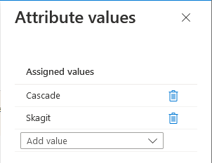
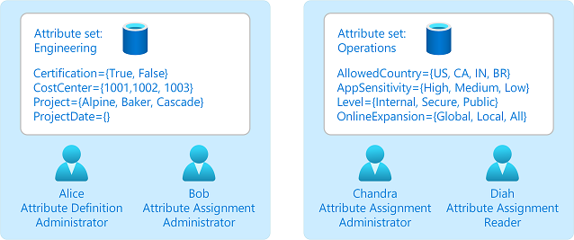
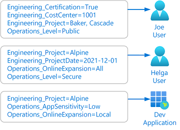

# What are custom security attributes in Azure AD? (Preview)

> [!IMPORTANT]
> Custom security attributes are currently in PREVIEW.
> See the [Supplemental Terms of Use for Microsoft Azure Previews](https://azure.microsoft.com/support/legal/preview-supplemental-terms/) for legal terms that apply to Azure features that are in beta, preview, or otherwise not yet released into general availability.

Custom security attributes is a feature of Azure Active Directory (Azure AD) that enables you to define and assign your own custom security attributes (key-value pairs) to Azure AD objects. For example, your organization might want to add a custom security attribute to the profiles of all your employees or applications.

## Why use custom security attributes?

- Extend user profiles, such as add Employee Hire Date and Hourly Salary to all my employees.
- Ensure only administrators can see the Hourly Salary attribute in my employees' profiles.
- Categorize hundreds or thousands of applications to easily create a filterable inventory for auditing.
- Grant users access to the Azure Storage blobs belonging to a project.

## What can I do with custom security attributes?

- Define business-specific information (attributes) for your tenant.
- Add a set of custom security attributes on users, applications, Azure AD resources, or Azure resources.
- Manage Azure AD objects using custom security attributes with queries and filters.
- Provide attribute governance so attributes determine who can get access.

## Features of custom security attributes

- Available tenant-wide​
- Include a description
- Support different data types: Boolean, integer, string​
- Support single value or multiple values
- Support user-defined free-form values​ or predefined values

The following example shows how you can specify values that are single, multiple, free-form, or predefined.

## Objects that support custom security attributes

Currently, you can add custom security attributes for the following Azure AD objects:

- Azure AD users
- Azure AD enterprise applications (service principals)
- Managed identities for Azure resources

## Steps to use custom security attributes

1. Define custom security attributes in Azure AD. You can specify whether values are predefined, free-form, single, or multiple.

    

1. Specify who can manage and assign attributes.

1. Assign attributes to users and other Azure AD objects for your business scenarios.

    

1. Choose how you want to use attributes.

    This can include searching and filtering users or adding conditions to Azure role assignments for fine-grained access control.

## Terminology

To better understand custom security attributes, you can refer back to the following list of terms.

| Term | Definition |
| --- | --- |
| custom security attribute definition | The schema of a custom security attribute. For example, the custom security attribute name, description, data type, and values. |
| custom security attribute set | A collection of custom security attributes that can be delegated to other users for defining and assigning custom security attributes. |
| custom security attribute name | A unique name of a custom security  attribute within a custom security attribute set. The combination of attribute set and attribute name forms a unique attribute for your tenant. |
| custom security attribute assignment | The assignment of a custom security attribute to an Azure AD object, such as users, enterprise applications (service principals), and managed identities. |

## Custom security attribute properties

The following table lists the properties you can specify for custom security attribute sets and custom security attributes. Some properties are immutable and cannot be changed later.

| Property | Required | Can be changed later | Description |
| --- | --- | --- | --- |
| Attribute set name  | :heavy_check_mark: |  | Name of the custom security attribute set. |
| Attribute set description |  | :heavy_check_mark: | A short description of the custom security attribute. |
| Maximum number of attributes |  | :heavy_check_mark: | Maximum number of custom security attributes for the custom security attribute set. |
| Attribute set | :heavy_check_mark: |  | A group of related custom security attributes. Every custom security attribute must be part of a custom security attribute set. |
| Attribute name  | :heavy_check_mark: |  | Name of the custom security attribute. |
| Attribute description |  | :heavy_check_mark: | A short description of the custom security attribute. |
| Data type | :heavy_check_mark: |  | The data type for the custom security attribute values (Boolean, integer, or string). |
| Allow multiple values to be assigned | :heavy_check_mark: |  | Indicates whether multiple values can be assigned to the custom security attribute. |
| Only allow predefined values to be assigned | :heavy_check_mark: |  | Indicates whether only predefined values can be assigned to the custom security attribute. Can later be changed from Yes to No, but cannot be changed from No to Yes. |
| Predefined values |  |  | Predefined values for the custom security attribute of the selected data type. More predefined values can added later. |
| Predefined value is active |  | :heavy_check_mark: | Predefined values can be in an active or deactivated state. |
| Attribute is active |  | :heavy_check_mark: | Custom security attributes can be in an active or deactivated state. |

## Limits and constraints

Here are some of the limits and constraints for a custom security attributes.

> [!div class="mx-tableFixed"]
> | Resource | Limit |
> | --- | --- |
> | Custom security attribute set name | 32 characters long including Unicode characters |
> | Custom security attribute set description | 128 characters |
> | Maximum number of custom security attributes in a custom security attribute set | 500 |
> | Custom security attribute name | 32 characters long including Unicode characters |
> | Custom security attribute description | 128 characters |
> | Maximum number of predefined values per custom security attribute | 100 |
> | Maximum number of custom security attribute values that can assigned per security principal (values can be distributed across single and multi-valued custom security attributes) | 50 |

## Azure AD roles

Azure AD provides built-in roles to work with custom security attributes. The Attribute Definition Administrator role is the minimum role you need to manage custom security attributes. The Attribute Assignment Administrator role is the minimum role you need to assign custom security attribute values for Azure AD objects like users and applications.

> [!div class="mx-tableFixed"]
> | Role | Permissions |
> | --- | --- |
> | Attribute Definition Administrator | Manage attribute sets in the catalog Manage security attribute definitions |
> | Attribute Definition Reader | Read attribute set in the catalog Read security attribute definitions |
> | Attribute Assignment Administrator | Read attribute set in the catalog Read security attribute definitions Read security attributes values for devices Manage security attributes values for devices Read security attributes values for service principals Manage security attributes values for service principals Read security attributes values for users Manage security attributes values for users |
> | Attribute Assignment Reader | Read attribute set in the catalog Read security attribute definitions Read security attributes values for devices Read security attributes values for service principals Read security attributes values for users |

> [!IMPORTANT]
> [Global Administrator](../roles/permissions-reference.md#global-administrator) and [Global Reader](../roles/permissions-reference.md#global-reader) do not have permissions to read or manage custom security attributes. To work with custom security attributes, you must be assigned one of these roles.

## License requirements

[!INCLUDE [Azure AD Premium P1 license](../../../includes/active-directory-p1-license.md)]

## Next steps

- [Add or deactivate custom security attributes in Azure AD](../fundamentals/attribute-add.md)
- [Assign or remove custom security attributes for a user](../enterprise-users/users-attributes-add.md)
- [Assign or remove custom security attributes for an application](../manage-apps/add-application-portal-attributes.md)
