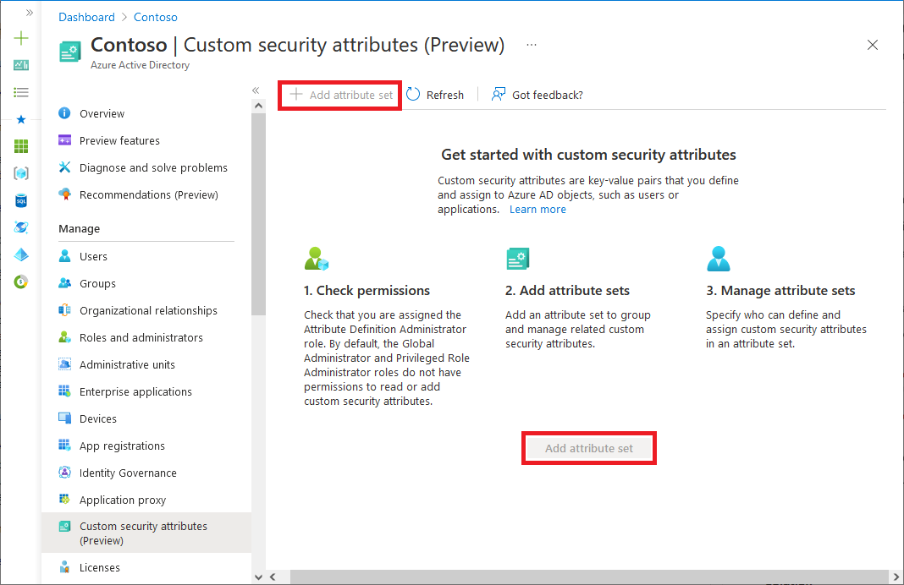
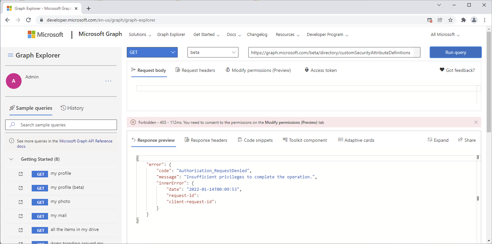
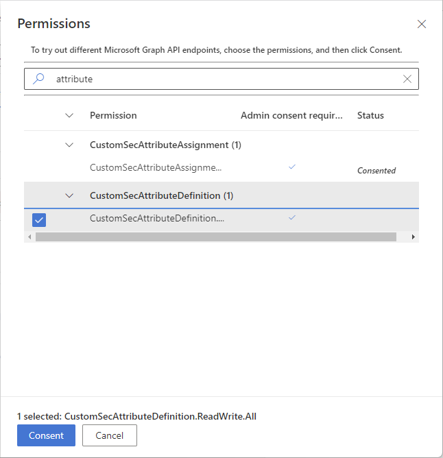
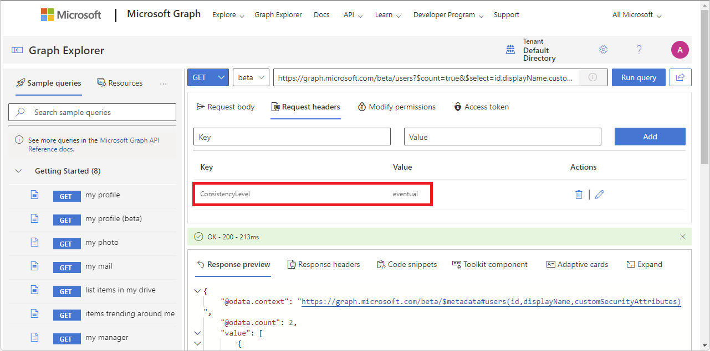

# Troubleshoot custom security attributes in Microsoft Entra ID (Preview)

> [!IMPORTANT]
> Custom security attributes are currently in PREVIEW.
> For more information about previews, see [Universal License Terms For Online Services](https://www.microsoft.com/licensing/terms/product/ForOnlineServices/all).

## Symptom - Custom security attributes page is disabled

When signed in to the [Microsoft Entra admin center](https://entra.microsoft.com) and you try to access the **Custom security attributes** page, it is disabled.


**Cause**

Custom security attributes require a Microsoft Entra ID P1 or P2 license.

**Solution**

Browse to **Identity** > **Overview** and check the license for your tenant.

## Symptom - Add attribute set is disabled

When signed in to the [Microsoft Entra admin center](https://entra.microsoft.com) and you try to click the **Custom security attributes** > **Add attribute set** option, it is disabled.



**Cause**

You don't have permissions to add an attribute set. To add an attribute set and custom security attributes, you must be assigned the [Attribute Definition Administrator](../roles/permissions-reference.md#attribute-definition-administrator) role. By default, [Global Administrator](../roles/permissions-reference.md#global-administrator) and other administrator roles do not have permissions to read, define, or assign custom security attributes.

**Solution**

Make sure that you are assigned the [Attribute Definition Administrator](../roles/permissions-reference.md#attribute-definition-administrator) role at either the tenant scope or attribute set scope. For more information, see [Manage access to custom security attributes in Microsoft Entra ID](custom-security-attributes-manage.md).

## Symptom - Error when you try to assign a custom security attribute

When you try to save a custom security attribute assignment, you get the message:

```
Insufficient privileges to save custom security attributes
This account does not have the necessary admin privileges to change custom security attributes
```

**Cause**

You don't have permissions to assign custom security attributes. To assign custom security attributes, you must be assigned the [Attribute Assignment Administrator](../roles/permissions-reference.md#attribute-assignment-administrator) role. By default, [Global Administrator](../roles/permissions-reference.md#global-administrator) and other administrator roles do not have permissions to read, define, or assign custom security attributes.

**Solution**

Make sure that you are assigned the [Attribute Assignment Administrator](../roles/permissions-reference.md#attribute-assignment-administrator) role at either the tenant scope or attribute set scope. For more information, see [Manage access to custom security attributes in Microsoft Entra ID](custom-security-attributes-manage.md).

## Symptom - Cannot filter custom security attributes for users or applications

**Cause 1**

You don't have permissions to filter custom security attributes. To read and filter custom security attributes for users or enterprise applications, you must be assigned the [Attribute Assignment Reader](../roles/permissions-reference.md#attribute-assignment-reader) or [Attribute Assignment Administrator](../roles/permissions-reference.md#attribute-assignment-administrator) role. By default, [Global Administrator](../roles/permissions-reference.md#global-administrator) and other administrator roles do not have permissions to read, define, or assign custom security attributes.

**Solution 1**

Make sure that you are assigned one of the following Microsoft Entra built-in roles at either the tenant scope or attribute set scope. For more information, see [Manage access to custom security attributes in Microsoft Entra ID](custom-security-attributes-manage.md).

- [Attribute Assignment Administrator](../roles/permissions-reference.md#attribute-assignment-administrator)
- [Attribute Assignment Reader](../roles/permissions-reference.md#attribute-assignment-reader)

**Cause 2**

You are assigned the Attribute Assignment Reader or Attribute Assignment Administrator role, but you have not been assigned access to an attribute set.

**Solution 2**

You can delegate the management of custom security attributes at the tenant scope or at the attribute set scope. Make sure you have been assigned access to an attribute set at either the tenant scope or attribute set scope. For more information, see [Manage access to custom security attributes in Microsoft Entra ID](custom-security-attributes-manage.md).

**Cause 3**

There are no custom security attributes defined and assigned yet for your tenant.

**Solution 3**

Add and assign custom security attributes to users or enterprise applications. For more information, see [Add or deactivate custom security attribute definitions in Microsoft Entra ID](custom-security-attributes-add.md), [Assign, update, list, or remove custom security attributes for a user](../enterprise-users/users-custom-security-attributes.md), or [Assign, update, list, or remove custom security attributes for an application](../manage-apps/custom-security-attributes-apps.md).

## Symptom - Custom security attributes cannot be deleted

**Cause**

Currently, you can only activate and deactivate custom security attribute definitions. Deletion of custom security attributes is not supported. Deactivated definitions do not count towards the tenant wide 500 definition limit.

**Solution**

Deactivate the custom security attributes you no longer need. For more information, see [Add or deactivate custom security attribute definitions in Microsoft Entra ID](custom-security-attributes-add.md).

## Symptom - Cannot add a role assignment at an attribute set scope using PIM

When you try to add an eligible Microsoft Entra role assignment using [Microsoft Entra Privileged Identity Management (PIM)](../privileged-identity-management/pim-configure.md), you cannot set the scope to an attribute set.

**Cause**

PIM currently does not support adding an eligible Microsoft Entra role assignment at an attribute set scope.

## Symptom - Insufficient privileges when using Graph Explorer

When you try to use [Graph Explorer](/graph/graph-explorer/graph-explorer-overview) to call Microsoft Graph APIs for custom security attributes, you see a message similar to the following:

```
Forbidden - 403. You need to consent to the permissions on the Modify permissions (Preview) tab
Authorization_RequestDenied
Insufficient privileges to complete the operation.
```



**Cause 1**

You have not consented to the required custom security attribute permissions to make the API call.

**Solution 1**

Open the Permissions panel, select the appropriate custom security attribute permission, and click **Consent**. In the Permissions requested window that appears, review the requested permissions.



**Cause 2**

You are not assigned the required custom security attribute role to make the API call. By default, [Global Administrator](../roles/permissions-reference.md#global-administrator) and other administrator roles do not have permissions to read, define, or assign custom security attributes.

**Solution 2**

Make sure that you are assigned the required custom security attribute role. For more information, see [Manage access to custom security attributes in Microsoft Entra ID](custom-security-attributes-manage.md).

## Symptom - Request_UnsupportedQuery error

When you try to call Microsoft Graph APIs for custom security attributes, you see a message similar to the following:

```
Bad Request - 400
Request_UnsupportedQuery
Unsupported or invalid query filter clause specified for property '<AttributeSet>_<Attribute>' of resource 'CustomSecurityAttributeValue'.
```

**Cause**

The request isn't formatted correctly.

**Solution**

If required, add `ConsistencyLevel=eventual` in the request or the header. You might also need to include `$count=true` to ensure the request is routed correctly. For more information, see [Examples: Assign, update, list, or remove custom security attribute assignments using the Microsoft Graph API](/graph/custom-security-attributes-examples).



## Next steps

- [Manage access to custom security attributes in Microsoft Entra ID](custom-security-attributes-manage.md)
- [Troubleshoot Azure role assignment conditions](/azure/role-based-access-control/conditions-troubleshoot)
