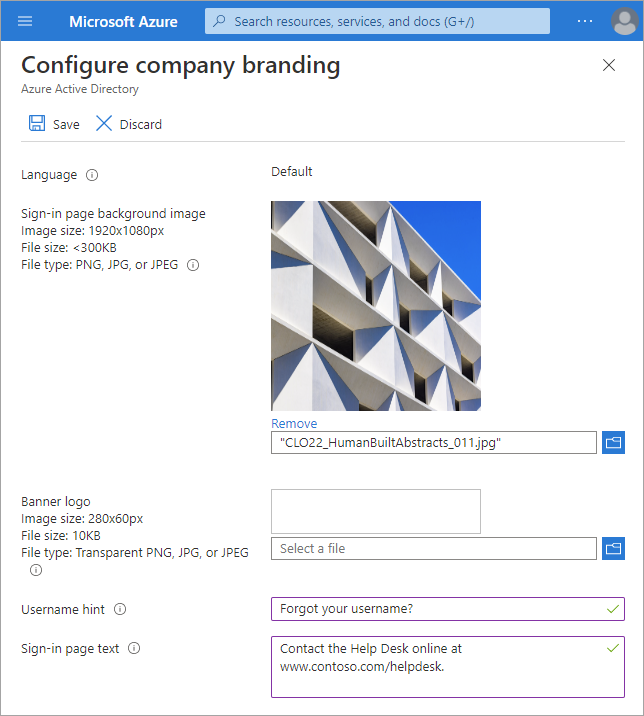
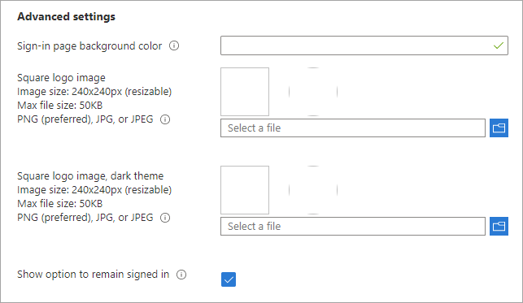

# Configure your company branding

Create a consistent experience when users sign into your organization's web-based apps that use Azure Active Directory (Azure AD) as your identity provider, such as Microsoft 365. The sign-in process can include your company logo and customized experiences based on browser language.

## License requirements

Adding custom branding and configuring the 'keep me signed in' (KMSI) option requires one of the following licenses:

- Azure AD Premium 1
- Azure AD Premium 2
- Office 365 (for Office apps)
- Microsoft 365 (KMSI only)

Azure AD Premium editions are available for customers in China using the worldwide instance of Azure AD. Azure AD Premium editions aren't currently supported in the Azure service operated by 21Vianet in China. For more information about licensing and editions, see [Sign up for Azure AD Premium](active-directory-get-started-premium.md).

## Customize the default sign-in experience

You can customize the sign-in experience when users sign in to your organization's tenant-specific apps, such as `https://outlook.com/woodgrove.com`, or when passing a domain variable, such as `https://passwordreset.microsoftonline.com/?whr=woodgrove.com`.

Custom branding appears after users sign in. Users that start the sign-in process at a site like www\.office.com  won't see the branding. After users sign in, the branding may take at least 15 minutes to appear.

**All branding elements are optional. Default settings will remain, if left unchanged.** For example, if you specify a banner logo but no background image, the sign-in page shows your logo with a default background image from the destination site such as Microsoft 365. Additionally, sign-in page branding doesn't carry over to personal Microsoft accounts. If your users or guests sign in using a personal Microsoft account, the sign-in page won't reflect the branding of your organization.

**Images have different image and file size requirements.** Take note of the requirements for each option. You may need to use a photo editor to create the right-sized images. The preferred image type for all images is PNG, but JPG is accepted. 

1. Sign in to the [Azure portal](https://portal.azure.com/) using a Global administrator account for the directory.

2. Go to **Azure Active Directory** > **Company branding** > **Configure**.

3. On the **Configure company branding** page, provide any or all of the following information.

    

    - **Language** The language for your first customized branding configuration is based on your default locale can't be changed. Once a default sign-in experience is created, you can add language-specific customized branding.
        
    - **Sign-in page background image** Select a PNG or JPG image file to appear as the background for your sign-in pages. The image will be anchored to the center of the browser, and will scale to the size of the viewable space.
        
        We recommended using images without a strong subject focus. An opaque white box appears in the center of the screen, which could cover any part of the image depending on the dimensions of the viewable space.

    - **Banner logo** Select a PNG or JPG version of your logo to appear on the sign-in page after the user enters a username and on the **My Apps** portal page.
            
        We recommend using a transparent image because the background might not match your logo background. We also recommend not adding padding around the image or it might make your logo look small. 

    - **Username hint** Type the hint text that appears to users if they forget their username. This text must be Unicode, without links or code, and can't exceed 64 characters. If guests sign in to your app, we suggest not adding this hint.

    - **Sign-in page text** Type the text that appears on the bottom of the sign-in page. You can use this text to communicate additional information, such as the phone number to your help desk or a legal statement. This text must be Unicode and can't exceed 1024 characters.

       To begin a new paragraph, use the enter key twice. You can also change text formatting to include bold, italics, an underline or clickable link. Use the following syntax to add formatting to text: 

       > Hyperlink: `[text](link)` 
        
       > Bold: `**text**` or `__text__` 
          
       > Italics: `*text*` or `_text_` 
          
       > Underline: `++text++` 
         
    > [!IMPORTANT]
    > Hyperlinks that are added to the sign-in page text render as text in native environments, such as desktop and mobile applications.

- **Advanced settings**
            
       

    - **Sign-in page background color** Specify the hexadecimal color (#FFFFFF) that will appear in place of your background image in low-bandwidth connection situations. We recommend using the primary color of your banner logo or your organization color.

    - **Square logo image** Select a PNG or JPG image of your organization's logo to appear during the setup process for new Windows 10 Enterprise devices. This image is only used for Windows authentication and appears only on tenants that are using [Windows Autopilot](/windows/deployment/windows-autopilot/windows-10-autopilot) for deployment or for password entry pages in other Windows 10 experiences. In some cases, it may also appear in the consent dialog.
        
        We recommend using a transparent image since the background might not match your logo background. We also recommend not adding padding around the image or it might make your logo look small.
    
    - **Square logo image, dark theme** Same as the square logo image above. This logo image takes the place of the square logo image when used with a dark background, such as with Windows 10 Azure AD joined screens during the out-of-box experience (OOBE). If your logo looks good on white, dark blue, and black backgrounds, you don't need to add this image. 
        
    >[!IMPORTANT]
    > Transparent logos are supported with the square logo image. The color palette used in the transparent logo could conflict with backgrounds (such as, white, light grey, dark grey, and black backgrounds) used within Microsoft 365 apps and services that consume the square logo image. Solid color backgrounds may need to be used to ensure the square image logo is rendered correctly in all situations.
        
    - **Show option to remain signed in** You can choose to let your users remain signed in to Azure AD until explicitly signing out. If you uncheck this option, users must sign in each time the browser is closed and reopened. This feature is covered in detail in the [Learn about the 'Stay signed in?' prompt](#learn-about-the-stay-signed-in-prompt) section of this article.

3. After you've finished adding your branding, select **Save** in the upper-left corner of the configuration panel.

    This process creates your first custom branding configuration, and it becomes the default for your tenant. The default custom branding configuration serves as a fallback option for all language-specific branding configurations. The configuration can't be removed after you create it.
    
    >[!IMPORTANT]
    >To add more corporate branding configurations to your tenant, you must choose **New language** on the **Contoso - Company branding** page. This opens the **Configure company branding** page, where you can follow the same steps as above.

## Customize the sign-in experience by browser language

To create an inclusive experience for all of your users, you can customize the sign-in experience based on browser language. You must create a default custom branding experience before you can add a new language.

1. Sign in to the [Azure portal](https://portal.azure.com/) using a Global administrator account for the directory.

2. Select **Azure Active Directory** > **Company branding** > **+ New language**.

The process for customizing the experience is the same as the [Default sign-in experience](#customize-the-default-sign-in-experience), except you select a **Language** from the dropdown list.

We recommend adding **Sign-in page text** in the selected language.

## Edit custom branding

If custom branding has been added to your tenant, you can edit the details already provided. Refer to the details and descriptions of each setting in the [Add custom branding](#customize-the-default-sign-in-experience) section of this article.

1. Sign in to the [Azure portal](https://portal.azure.com/) using a Global administrator account for the directory.

1. Go to **Azure Active Directory** > **Company branding**.

1. Select a custom branding item from the list.

1. On the **Edit company branding** page, edit any necessary details.

1. Select **Save**.

   It can take up to an hour for any changes you made to the sign-in page branding to appear.

## Learn about the 'Stay signed in?' prompt

The **Stay signed in?** prompt appears after a user successfully signs in. This process is known as **Keep me signed in** (KMSI). If a user answers **Yes** to this prompt, the KMSI service gives them a persistent [refresh token](../develop/developer-glossary.md#refresh-token). For federated tenants, the prompt will show after the user successfully authenticates with the federated identity service.

The following diagram shows the user sign-in flow for a managed tenant and federated tenant using the KMSI in prompt. This flow contains smart logic so that the **Stay signed in?** option won't be displayed if the machine learning system detects a high-risk sign-in or a sign-in from a shared device.

KMSI is only available on the default custom branding. It can't be added to language-specific branding. Some features of SharePoint Online and Office 2010 depend on users being able to choose to remain signed in. If you uncheck the **Show option to remain signed in** option, your users may see other unexpected prompts during the sign-in process.

See the [License requirements](#license-requirements) section for using the KMSI service.

### Troubleshoot 'Stay signed in?' issues

If a user doesn't act on the **Stay signed in?** prompt but abandons the sign-in attempt, a sign-in log entry appears in the Azure AD **Sign-ins** page. The prompt the user sees is called an "interrupt."

Details about the sign-in error are found in the **Sign-in logs** in Azure AD. Select the impacted user from the list and locate the details below in the **Basic info** section.

* **Sign in error code**: 50140
* **Failure reason**: This error occurred due to "Keep me signed in" interrupt when the user was signing in.

You can stop users from seeing the interrupt by setting the **Show option to remain signed in** setting to **No** in the advanced branding settings. This setting disables the KMSI prompt for all users in your Azure AD directory.

You also can use the [persistent browser session controls in Conditional Access](../conditional-access/howto-conditional-access-session-lifetime.md) to prevent users from seeing the KMSI prompt. This option allows you to disable the KMSI prompt for a select group of users (such as the global administrators) without affecting sign-in behavior for everyone else in the directory.

To ensure that the KMSI prompt is shown only when it can benefit the user, the KMSI prompt is intentionally not shown in the following scenarios:

* User is signed in via seamless SSO and integrated Windows authentication (IWA)
* User is signed in via Active Directory Federation Services and IWA
* User is a guest in the tenant
* User's risk score is high
* Sign-in occurs during user or admin consent flow
* Persistent browser session control is configured in a conditional access policy

## Next steps

- [Add your organization's privacy info on Azure AD](/azure/active-directory/fundamentals/active-directory-properties-area)
- [Learn more about Conditional Access](../conditional-access/overview.md)
